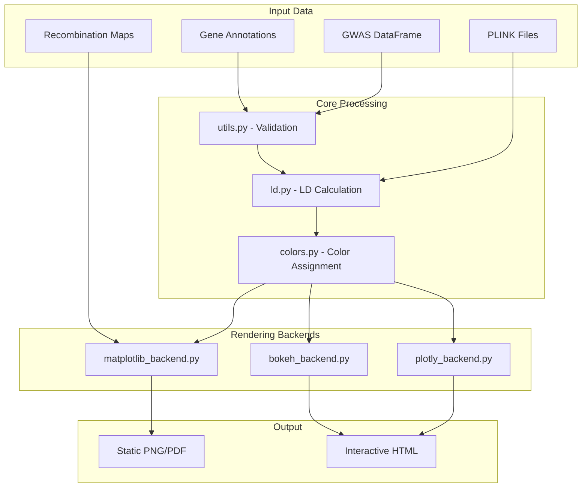

# pyLocusZoom

**"LocusZoom plots without the web dependency"**

Designed for publication-ready GWAS visualization with regional association plots, gene tracks, eQTL, PheWAS, fine-mapping, and forest plots.

## Architecture



## Key Design Decisions

| Decision | Rationale |
|----------|-----------|
| **Matplotlib-first** | Publication-quality static plots are the primary use case |
| **Pre-computed LD support** | `ld_col` parameter avoids PLINK dependency when LD already calculated |
| **Species-agnostic core** | Dog/cat recombination built-in, but custom species fully supported |
| **Backend protocol** | `PlotBackend` protocol enables future interactive backends |
| **Validation at boundaries** | All DataFrames validated on entry with clear error messages |
| **Kwargs interface** | `plot()` / `plot_stacked()` use direct kwargs; config classes are internal validation only |

## Key Files

| Path | Purpose |
|------|---------|
| `src/pylocuszoom/plotter.py` | Main entry point: `LocusZoomPlotter` class (regional plots) |
| `src/pylocuszoom/manhattan_plotter.py` | Manhattan/QQ genome-wide plots |
| `src/pylocuszoom/stats_plotter.py` | PheWAS/forest statistical plots |
| `src/pylocuszoom/_plotter_utils.py` | Shared utilities (transform_pvalues, significance lines) |
| `src/pylocuszoom/backends/base.py` | `PlotBackend` protocol definition |
| `src/pylocuszoom/colors.py` | LD bins, eQTL effect colors, credible set colors, PheWAS colors |
| `src/pylocuszoom/ld.py` | PLINK wrapper for LD calculation |
| `src/pylocuszoom/gene_track.py` | Gene/exon rendering with overlap handling |
| `src/pylocuszoom/labels.py` | SNP label positioning with adjustText |
| `src/pylocuszoom/finemapping.py` | SuSiE/fine-mapping visualization |
| `src/pylocuszoom/eqtl.py` | eQTL data validation and filtering |
| `src/pylocuszoom/phewas.py` | PheWAS data validation |
| `src/pylocuszoom/forest.py` | Forest plot data validation |
| `src/pylocuszoom/recombination.py` | Recomb map loading, CanFam4 liftover |
| `src/pylocuszoom/reference_data/` | Bundled recombination maps (auto-downloaded) |
| `src/pylocuszoom/utils.py` | DataFrame validation, PySpark support |

## Quick Reference

```bash
# Run tests (parallel by default)
uv run python -m pytest tests/ -n auto -q

# Run specific test
uv run python -m pytest tests/test_plotter.py::TestPlotEdgeCases -v

# Run tests without coverage (faster iteration)
uv run python -m pytest tests/ -n auto -q --no-cov

# Lint and format
uv tool run ruff check src/ tests/
uv tool run ruff format src/ tests/

# Generate example plots
uv run python examples/generate_readme_plots.py

# Build package
uv build
```

## Superpowers (Skills & Agents)

Use these proactively throughout development:

### Planning & Design Skills

| Skill | When to Use |
|-------|-------------|
| `/brainstorming` | Before creative/feature work, exploring options |
| `/writing-plans` | Multi-step implementation planning |
| `/test-driven-development` | **Always** - write tests before implementation |
| `/systematic-debugging` | When bugs arise, methodical root cause analysis |
| `/verification-before-completion` | Before claiming any task is done |
| `/release` | Pre-commit/pre-PR checklist automation |

### Code Quality Agents

| Agent | When to Use |
|-------|-------------|
| `code-simplifier:code-simplifier` | After writing code - simplify, remove dead code |
| `pr-review-toolkit:code-reviewer` | Before commits/PRs - check style, patterns |
| `pr-review-toolkit:silent-failure-hunter` | Review error handling, catch swallowed exceptions |
| `pr-review-toolkit:comment-analyzer` | Verify comments are accurate, not stale |
| `pr-review-toolkit:pr-test-analyzer` | Ensure adequate test coverage |
| `pr-review-toolkit:type-design-analyzer` | Review type design quality |

### Documentation & Maintenance

| Tool | When to Use |
|------|-------------|
| `claude-md-management:revise-claude-md` | Update CLAUDE.md with session learnings |
| `claude-md-management:claude-md-improver` | Audit and improve CLAUDE.md quality |

### Issue Tracking (Beads)

| Command | Purpose |
|---------|---------|
| `bd ready` | Find tasks with no blockers |
| `bd create` | Create new issue |
| `bd update <id> --status=in_progress` | Claim work |
| `bd close <id>` | Mark complete |
| `bd sync` | Sync with git remote |

---

## Development Workflow

### Finding Work
- Check GitHub issues or use `bd ready` for tracked tasks

### Planning
- Invoke `/brainstorming` skill before creative/feature work
- Invoke `/writing-plans` skill for multi-step implementation

### Implementation
- Invoke `/test-driven-development` skill - **always write tests first**
- Invoke `/systematic-debugging` skill when bugs arise
- Mock PLINK calls in LD tests (see `tests/test_ld.py`)

---

## Pre-commit Checklist

**CRITICAL**: Run this checklist before EVERY commit:

```bash
# 1. Run tests (parallel)
uv run python -m pytest tests/ -n auto -q

# 2. Run lint check (must pass)
uv tool run ruff check src/ tests/

# 3. Run format check (must pass)
uv tool run ruff format --check src/ tests/
# If fails, fix with:
uv tool run ruff format src/ tests/
```

**CI will fail if**: Tests fail, lint errors, or format errors.

---

## Pre-PR / Release Checklist

**Use `/release` command or follow this checklist manually before creating a PR or release:**

### 1. Code Quality
```bash
# Run full test suite (parallel)
uv run python -m pytest tests/ -n auto -v

# Lint and format
uv tool run ruff check src/ tests/
uv tool run ruff format src/ tests/
```

### 2. Code Simplification & Review
Run these agents on changed files (get list with `git diff --name-only HEAD~1`):

| Agent | Purpose |
|-------|---------|
| `code-simplifier:code-simplifier` | Simplify, remove dead code, reduce complexity |
| `pr-review-toolkit:code-reviewer` | Check style, patterns, best practices |
| `pr-review-toolkit:silent-failure-hunter` | Catch swallowed exceptions, poor error handling |
| `pr-review-toolkit:comment-analyzer` | Verify comments are accurate |
| `pr-review-toolkit:pr-test-analyzer` | Check test coverage adequacy |

### 3. Documentation Updates

| File | Update When |
|------|-------------|
| `CHANGELOG.md` | **Every PR** - Add entry under "Unreleased" section |
| `README.md` | API changes, new features, new examples |
| `docs/USER_GUIDE.md` | New features, usage patterns, configuration options |
| `CLAUDE.md` | Architecture changes, new gotchas, workflow updates |

#### CHANGELOG Entry Format
```markdown
## [Unreleased]

### Added
- New feature description (#issue)

### Changed
- Changed behavior description

### Fixed
- Bug fix description (#issue)

### Removed
- Removed feature description
```

### 4. Architecture Diagram
Update the mermaid diagram in CLAUDE.md if:
- New modules added
- Data flow changed
- New backends added
- Component relationships changed

### 5. Example Plots
Regenerate if visualization changed:
```bash
uv run python examples/generate_readme_plots.py
```
Review generated images in `examples/` directory.

### 6. Verification
Run `/verification-before-completion` or manually verify:
- [ ] All tests pass
- [ ] No lint/format errors
- [ ] CHANGELOG updated
- [ ] README accurate
- [ ] Example plots current
- [ ] No debug code left in
- [ ] No hardcoded paths
- [ ] No sensitive data exposed

### 7. Final Commit
```bash
git add <files>
git commit -m "descriptive message"
git push
```

---

## Release Procedure

For version releases (vX.Y.Z):

### 1. Pre-release Checks
- [ ] All items from Pre-PR checklist complete
- [ ] All tests pass on CI
- [ ] CHANGELOG has release date

### 2. Version Bump
```bash
# Update version in pyproject.toml
# Update CHANGELOG.md - change [Unreleased] to [X.Y.Z] - YYYY-MM-DD
```

### 3. Create Release
```bash
git add pyproject.toml CHANGELOG.md
git commit -m "Release vX.Y.Z: Brief description"
git push
# Create GitHub release with tag vX.Y.Z
# GitHub Actions auto-publishes to PyPI
```

### 4. Post-release
- Update Bioconda recipe (see Publishing section)
- Announce if major release

## Testing

- Tests use pytest fixtures from `tests/conftest.py`
- Mock PLINK calls - don't require actual PLINK installation
- Test edge cases: empty DataFrames, missing columns, mismatched list lengths
- Interactive backend tests: `tests/test_notebook_backends.py` (21 tests for Plotly/Bokeh compatibility)
- Run `/verification-before-completion` before claiming tests pass

## Species Support

| Species | Recombination | LD | Genome Build |
|---------|--------------|-----|--------------|
| Canine | Built-in (auto-download) | `--dog` flag | CanFam3.1, CanFam4 |
| Feline | User-provided | `--chr-set 18` | FelCat9 |
| Custom | User-provided | User config | Any |

## Gotchas

- **README images for PyPI**: Images must use absolute GitHub URLs (`https://raw.githubusercontent.com/michael-denyer/pyLocusZoom/main/examples/...`) not relative paths - PyPI doesn't host images
- **Matplotlib-only guards**: When calling matplotlib-specific methods (`_add_ld_legend`), always check `self.backend_name == "matplotlib"` first
- **Parameter naming**: `plot()` uses `lead_pos`, `plot_stacked()` uses `lead_positions` (plural with list)
- **PLINK species flags**: `species="canine"` maps to PLINK's `--dog` flag internally
- **LD requires rs_col**: When using `ld_reference_file`, the GWAS DataFrame must have SNP IDs column
- **Matplotlib non-interactive**: `plt.ioff()` called to prevent display in notebooks - use `fig.savefig()`
- **Recombination auto-download**: First canine plot downloads ~50MB recombination maps to cache
- **CanFam4 liftover**: Recomb maps are CanFam3.1; automatically lifted over when `genome_build="canfam4"`
- **Gene track height**: Dynamically calculated based on overlapping genes in region

## Backend Support

| Backend | Status | Features |
|---------|--------|----------|
| `matplotlib` | ✅ Full | SNP labels (adjustText), recombination overlay, gene track, LD legend |
| `plotly` | ✅ Full | Hover tooltips, pan/zoom, gene track, recombination overlay, LD legend, HTML export |
| `bokeh` | ✅ Full | Hover tooltips, pan/zoom, gene track, recombination overlay, LD legend, HTML export |

**All backends:** recombination overlay, gene track, LD legend
**Matplotlib only:** SNP labels with adjustText for automatic repositioning
**Interactive backends:** Hover tooltips provide SNP information on mouse-over

**Usage:**
```python
# Static matplotlib (default)
fig = plotter.plot(df, chrom=1, start=1e6, end=2e6)

# Interactive plotly
fig = plotter.plot(df, chrom=1, start=1e6, end=2e6, backend="plotly")
fig.write_html("plot.html")

# Notebook display (Plotly)
from IPython.display import display, HTML
display(HTML(fig.to_html(include_plotlyjs='cdn')))

# Notebook display (Bokeh)
from bokeh.resources import CDN
from bokeh.embed import file_html
display(HTML(file_html(fig, CDN, "title")))
```

## Publishing

### PyPI (automatic)
GitHub Actions Trusted Publishing:
1. Update version in `pyproject.toml`
2. Update `CHANGELOG.md` with release date
3. Commit and push
4. Create GitHub release with tag `vX.Y.Z`
5. Workflow auto-publishes to PyPI

### Bioconda (manual, after PyPI)
1. Get SHA256: `curl -sL https://pypi.io/packages/source/p/pylocuszoom/pylocuszoom-X.Y.Z.tar.gz | sha256sum`
2. Update `bioconda/meta.yaml` with new version and SHA256
3. Fork [bioconda-recipes](https://github.com/bioconda/bioconda-recipes)
4. Copy `bioconda/meta.yaml` to `recipes/pylocuszoom/meta.yaml`
5. Submit PR to bioconda-recipes
