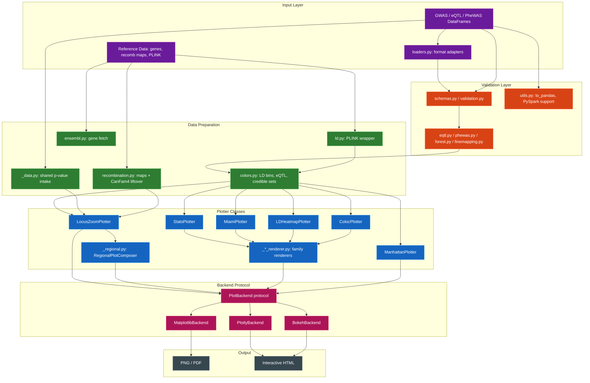

# Architecture

## System Overview

pyLocusZoom is a Python library for producing publication-ready regional
association plots for GWAS and related genetic studies, without depending on a
web service. It takes GWAS summary statistics (and optionally gene annotations,
recombination maps, PLINK genotype data, eQTL tables, fine-mapping output, or
PheWAS tables) as pandas/PySpark DataFrames, validates them at the API
boundary, assigns colors based on linkage disequilibrium (LD) or fine-mapping
credible sets, and dispatches rendering through a `PlotBackend` protocol to one
of three interchangeable backends: matplotlib (static PNG/PDF), plotly
(interactive HTML), or bokeh (interactive HTML). The architecture is a layered,
backend-pluggable pipeline: validation → data preparation → backend-agnostic
plot assembly → backend-specific rendering.

## Component Diagram


```mermaid
graph TD
    subgraph Input["Input Layer"]
        GWAS[GWAS / eQTL / PheWAS DataFrames]
        REF[Reference Data: genes, recomb maps, PLINK]
        LOAD[loaders.py: format adapters]
    end

    subgraph Validate["Validation Layer"]
        SCHEMA[schemas.py / validation.py]
        EQTLV[eqtl.py / phewas.py / forest.py / finemapping.py]
        UTILS[utils.py: to_pandas, PySpark support]
    end

    subgraph Prepare["Data Preparation"]
        DATA[_data.py: shared p-value intake]
        LD[ld.py: PLINK wrapper]
        RECOMB[recombination.py: maps + CanFam4 liftover]
        ENSEMBL[ensembl.py: gene fetch]
        COLORS[colors.py: LD bins, eQTL, credible sets]
    end

    subgraph Plotters["Plotter Classes"]
        LZ[LocusZoomPlotter]
        REGIONAL[_regional.py: RegionalPlotComposer]
        FAMILIES[_*_renderer.py: family renderers]
        MP[ManhattanPlotter]
        SP[StatsPlotter]
        MIAMI[MiamiPlotter]
        LDH[LDHeatmapPlotter]
        CP[ColocPlotter]
    end

    subgraph Backends["Backend Protocol"]
        PROTO[PlotBackend protocol]
        MPL[MatplotlibBackend]
        PLOTLY[PlotlyBackend]
        BOKEH[BokehBackend]
    end

    subgraph Output["Output"]
        STATIC[PNG / PDF]
        HTML[Interactive HTML]
    end

    GWAS --> LOAD
    LOAD --> SCHEMA
    GWAS --> SCHEMA
    GWAS --> UTILS
    GWAS --> DATA
    REF --> ENSEMBL
    REF --> LD
    REF --> RECOMB
    SCHEMA --> EQTLV
    EQTLV --> COLORS
    LD --> COLORS
    COLORS --> LZ
    DATA --> LZ
    COLORS --> MP
    COLORS --> SP
    COLORS --> MIAMI
    COLORS --> LDH
    COLORS --> CP
    RECOMB --> LZ
    LZ --> PROTO
    LZ --> REGIONAL
    REGIONAL --> PROTO
    SP --> FAMILIES
    MIAMI --> FAMILIES
    LDH --> FAMILIES
    CP --> FAMILIES
    FAMILIES --> PROTO
    MP --> PROTO
    PROTO --> MPL
    PROTO --> PLOTLY
    PROTO --> BOKEH
    MPL --> STATIC
    PLOTLY --> HTML
    BOKEH --> HTML

    %% Palette matches docs/CODEMAP.md layer colours
    style GWAS fill:#6a1b9a,stroke:#ab47bc,color:#ffffff
    style REF fill:#6a1b9a,stroke:#ab47bc,color:#ffffff
    style LOAD fill:#6a1b9a,stroke:#ab47bc,color:#ffffff

    style SCHEMA fill:#d84315,stroke:#ff7043,color:#ffffff
    style EQTLV fill:#d84315,stroke:#ff7043,color:#ffffff
    style UTILS fill:#d84315,stroke:#ff7043,color:#ffffff

    style DATA fill:#2e7d32,stroke:#66bb6a,color:#ffffff
    style LD fill:#2e7d32,stroke:#66bb6a,color:#ffffff
    style RECOMB fill:#2e7d32,stroke:#66bb6a,color:#ffffff
    style ENSEMBL fill:#2e7d32,stroke:#66bb6a,color:#ffffff
    style COLORS fill:#2e7d32,stroke:#66bb6a,color:#ffffff

    style LZ fill:#1565c0,stroke:#42a5f5,color:#ffffff
    style REGIONAL fill:#1565c0,stroke:#42a5f5,color:#ffffff
    style FAMILIES fill:#1565c0,stroke:#42a5f5,color:#ffffff
    style MP fill:#1565c0,stroke:#42a5f5,color:#ffffff
    style SP fill:#1565c0,stroke:#42a5f5,color:#ffffff
    style MIAMI fill:#1565c0,stroke:#42a5f5,color:#ffffff
    style LDH fill:#1565c0,stroke:#42a5f5,color:#ffffff
    style CP fill:#1565c0,stroke:#42a5f5,color:#ffffff

    style PROTO fill:#ad1457,stroke:#f06292,color:#ffffff
    style MPL fill:#ad1457,stroke:#f06292,color:#ffffff
    style PLOTLY fill:#ad1457,stroke:#f06292,color:#ffffff
    style BOKEH fill:#ad1457,stroke:#f06292,color:#ffffff

    style STATIC fill:#37474f,stroke:#78909c,color:#ffffff
    style HTML fill:#37474f,stroke:#78909c,color:#ffffff
```

## Data Flow

A typical call to `LocusZoomPlotter.plot(df, chrom, start, end)` follows these
stages:

1. **Entry.** The user constructs `LocusZoomPlotter(species=..., backend=...)`
   from `src/pylocuszoom/plotter.py` and calls `plot()` or `plot_stacked()`.
   The plotter resolves the backend via `backends.get_backend(name)`, which
   lazily imports and registers the concrete backend class.
2. **Validation and intake.** The input DataFrame is normalized through
   `utils.to_pandas()` (supports PySpark input) and validated against expected
   columns using `validation.py` and `schemas.py`. P-value-bearing plot paths
   then share `_data.prepare_pvalue_data()` for null/range filtering and finite
   `-log10` transformation; specialized inputs (eQTL, PheWAS, forest,
   fine-mapping) retain their domain-specific column and range checks.
3. **Region filtering and LD.** Rows are filtered to `[start, end]` on the
   requested chromosome. If `ld_reference_file` is supplied, `ld.py` shells
   out to PLINK via a wrapper to compute R² against the lead variant; if
   `ld_col` is already present in the DataFrame, PLINK is skipped.
4. **Color assignment.** `colors.py` maps each SNP to an LD bin color (or an
   eQTL effect-size color, credible-set color, or PheWAS category color
   depending on the plotter).
5. **Auxiliary data.** Gene annotations are assembled via `gene_track.py` (or
   fetched via `ensembl.py`, which serves one assembly per species and warns
   when that is not the plotter's `genome_build`). Recombination rates are
   loaded via `recombination.py`, which handles download of bundled canine maps
   and CanFam3.1 → CanFam4 liftover through pyliftover.
6. **Regional composition and backend dispatch.** `LocusZoomPlotter` routes
   both single and stacked association panels through `RegionalPlotComposer`,
   which owns shared axes, labels, significance line, LD legend, SNP-label,
   and recombination policy. Manhattan and QQ plotters hand prepared data and
   figure intent to semantic renderers: `ManhattanQQRenderer`,
   `MiamiRenderer`, `StatsRenderer`, `ColocRenderer`, and
   `LDHeatmapRenderer`. These renderers own panel composition, labels, axes,
   legends, and layout, translating intent through the existing `PlotBackend`
   primitive contract. Backend implementations translate the primitive calls
   into matplotlib Axes, plotly Figure traces, or bokeh figure glyphs.
7. **Output.** Matplotlib returns a `Figure` object; plotly and bokeh return
   their respective figure objects that serialize to HTML via `save()` or
   their native export methods.

## Key Abstractions

| Abstraction | Kind | Location | Purpose |
|-------------|------|----------|---------|
| `LocusZoomPlotter` | Class | `src/pylocuszoom/plotter.py` | Primary entry point for regional association plots; orchestrates validation, LD, gene track, recombination overlay, and backend rendering |
| `RegionalPlotComposer` | Internal class | `src/pylocuszoom/_regional.py` | Renders ordered typed panel plans for single and stacked regional figures |
| Family renderers | Internal modules | `src/pylocuszoom/_*_renderer.py` | Focused semantic renderers for Miami, PheWAS/forest, colocalization, and LD heatmap families |
| `ManhattanPlotter` | Class | `src/pylocuszoom/manhattan_plotter.py` | Genome-wide Manhattan and QQ plots |
| `StatsPlotter` | Class | `src/pylocuszoom/stats_plotter.py` | PheWAS and forest plots |
| `MiamiPlotter` | Class | `src/pylocuszoom/miami_plotter.py` | Mirrored Manhattan comparison plots |
| `LDHeatmapPlotter` | Class | `src/pylocuszoom/ld_heatmap_plotter.py` | Pairwise LD heatmaps |
| `ColocPlotter` | Class | `src/pylocuszoom/coloc_plotter.py` | Colocalization visualizations |
| `PlotBackend` | Protocol | `src/pylocuszoom/backends/base.py` | Structural-typing contract every backend must satisfy: drawing primitives only (figure creation, scatter/line/fill, neutral `add_legend`). Heatmap and bar-chart drawing left the contract in 2.1 and are optional protocols (ADR-0005) |
| `backends/composition.py` | Internal module | `src/pylocuszoom/backends/composition.py` | Pure functions that compose legends and the recombination overlay above the primitive seam; owns `LegendEntry` and `render_recombination_overlay` |
| `SupportsRegionHighlight`, `SupportsSNPLabels`, `SupportsSecondaryAxis`, `SupportsHeatmap`, `SupportsBarCharts` | Optional protocols | `src/pylocuszoom/backends/base.py` | `@runtime_checkable` capabilities a backend opts into by implementing the methods; detected with `isinstance` |
| `ManhattanQQRenderer` | Internal module | `src/pylocuszoom/_rendering.py` | Semantic rendering module for Manhattan and QQ figures; owns panel policy while retaining the primitive backend seam for compatibility |
| `prepare_pvalue_data` | Internal function | `src/pylocuszoom/_data.py` | Shared p-value intake policy: filtering, zero-value mode, and finite `-log10` transformation |
| `@register_backend` | Decorator | `src/pylocuszoom/backends/__init__.py` | Registers a backend class into `_BACKENDS`; enables adding custom backends without touching core code |
| `get_backend(name)` | Function | `src/pylocuszoom/backends/__init__.py` | Lazy-imports and returns a backend instance by name, raising `ImportError` with install instructions when an optional backend is missing |
| `PyLocusZoomError` hierarchy | Exceptions | `src/pylocuszoom/exceptions.py` | Root type for all library errors; specialized subclasses (`ValidationError`, `BackendError`, `PlinkError`, `DataDownloadError`, plus per-data-type validation errors) |
| Loader functions | Functions | `src/pylocuszoom/loaders.py` | Format adapters that read PLINK `.assoc`, REGENIE, BOLT-LMM, GEMMA, SAIGE, GWAS Catalog, GTEx, SuSiE, FINEMAP, CAVIAR, PolyFun, GTF, BED, and Ensembl into canonical DataFrames |

## Directory Structure Rationale

The project uses a standard `src/`-layout Python package (`pyproject.toml` with
`hatchling` as the build backend), so the package lives under
`src/pylocuszoom/` and is installed via `uv` or `pip`. Within the package,
modules are organized by responsibility rather than by data flow stage — this
keeps related validation, data-prep, and rendering code for each feature
co-located, while cross-cutting concerns (colors, backends, utilities) live in
shared modules.

```text
pyLocusZoom/
├── src/pylocuszoom/           # The installable package
│   ├── __init__.py            # Public API re-exports (stable surface)
│   ├── plotter.py             # LocusZoomPlotter — regional plot orchestration
│   ├── manhattan_plotter.py   # Manhattan/QQ plotter class
│   ├── manhattan.py           # Lower-level Manhattan helpers
│   ├── qq.py                  # QQ plot primitives
│   ├── stats_plotter.py       # StatsPlotter — PheWAS and forest plots
│   ├── miami_plotter.py       # Miami (mirrored Manhattan) plotter
│   ├── ld_heatmap_plotter.py  # Pairwise LD heatmap plotter
│   ├── coloc_plotter.py       # Colocalization plotter
│   ├── coloc.py               # Colocalization statistics
│   ├── _data.py               # Shared p-value intake and transformation policy
│   ├── _plotter_utils.py      # Shared internals (compatibility transform, sig lines)
│   ├── _regional.py           # Shared single/stacked regional composition
│   ├── _miami_renderer.py      # Miami figure composition
│   ├── _stats_renderer.py      # PheWAS and forest figure composition
│   ├── _coloc_renderer.py      # Colocalization figure composition
│   ├── _ld_heatmap_renderer.py # Standalone LD heatmap composition
│   ├── _rendering.py          # Semantic Manhattan/QQ rendering module
│   ├── _manhattan_panel.py    # Manhattan primitives shared with the Miami renderer
│   ├── backends/              # Pluggable rendering backends
│   │   ├── __init__.py        # Backend registry (@register_backend, get_backend)
│   │   ├── base.py            # PlotBackend protocol + optional capability protocols
│   │   ├── composition.py     # Legend and recombination-overlay composition above the seam
│   │   ├── matplotlib_backend.py
│   │   ├── plotly_backend.py
│   │   ├── bokeh_backend.py
│   │   └── hover.py           # Hover tooltip helpers for interactive backends
│   ├── colors.py              # LD bins, eQTL, credible-set, PheWAS palettes
│   ├── ld.py                  # PLINK wrapper for R² calculation
│   ├── recombination.py       # Recomb map loading + CanFam4 liftover
│   ├── reference_data/        # Bundled reference datasets (auto-populated)
│   ├── gene_track.py          # Gene/exon rendering with overlap resolution
│   ├── ensembl.py             # Ensembl REST client with caching
│   ├── labels.py              # adjustText-based SNP label placement
│   ├── eqtl.py                # eQTL validation and filtering
│   ├── phewas.py              # PheWAS validation
│   ├── forest.py              # Forest-plot validation
│   ├── finemapping.py         # SuSiE / fine-mapping validation + plot_finemapping()
│   ├── loaders.py             # Format adapters (PLINK, REGENIE, GTEx, SuSiE, GTF, BED, …)
│   ├── schemas.py             # Canonical DataFrame column schemas
│   ├── validation.py          # Shared validation primitives
│   ├── utils.py               # DataFrame helpers; to_pandas() handles PySpark
│   ├── config.py              # Internal PlotConfig / StackedPlotConfig (not public)
│   ├── exceptions.py          # PyLocusZoomError hierarchy
│   ├── logging.py             # enable_logging / disable_logging (loguru)
│   └── py.typed               # PEP 561 marker — ships with type hints
├── tests/                     # pytest suite (parallelized, randomized, timeout 30s)
├── docs/                      # Project documentation (this file lives here)
├── examples/                  # Runnable example scripts, incl. README plot generator
├── CHANGELOG.md               # Release notes
└── pyproject.toml             # Build system, deps, ruff/pytest config
```

The `backends/` subpackage is the single point of extensibility for new
renderers — adding a backend means writing one module that implements
`PlotBackend` and decorating it with `@register_backend("name")`. No plotter
class needs to change. The `reference_data/` directory is populated lazily at
runtime by `recombination.ensure_recomb_maps()` and
`download_canine_recombination_maps()` rather than shipping ~50 MB of maps in
the wheel.

### Custom backends in 2.0

2.0 completes the rendering seam, which breaks the 1.x extension contract. A
custom backend needs three changes.

**1. One neutral `add_legend`.** The five semantic legend methods
(`add_ld_legend`, `add_effect_legend`, `add_eqtl_legend`,
`add_finemapping_legend`, `add_simple_legend`) are gone, and the old generic
`add_legend(handles, labels)` is replaced. Legend content is now built above the
seam by pure functions in `backends/composition.py` and handed down as
`LegendEntry` values:

```python
def add_legend(self, ax, entries: list[LegendEntry], loc="upper left", title=None):
    """entries carry label, color, marker ("patch" or a marker code), edgecolor."""
```

Backends must honour `loc` (matplotlib's vocabulary) and each entry's
`edgecolor`, falling back to black when it is `None`.

**2. `add_recombination_overlay` is gone.** The overlay is composed from
primitives by `composition.render_recombination_overlay()`. A backend that wants
the overlay implements `SupportsSecondaryAxis`: `create_twin_axis(ax)` returns
an opaque per-backend handle, and `line_secondary`, `fill_between_secondary`,
`set_secondary_ylim`, and `set_secondary_ylabel` each take that handle as their
first argument.

**3. Capabilities are protocols, not booleans.** The `supports_snp_labels` and
`supports_secondary_axis` properties are removed. Optional capabilities are
detected with `isinstance` against `@runtime_checkable` protocols, so a backend
declares support by implementing the methods and declines by omitting them:
`SupportsRegionHighlight`, `SupportsSNPLabels`, `SupportsSecondaryAxis`.
`supports_hover` stays a boolean, because it is a rendering-quality flag with no
method to key on.

No compatibility shim is provided. See
[ADR-0004](adr/0004-complete-rendering-seam-and-capability-protocols.md) for the
reasoning.

### Optional capabilities in 2.1

Two more clusters left `PlotBackend` in 2.1, following the same rule
([ADR-0005](adr/0005-heatmap-and-bar-chart-capability-protocols.md)):

| Protocol | Methods | Used by |
|----------|---------|---------|
| `SupportsHeatmap` | `add_heatmap`, `add_colorbar`, `highlight_heatmap_snp` | LD heatmaps (standalone and the regional heatmap panel) |
| `SupportsBarCharts` | `hbar`, `errorbar_h` | Forest plots |

Signatures are unchanged, so a 2.0 backend that implements all five of those
methods needs no edits: it satisfies both new protocols structurally. A backend
that implements none of the five optional protocols still renders every
regional, Manhattan, Miami, colocalisation, and PheWAS plot.

How a caller reacts to a missing capability depends on what is left without it.
`RegionalPlotComposer.render_heatmap_panel` skips the panel with a debug log,
because the rest of the regional figure still renders. `LDHeatmapRenderer` and
`StatsRenderer.render_forest` raise `TypeError` naming the backend class and the
missing protocol, because there the capability is the whole figure.

Two pieces of shared drawing knowledge sit above the seam rather than in each
adapter. `composition.heatmap_highlight_cells(snp_idx, n_snps)` returns the
matrix cells a SNP highlight covers, so a backend implementing
`highlight_heatmap_snp` supplies only the drawing call. `hover.plotly_hovertemplate`
and `hover.bokeh_tooltips` build the tooltip spec from a hover DataFrame, so the
column-name-to-number-format heuristic has one owner.
