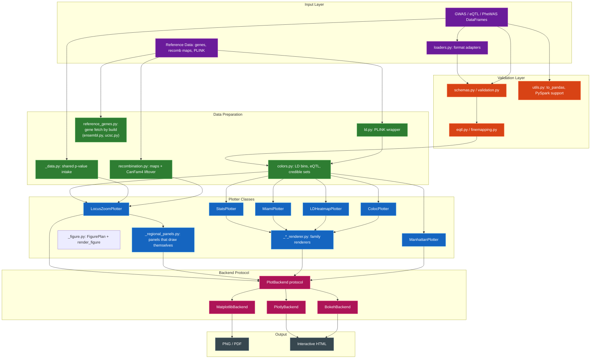

# Architecture

## System Overview

pyLocusZoom is a Python library for producing publication-ready regional
association plots for GWAS and related genetic studies, without depending on a
web service. It takes GWAS summary statistics (and optionally gene annotations,
recombination maps, PLINK genotype data, eQTL tables, fine-mapping output, or
PheWAS tables) as pandas/PySpark DataFrames, validates them at the API
boundary, assigns colors based on linkage disequilibrium (LD) or fine-mapping
credible sets, and dispatches rendering through a `PlotBackend` protocol to one
of three interchangeable backends: matplotlib (static PNG/PDF), plotly
(interactive HTML), or bokeh (interactive HTML). The architecture is a layered,
backend-pluggable pipeline: validation → data preparation → backend-agnostic
plot assembly → backend-specific rendering.

## Component Diagram


```mermaid
graph TD
    subgraph Input["Input Layer"]
        GWAS[GWAS / eQTL / PheWAS DataFrames]
        REF[Reference Data: genes, recomb maps, PLINK]
        LOAD[loaders.py: format adapters]
    end

    subgraph Validate["Validation Layer"]
        SCHEMA[schemas.py / validation.py]
        EQTLV[eqtl.py / finemapping.py]
        UTILS[utils.py: to_pandas, PySpark support]
    end

    subgraph Prepare["Data Preparation"]
        DATA[_data.py: shared p-value intake]
        LD[ld.py: PLINK wrapper]
        RECOMB[recombination.py: maps + CanFam4 liftover]
        ENSEMBL["reference_genes.py:<br/>gene fetch by build<br/>(ensembl.py, ucsc.py)"]
        COLORS[colors.py: LD bins, eQTL, credible sets]
    end

    subgraph Plotters["Plotter Classes"]
        LZ[LocusZoomPlotter]
        REGIONAL["_regional_panels.py: panels that draw themselves"]
        FIGURE["_figure.py: FigurePlan + render_figure"]
        FAMILIES[_*_renderer.py: family renderers]
        MP[ManhattanPlotter]
        SP[StatsPlotter]
        MIAMI[MiamiPlotter]
        LDH[LDHeatmapPlotter]
        CP[ColocPlotter]
    end

    subgraph Backends["Backend Protocol"]
        PROTO[PlotBackend protocol]
        MPL[MatplotlibBackend]
        PLOTLY[PlotlyBackend]
        BOKEH[BokehBackend]
    end

    subgraph Output["Output"]
        STATIC[PNG / PDF]
        HTML[Interactive HTML]
    end

    GWAS --> LOAD
    LOAD --> SCHEMA
    GWAS --> SCHEMA
    GWAS --> UTILS
    GWAS --> DATA
    REF --> ENSEMBL
    REF --> LD
    REF --> RECOMB
    SCHEMA --> EQTLV
    EQTLV --> COLORS
    LD --> COLORS
    COLORS --> LZ
    DATA --> LZ
    COLORS --> MP
    COLORS --> SP
    COLORS --> MIAMI
    COLORS --> LDH
    COLORS --> CP
    RECOMB --> LZ
    LZ --> PROTO
    LZ --> REGIONAL
    REGIONAL --> PROTO
    SP --> FAMILIES
    MIAMI --> FAMILIES
    LDH --> FAMILIES
    CP --> FAMILIES
    FAMILIES --> PROTO
    MP --> PROTO
    PROTO --> MPL
    PROTO --> PLOTLY
    PROTO --> BOKEH
    MPL --> STATIC
    PLOTLY --> HTML
    BOKEH --> HTML

    %% Palette matches docs/CODEMAP.md layer colours
    style GWAS fill:#6a1b9a,stroke:#ab47bc,color:#ffffff
    style REF fill:#6a1b9a,stroke:#ab47bc,color:#ffffff
    style LOAD fill:#6a1b9a,stroke:#ab47bc,color:#ffffff

    style SCHEMA fill:#d84315,stroke:#ff7043,color:#ffffff
    style EQTLV fill:#d84315,stroke:#ff7043,color:#ffffff
    style UTILS fill:#d84315,stroke:#ff7043,color:#ffffff

    style DATA fill:#2e7d32,stroke:#66bb6a,color:#ffffff
    style LD fill:#2e7d32,stroke:#66bb6a,color:#ffffff
    style RECOMB fill:#2e7d32,stroke:#66bb6a,color:#ffffff
    style ENSEMBL fill:#2e7d32,stroke:#66bb6a,color:#ffffff
    style COLORS fill:#2e7d32,stroke:#66bb6a,color:#ffffff

    style LZ fill:#1565c0,stroke:#42a5f5,color:#ffffff
    style REGIONAL fill:#1565c0,stroke:#42a5f5,color:#ffffff
    style FAMILIES fill:#1565c0,stroke:#42a5f5,color:#ffffff
    style MP fill:#1565c0,stroke:#42a5f5,color:#ffffff
    style SP fill:#1565c0,stroke:#42a5f5,color:#ffffff
    style MIAMI fill:#1565c0,stroke:#42a5f5,color:#ffffff
    style LDH fill:#1565c0,stroke:#42a5f5,color:#ffffff
    style CP fill:#1565c0,stroke:#42a5f5,color:#ffffff

    style PROTO fill:#ad1457,stroke:#f06292,color:#ffffff
    style MPL fill:#ad1457,stroke:#f06292,color:#ffffff
    style PLOTLY fill:#ad1457,stroke:#f06292,color:#ffffff
    style BOKEH fill:#ad1457,stroke:#f06292,color:#ffffff

    style STATIC fill:#37474f,stroke:#78909c,color:#ffffff
    style HTML fill:#37474f,stroke:#78909c,color:#ffffff
```

## Data Flow

A typical call to `LocusZoomPlotter.plot(df, chrom, start, end)` follows these
stages:

1. **Entry.** The user constructs `LocusZoomPlotter(species=..., backend=...)`
   from `src/pylocuszoom/plotter.py` and calls `plot()` or `plot_stacked()`.
   The plotter resolves the backend via `backends.get_backend(name)`, which
   lazily imports and registers the concrete backend class. It also resolves
   `species` once, through `species.resolve_species`, and stores the `Species`
   record rather than the caller's string. Everything downstream (PLINK's
   chromosome-set flags, the default genome build, the recombination source,
   the Ensembl species name, the whole-genome chromosome order) reads that one
   record, so an alias cannot mean one species to one subsystem and another to
   the next. An unknown name raises `ValidationError` here rather than
   degrading silently three layers down.
2. **Validation and intake.** The input DataFrame is normalized through
   `utils.to_pandas()` (supports PySpark input) and validated against expected
   columns. `schemas.spec(family, tier)` names the contract and
   `validation.check` runs it, strictly at `Tier.LOAD` for a frame a loader
   just parsed and permissively at `Tier.PLOT` for one the caller assembled.
   P-value-bearing plot paths
   then share `_data.prepare_pvalue_data()` for null/range filtering and finite
   `-log10` transformation.
3. **Region filtering and LD.** Rows are filtered to `[start, end]` on the
   requested chromosome. If `ld_reference_file` is supplied, `ld.py` shells
   out to PLINK via a wrapper to compute R² against the lead variant; if
   `ld_col` is already present in the DataFrame, PLINK is skipped.
4. **Color assignment.** `colors.py` maps each SNP to an LD bin color (or an
   eQTL effect-size color, credible-set color, or PheWAS category color
   depending on the plotter).
5. **Auxiliary data.** Gene annotations are assembled via `gene_track.py`, or
   fetched through `reference_genes.py`, which routes the plotter's
   `genome_build` to whichever source can serve it: `ucsc.py` for CanFam3.1,
   CanFam4 and FelCat9, `ensembl.py` for everything else. Each source answers
   with genes and exons from one request, so an automatic gene track carries
   exon structure. Recombination rates come from
   `recombination.recomb_for_region`, which handles download of bundled canine
   maps and CanFam3.1 → CanFam4 liftover through pyliftover. It never warns:
   it returns a `RecombResult` whose `RecombStatus` says whether there is a
   frame and, if not, why. The plotter turns any status other than `OK` into
   one `UserWarning` pointing at the caller's own line, so every reason the
   overlay is missing reaches the user the same way.
6. **Regional composition and backend dispatch.** `plot()` and
   `plot_stacked()` validate every keyword through `PlotConfig`, whose
   `panels` field (`PanelInputs`) carries the optional-panel data, then
   share one private pipeline, `_render_regional`, which
   builds each optional panel through its own constructor
   (`FinemappingPanel.from_frame`, `EqtlPanel.from_frame`,
   `GenePanel.from_genes`, `HeatmapPanel.from_matrix`) and puts them on a
   `FigurePlan` for `render_figure`, which creates the figure, calls each
   panel's `draw` method on its axis, labels and formats the shared
   megabase x axis, and finalizes the layout
   ([ADR-0007](adr/0007-one-figure-plan.md)). Every panel resolves its
   mode, its region and its hover contract when it is built, so the drawing
   never inspects the frame's columns; axes, labels, LD legend, SNP-label,
   and recombination policy live on the association panel, and both the
   association and eQTL significance lines go through the same
   `add_significance_line` the Manhattan family uses
   ([ADR-0006](adr/0006-one-regional-pipeline.md)). `ManhattanPlotter`
   builds `ManhattanPanelSpec` and `QQPanelSpec` values through
   `manhattan_spec`, `categorical_spec` and `stacked_manhattan_specs` and
   puts them on a `FigurePlan` as one panel, a vertical stack, or a
   two-column grid beside QQ panels. `MiamiPlotter` builds a `MiamiRequest`
   and `miami_plan` turns it into two `MiamiPanel`s (a mirrored
   `ManhattanPanelSpec` each, plus SNP annotations) and the highlights that
   span both. `StatsPlotter` builds a `PhewasPanel` or a `ForestPanel`
   through its `from_frame`; colocalisation and the standalone LD heatmap
   each build one frozen request value (`ColocRequest`, `LDHeatmapRequest`)
   and pass it to a module-level `render_*` function.
   Panels own their drawing, labels, axes and legends; `render_figure` owns
   the figure, translating intent through the existing `PlotBackend`
   primitive contract. Backend implementations translate the primitive calls
   into matplotlib Axes, plotly Figure traces, or bokeh figure glyphs.
7. **Output.** Matplotlib returns a `Figure` object; plotly and bokeh return
   their respective figure objects. Callers export with the figure's own
   methods (`fig.savefig()`, `fig.write_html()`, `bokeh.io.save()`); the
   backend contract carries drawing primitives only.

## Key Abstractions

| Abstraction | Kind | Location | Purpose |
|-------------|------|----------|---------|
| `LocusZoomPlotter` | Class | `src/pylocuszoom/plotter.py` | Primary entry point for regional association plots; orchestrates validation, LD, gene track, recombination overlay, and backend rendering |
| `FigurePlan`, `render_figure` | Internal module | `src/pylocuszoom/_figure.py` | The one figure model: an ordered list of panels on a grid plus figure-level policy (size, row and column ratios, shared-x label and megabase format, cross-panel highlights, title, layout fractions). `render_figure` is the only caller of `create_figure`, `create_figure_grid`, `set_suptitle` and `finalize_layout` outside `backends/` |
| Regional panels | Internal module | `src/pylocuszoom/_regional_panels.py` | The five panel value types, the constructor each builds itself through, and the `draw` method that draws it. A panel carries its resolved mode, region, hover contract and layout, so drawing inspects no columns |
| `MiamiRequest`, `MiamiPanel`, `miami_plan` | Internal module | `src/pylocuszoom/_miami_panels.py` | The Miami figure: a request the plotter resolves, a panel that draws one mirrored Manhattan half with its SNP annotations, and the builder that lays two of them on a `FigurePlan` with the cross-panel highlights |
| `PhewasPanel`, `ForestPanel` | Internal module | `src/pylocuszoom/_stats_panels.py` | The PheWAS and forest panels, each built through `from_frame` and drawing itself. Every family is a panel value with `draw` on a `FigurePlan`; no family holds a renderer class |
| Family renderers | Internal modules | `src/pylocuszoom/_*_renderer.py` | The colocalization and LD heatmap families: a frozen request value plus one `render_*` function |
| `ManhattanPlotter` | Class | `src/pylocuszoom/manhattan_plotter.py` | Genome-wide Manhattan and QQ plots |
| `StatsPlotter` | Class | `src/pylocuszoom/stats_plotter.py` | PheWAS and forest plots |
| `MiamiPlotter` | Class | `src/pylocuszoom/miami_plotter.py` | Mirrored Manhattan comparison plots |
| `LDHeatmapPlotter` | Class | `src/pylocuszoom/ld_heatmap_plotter.py` | Pairwise LD heatmaps |
| `ColocPlotter` | Class | `src/pylocuszoom/coloc_plotter.py` | Colocalization visualizations |
| `PlotBackend` | Protocol | `src/pylocuszoom/backends/base.py` | Structural-typing contract every backend must satisfy: drawing primitives only (figure creation, scatter/line/fill, heatmaps, error bars, the secondary axis, the region highlight, neutral `add_legend`). `add_snp_labels` is the one method left outside it |
| `backends/composition.py` | Internal module | `src/pylocuszoom/backends/composition.py` | Pure functions that compose legends and the recombination overlay above the primitive seam; owns `LegendEntry`, `render_recombination_overlay`, `lower_triangle`, and `mb_tick_positions` |
| `backends/_coerce.py` | Internal module | `src/pylocuszoom/backends/_coerce.py` | Pure coercions out of `PlotBackend`'s matplotlib vocabulary (inches to pixels, marker area to diameter, scalar broadcast) that plotly and bokeh both need |
| `backends/plotly_layout.py` | Internal module | `src/pylocuszoom/backends/plotly_layout.py` | Plotly subplot geometry as value types plus pure functions: `_Panel` is the panel handle the Plotly backend hands renderers and owns the linear subplot-index axis naming, `_SecondaryAxis` is the twin-axis handle, alongside `configure_legend`, `panel_y`, and `x_range` |
| `SupportsSNPLabels` | Optional protocol | `src/pylocuszoom/backends/base.py` | The one `@runtime_checkable` capability a backend opts into by implementing `add_snp_labels`; detected with `isinstance` |
| `ManhattanPanelSpec`, `render_manhattan_panel` | Internal module | `src/pylocuszoom/_manhattan_panel.py` | The one Manhattan-panel policy. A frozen spec names what the standard, categorical and mirrored Miami panels vary on; `render_manhattan_panel` draws any of them onto a backend axis, and `manhattan_spec`, `categorical_spec` and `stacked_manhattan_specs` build the specs the plotters put on their `FigurePlan` |
| `QQPanelSpec`, `render_qq_panel` | Internal module | `src/pylocuszoom/_qq_panel.py` | The one QQ-panel policy, beside `ManhattanPanelSpec`. A frozen spec names what the standalone, side-by-side and stacked QQ panels vary on, and the pure `qq_title` builds the three title variants |
| `GenomeLayout`, `CategoryLayout`, `PreparedManhattan` | Internal values | `src/pylocuszoom/manhattan.py` | Where each chromosome or category sits on the x axis: order, offsets, colours, tick centres, and limits. `prepare_manhattan_frames` computes one layout from every frame of a figure and returns each frame paired with it as a `PreparedManhattan`, so Miami and stacked panels share offsets and ticks instead of deriving their own. `qq.PreparedQQ` is the same shape for a QQ panel: the quantile frame with its `lambda_gc` and `n_variants` |
| `prepare_pvalue_data` | Internal function | `src/pylocuszoom/_data.py` | Shared p-value intake policy: filtering, zero-value mode, and finite `-log10` transformation. Every family routes through it, and the transformed column is `neglog10p` everywhere except colocalization, which needs two of them and names them `neglog10_gwas` and `neglog10_eqtl` |
| `@register_backend` | Decorator | `src/pylocuszoom/backends/__init__.py` | Registers a backend class into `_BACKENDS`; enables adding custom backends without touching core code |
| `BUILTIN_BACKENDS` | Constant | `src/pylocuszoom/backends/__init__.py` | The backend names shipped with the library, derived from `BackendType` so the two cannot drift; contract tests parametrize over it |
| `get_backend(name)` | Function | `src/pylocuszoom/backends/__init__.py` | Lazy-imports and returns a backend instance by name, raising `ImportError` with install instructions when an optional backend is missing |
| `PyLocusZoomError` hierarchy | Exceptions | `src/pylocuszoom/exceptions.py` | Root type for all library errors; specialized subclasses (`ValidationError`, `PlinkError`, `DataDownloadError` with `ReferenceAPIError` beneath it, plus per-data-type validation errors) |
| Loader functions | Functions | `src/pylocuszoom/loaders.py` | Format adapters that read PLINK `.assoc`, REGENIE, BOLT-LMM, GEMMA, SAIGE, GWAS Catalog, GTEx, SuSiE, FINEMAP, CAVIAR, PolyFun, GTF, BED, and Ensembl into canonical DataFrames |

## Directory Structure Rationale

The project uses a standard `src/`-layout Python package (`pyproject.toml` with
`hatchling` as the build backend), so the package lives under
`src/pylocuszoom/` and is installed via `uv` or `pip`. Within the package,
modules are organized by responsibility rather than by data flow stage — this
keeps related validation, data-prep, and rendering code for each feature
co-located, while cross-cutting concerns (colors, backends, utilities) live in
shared modules.

```text
pyLocusZoom/
├── src/pylocuszoom/           # The installable package
│   ├── __init__.py            # Public API re-exports (stable surface)
│   ├── plotter.py             # LocusZoomPlotter — regional plot orchestration
│   ├── manhattan_plotter.py   # Manhattan/QQ plotter class
│   ├── manhattan.py           # GenomeLayout and Manhattan frame preparation
│   ├── qq.py                  # QQ plot primitives
│   ├── stats_plotter.py       # StatsPlotter — PheWAS and forest plots
│   ├── miami_plotter.py       # Miami (mirrored Manhattan) plotter
│   ├── ld_heatmap_plotter.py  # Pairwise LD heatmap plotter
│   ├── coloc_plotter.py       # Colocalization plotter
│   ├── _data.py               # Shared p-value intake and transformation policy
│   ├── _plotter_utils.py      # Shared internals (compatibility transform, sig lines)
│   ├── _figure.py             # FigurePlan and render_figure, the one figure model
│   ├── _regional_panels.py    # Regional panel value types, each drawing itself
│   ├── _miami_panels.py        # Miami request, panel, and plan builder
│   ├── _stats_panels.py        # PheWAS and forest panels
│   ├── _coloc_renderer.py      # Colocalization figure composition
│   ├── _ld_heatmap_renderer.py # Standalone LD heatmap composition
│   ├── _manhattan_panel.py    # ManhattanPanelSpec and the one function that draws it
│   ├── _qq_panel.py           # QQPanelSpec and the one function that draws it
│   ├── backends/              # Pluggable rendering backends
│   │   ├── __init__.py        # Backend registry (@register_backend, get_backend)
│   │   ├── base.py            # PlotBackend protocol + optional capability protocols
│   │   ├── composition.py     # Legend and recombination-overlay composition above the seam
│   │   ├── _coerce.py         # Coercions out of matplotlib's vocabulary, shared by plotly and bokeh
│   │   ├── matplotlib_backend.py
│   │   ├── plotly_backend.py
│   │   ├── plotly_layout.py   # Plotly subplot geometry: _Panel, _SecondaryAxis, pure helpers
│   │   ├── bokeh_backend.py
│   │   └── hover.py           # Hover tooltip helpers for interactive backends
│   ├── colors.py              # LD bins, eQTL, credible-set, PheWAS palettes
│   ├── ld.py                  # PLINK wrapper for R² calculation
│   ├── _ld_plotting.py        # LD intake and merge for the regional plot
│   ├── recombination.py       # Recomb map loading + CanFam4 liftover
│   ├── _liftover.py           # pyliftover adapter behind a Lifter protocol
│   ├── gene_track.py          # Gene region filter, row layout, strand-arrow geometry
│   ├── ensembl.py             # Ensembl REST client with caching
│   ├── ucsc.py                # UCSC REST client for assemblies Ensembl retired
│   ├── reference_genes.py     # Build-to-source routing and the one fetch-and-cache orchestrator
│   ├── _gene_source.py        # GeneSource, GeneAnnotations, and the frame schema
│   ├── _gene_cache.py         # Disk cache shared by both gene sources
│   ├── _http.py               # Retrying JSON GET and file download
│   ├── labels.py              # adjustText-based SNP label placement
│   ├── eqtl.py                # eQTL validation and filtering
│   ├── finemapping.py         # SuSiE / fine-mapping validation, filtering, credible sets
│   ├── loaders.py             # Format adapters (PLINK, REGENIE, GTEx, SuSiE, GTF, BED, …)
│   ├── schemas.py             # Every family's column contract, at both tiers
│   ├── validation.py          # Shared validation primitives
│   ├── utils.py               # DataFrame helpers; to_pandas() handles PySpark
│   ├── config.py              # Internal PlotConfig / StackedPlotConfig (not public)
│   ├── exceptions.py          # PyLocusZoomError hierarchy
│   ├── logging.py             # enable_logging / disable_logging (loguru)
│   └── py.typed               # PEP 561 marker — ships with type hints
├── tests/                     # pytest suite (parallelized, randomized, timeout 30s)
├── docs/                      # Project documentation (this file lives here)
├── examples/                  # Runnable example scripts, incl. README plot generator
├── CHANGELOG.md               # Release notes
└── pyproject.toml             # Build system, deps, ruff/pytest config
```

The `backends/` subpackage is the single point of extensibility for new
renderers — adding a backend means writing one module that implements
`PlotBackend` and decorating it with `@register_backend("name")`. No plotter
class needs to change. Recombination maps are downloaded lazily at runtime by
`recombination.ensure_recomb_maps()` and `download_canine_recombination_maps()`
into the platform cache directory (`utils._platform_cache_base()`), rather than
shipping ~50 MB of maps in the wheel.

### Custom backends in 2.0

2.0 completes the rendering seam, which breaks the 1.x extension contract. A
custom backend needs three changes.

**1. One neutral `add_legend`.** The five semantic legend methods
(`add_ld_legend`, `add_effect_legend`, `add_eqtl_legend`,
`add_finemapping_legend`, `add_simple_legend`) are gone, and the old generic
`add_legend(handles, labels)` is replaced. Legend content is now built above the
seam by pure functions in `backends/composition.py` and handed down as
`LegendEntry` values:

```python
def add_legend(self, ax, entries: list[LegendEntry], loc="upper left", title=None):
    """entries carry label, color, marker ("patch" or a marker code), edgecolor."""
```

Backends must honour `loc` (matplotlib's vocabulary) and each entry's
`edgecolor`, falling back to black when it is `None`. No drawing primitive
takes a label, so `add_legend` is the only route to legend content.

**2. `add_recombination_overlay` is gone.** The overlay is composed from
primitives by `composition.render_recombination_overlay()`. A backend that wants
the overlay implements `SupportsSecondaryAxis`: `create_twin_axis(ax)` returns
a per-backend handle, `set_secondary_ylim` and `set_secondary_ylabel` take that
handle, and `line` and `fill_between` accept it in place of a panel to draw
against the secondary scale.

**3. Capabilities are protocols, not booleans.** The `supports_snp_labels` and
`supports_secondary_axis` properties are removed. Optional capabilities are
detected with `isinstance` against `@runtime_checkable` protocols, so a backend
declares support by implementing the methods and declines by omitting them:
`SupportsRegionHighlight`, `SupportsSNPLabels`, `SupportsSecondaryAxis`. Only
`SupportsSNPLabels` is still optional; see "One optional capability" below.
`supports_hover` stays a boolean, because it is a rendering-quality flag with no
method to key on.

No compatibility shim is provided. See
[ADR-0004](adr/0004-complete-rendering-seam-and-capability-protocols.md) for the
reasoning.

### One optional capability

`SupportsHeatmap`, `SupportsErrorBars`, `SupportsSecondaryAxis` and
`SupportsRegionHighlight` were folded back into `PlotBackend`. All three shipped
backends implemented all four, so every `isinstance` gate on them guarded a
branch no backend reached, and the three call sites had invented three different
policies for a case that could not occur. `SupportsSNPLabels` remains the one
optional protocol, because it needs adjustText and plotly and bokeh really do
decline it. See
[ADR-0005](adr/0005-heatmap-and-bar-chart-capability-protocols.md) for the split
and why it was reversed.

`add_heatmap`, `add_colorbar`, `errorbar_h`, `create_twin_axis`,
`set_secondary_ylim`, `set_secondary_ylabel` and `add_region_highlight` are
required methods again. A backend that implements every required method and no
`add_snp_labels` still renders every regional, Manhattan, Miami, colocalisation
and PheWAS plot.

Two pieces of shared drawing knowledge sit above the seam rather than in each
adapter. `composition.heatmap_highlight_rects(snp_idx, x_coords, y_coords)`
returns the outline rectangles marking a SNP, in the same data coordinates the
heatmap was drawn in, and the renderer draws them through `add_rectangle`, so no
adapter derives cell geometry. `hover.plotly_hovertemplate`
and `hover.bokeh_tooltips` build the tooltip spec from a hover DataFrame, so the
column-name-to-number-format heuristic has one owner.
