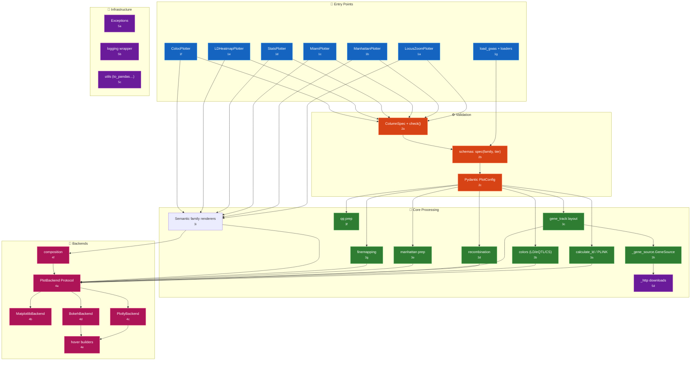
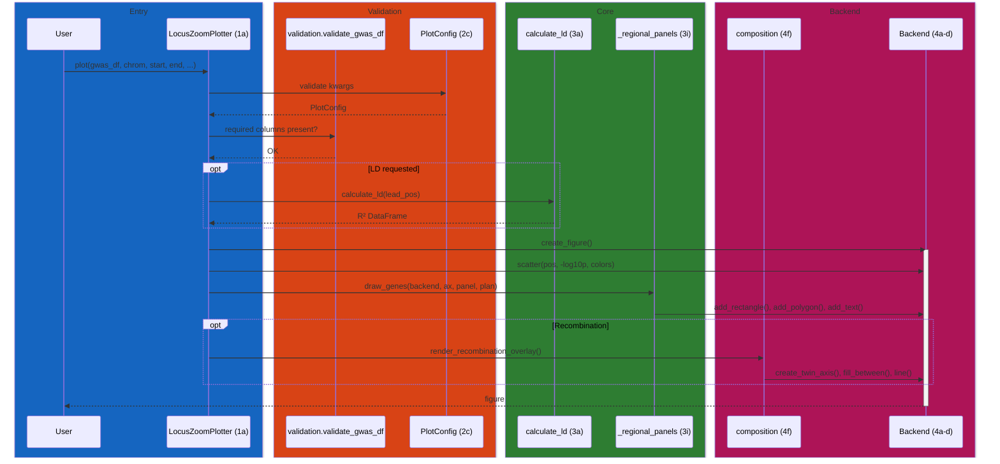
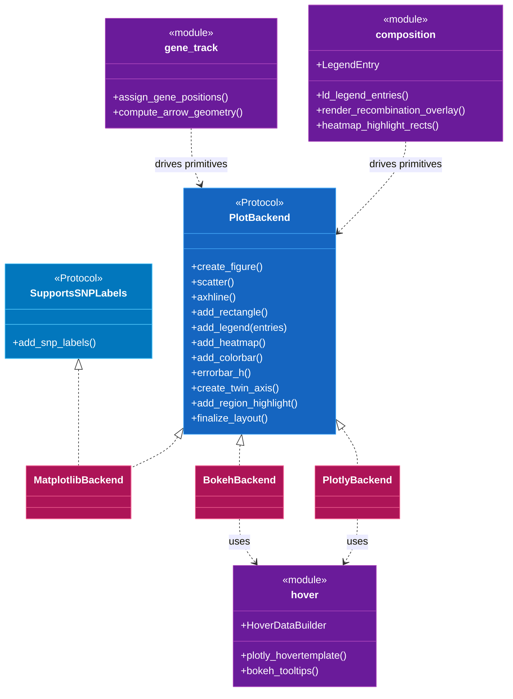

# pyLocusZoom Code Map

Navigation between the architecture diagram and source code. Each component has a stable ID (`[1a]`, `[2b]`, …) that appears in the overview diagram and the reference tables below. Source references link to files instead of volatile line numbers.

## System Overview



---

## [1] Entry Points

User-facing plotter classes and data loaders. Each plotter owns a single plot family and delegates to the backend layer.

| ID | Component | Description | File |
|----|-----------|-------------|-----------|
| 1a | LocusZoomPlotter | Regional association plots (single/stacked) | [plotter.py](../src/pylocuszoom/plotter.py) |
| 1b | ManhattanPlotter | Genome-wide Manhattan / QQ plots | [manhattan_plotter.py](../src/pylocuszoom/manhattan_plotter.py) |
| 1c | MiamiPlotter | Two-trait mirrored Manhattan plots | [miami_plotter.py](../src/pylocuszoom/miami_plotter.py) |
| 1d | StatsPlotter | PheWAS and forest plots | [stats_plotter.py](../src/pylocuszoom/stats_plotter.py) |
| 1e | LDHeatmapPlotter | Pairwise LD heatmaps | [ld_heatmap_plotter.py](../src/pylocuszoom/ld_heatmap_plotter.py) |
| 1f | ColocPlotter | Colocalisation scatter (GWAS × eQTL) | [coloc_plotter.py](../src/pylocuszoom/coloc_plotter.py) |
| 1g | load_gwas | Auto-detecting GWAS format loader | [loaders.py](../src/pylocuszoom/loaders.py) |
| 1g | LoaderSpec | Frozen per-format loader contract (separator, renames, p-value and first-present candidates, transform) driven by one `_load_tabular` engine | [loaders.py](../src/pylocuszoom/loaders.py) |

### File Loaders [1g]

Each static format is a `LoaderSpec` constant plus a thin public wrapper. `load_gtf`, `load_bed`, and `load_caviar` stay bespoke where the table did not fit.

| Domain | Formats | Entry points |
|--------|---------|--------------|
| GWAS | PLINK, REGENIE, BOLT-LMM, GEMMA, SAIGE, GWAS Catalog | [loaders.py](../src/pylocuszoom/loaders.py) |
| eQTL | GTEx, eQTL Catalogue, MatrixEQTL | [loaders.py](../src/pylocuszoom/loaders.py) |
| Fine-mapping | SuSiE, FINEMAP, CAVIAR, PolyFun | [loaders.py](../src/pylocuszoom/loaders.py) |
| Genes | GTF, BED, Ensembl | [loaders.py](../src/pylocuszoom/loaders.py) |

---

## [2] Validation

One validation engine, driven declaratively. `validation.py` holds the rule vocabulary, a frozen `ColumnSpec` and the `check(df, spec)` function that runs it, and knows no family. `schemas.py` holds every family contract at both tiers in one table, looked up with `spec(family, tier)`: `Tier.LOAD` is the strict contract a loader applies, `Tier.PLOT` the permissive one a plotter applies. Plot options validate via Pydantic.

| ID | Component | Description | File |
|----|-----------|-------------|-----------|
| 2a | ColumnSpec | Frozen per-family validation contract (required, numeric, not-null, ranges, p-value, ordering) | [validation.py](../src/pylocuszoom/validation.py) |
| 2a | RangeRule | One numeric-range constraint inside a `ColumnSpec` | [validation.py](../src/pylocuszoom/validation.py) |
| 2a | check | Runs a `ColumnSpec` against a DataFrame in fixed rule order | [validation.py](../src/pylocuszoom/validation.py) |
| 2b | Family, Tier | The DataFrame family and the validation tier a contract is looked up by | [schemas.py](../src/pylocuszoom/schemas.py) |
| 2b | spec | Returns the `ColumnSpec` for one family at one tier | [schemas.py](../src/pylocuszoom/schemas.py) |
| 2b | validate_gwas_df, validate_genes_df | Plot-time GWAS and gene-annotation checks | [schemas.py](../src/pylocuszoom/schemas.py) |
| 2b | validate_phewas_df, validate_forest_df, validate_coloc_df | Plot-time checks for the statistical families | [schemas.py](../src/pylocuszoom/schemas.py) |
| 2c | PlotConfig | Pydantic model for `plot()` kwargs | [config.py](../src/pylocuszoom/config.py) |
| 2c | StackedPlotConfig | Pydantic model for `plot_stacked()` | [config.py](../src/pylocuszoom/config.py) |
| 2c | PanelInputs | Optional-panel data carried on `PlotConfig.panels` | [config.py](../src/pylocuszoom/config.py) |

---

## [3] Core Processing

Data transformation between validated input and backend-ready primitives.

| ID | Component | Description | File |
|----|-----------|-------------|-----------|
| 3a | calculate_ld | PLINK wrapper, lead-SNP R² | [ld.py](../src/pylocuszoom/ld.py) |
| 3a | find_plink | Locate PLINK executable | [ld.py](../src/pylocuszoom/ld.py) |
| 3a | Species, resolve_species | The one record a species resolves to, and the boundary parser every entry point calls | [species.py](../src/pylocuszoom/species.py) |
| 3b | get_ld_color | Map R² → hex colour | [colors.py](../src/pylocuszoom/colors.py) |
| 3b | get_credible_set_color | CS index → colour | [colors.py](../src/pylocuszoom/colors.py) |
| 3b | get_eqtl_color | eQTL effect size → colour | [colors.py](../src/pylocuszoom/colors.py) |
| 3c | assign_gene_positions | Overlap-free gene row layout | [gene_track.py](../src/pylocuszoom/gene_track.py) |
| 3c | compute_arrow_geometry | Strand-arrow tip positions and dimensions | [gene_track.py](../src/pylocuszoom/gene_track.py) |
| 3d | get_recombination_rate_for_region | Region-filtered recomb rate | [recombination.py](../src/pylocuszoom/recombination.py) |
| 3d | download_canine_recombination_maps | Lazy-download bundled maps | [recombination.py](../src/pylocuszoom/recombination.py) |
| 3d | recomb_for_region, RecombResult | The one place the skip-the-overlay decision is made, reported as a value | [recombination.py](../src/pylocuszoom/recombination.py) |
| 3d | download_recombination_maps, RecombSource | Species-generic download, extract and publish; the record carries everything that varies | [recombination.py](../src/pylocuszoom/recombination.py) |
| 3e | prepare_manhattan_frames | Cumulative-position Manhattan prep against one shared `GenomeLayout` | [manhattan.py](../src/pylocuszoom/manhattan.py) |
| 3e | GenomeLayout | Chromosome order, offsets, colours, ticks, and x limits for every panel of a figure | [manhattan.py](../src/pylocuszoom/manhattan.py) |
| 3f | prepare_qq_data | Observed vs expected QQ data | [qq.py](../src/pylocuszoom/qq.py) |
| 3g | prepare_finemapping_for_plotting | PIP/credible-set prep | [finemapping.py](../src/pylocuszoom/finemapping.py) |
| 3h | GeneSource, GeneAnnotations, GENE_COLUMNS | The value types and frame schema both sources produce, in a leaf neither imports back | [_gene_source.py](../src/pylocuszoom/_gene_source.py) |
| 3h | source_for, get_genes_for_build | The build-to-source routing and the one fetch-and-cache orchestration | [reference_genes.py](../src/pylocuszoom/reference_genes.py) |
| 3h | ensembl_source, fetch_overlap_frames | Ensembl REST client | [ensembl.py](../src/pylocuszoom/ensembl.py) |
| 3h | ucsc_source, fetch_track_frames | UCSC track client, used for CanFam3.1, CanFam4 and FelCat9 | [ucsc.py](../src/pylocuszoom/ucsc.py) |
| 3h | gene cache | On-disk cache shared by both gene sources | [_gene_cache.py](../src/pylocuszoom/_gene_cache.py) |
| 3j | enrich_with_ld | Calls PLINK for lead-SNP R² and merges it into the GWAS frame under one recovery policy | [_ld_plotting.py](../src/pylocuszoom/_ld_plotting.py) |
| 3j | prepare_pvalue_data | Shared p-value intake: filtering, zero-value mode, finite `-log10` | [_data.py](../src/pylocuszoom/_data.py) |
| 3j | prepare_eqtl_for_plotting | eQTL panel prep | [eqtl.py](../src/pylocuszoom/eqtl.py) |
| 3j | calculate_colocalization_overlap | Colocalisation overlap between two association frames | [eqtl.py](../src/pylocuszoom/eqtl.py) |
| 3j | add_snp_labels | SNP label placement and lead-proximity filtering | [labels.py](../src/pylocuszoom/labels.py) |
| 3j | liftover | CanFam3.1 to CanFam4 coordinate lift for recombination maps | [_liftover.py](../src/pylocuszoom/_liftover.py) |
| 3j | UNSET, resolve_threshold | The significance-threshold sentinel every threshold-bearing plotter uses, which keeps `None` meaning "draw no line" | [_plotter_utils.py](../src/pylocuszoom/_plotter_utils.py) |
| 3i | Regional panels | The five regional panel value types and the `draw_*` function each dispatches to | [_regional_panels.py](../src/pylocuszoom/_regional_panels.py) |
| 3i | MiamiRequest, ColocRequest, LDHeatmapRequest | One frozen request per family, built by the plotter and consumed by `render_miami`, `render_coloc` and `render_ld_heatmap` | [_miami_renderer.py](../src/pylocuszoom/_miami_renderer.py), [_coloc_renderer.py](../src/pylocuszoom/_coloc_renderer.py), [_ld_heatmap_renderer.py](../src/pylocuszoom/_ld_heatmap_renderer.py) |
| 3i | Semantic family renderers | Panel composition and backend-neutral figure intent | [_rendering.py](../src/pylocuszoom/_rendering.py), [_regional.py](../src/pylocuszoom/_regional.py), [_miami_renderer.py](../src/pylocuszoom/_miami_renderer.py), [_stats_renderer.py](../src/pylocuszoom/_stats_renderer.py), [_coloc_renderer.py](../src/pylocuszoom/_coloc_renderer.py), [_ld_heatmap_renderer.py](../src/pylocuszoom/_ld_heatmap_renderer.py) |
| 3i | QQPanelSpec, render_qq_panel | One typed QQ-panel request and the function that draws it, used by the standalone, side-by-side and stacked QQ panels | [_qq_panel.py](../src/pylocuszoom/_qq_panel.py) |
| 3i | ManhattanPanelSpec, render_manhattan_panel | One typed panel request carrying its shared `GenomeLayout`, and the function that draws it, used by the standard, categorical and Miami panels, since a Miami plot is a mirrored Manhattan | [_manhattan_panel.py](../src/pylocuszoom/_manhattan_panel.py) |

### LD Colour Bins [3b]

```python
# from src/pylocuszoom/colors.py
LD_BINS = [
    (0.8, "0.8 - 1.0", "#FF0000"),
    (0.6, "0.6 - 0.8", "#FFA500"),
    (0.4, "0.4 - 0.6", "#00CD00"),
    (0.2, "0.2 - 0.4", "#00EEEE"),
    (0.0, "0.0 - 0.2", "#4169E1"),
]
LEAD_SNP_COLOR = "#7D26CD"
```

---

## [4] Backends

Rendering protocol plus three concrete implementations. Backends are discovered via a registry (`backends/__init__.py`). As of 2.0 the protocol carries drawing primitives only; legend and recombination-overlay composition sits above it in `composition.py`, and optional capabilities are negotiated with `@runtime_checkable` protocols.

| ID | Component | Description | File |
|----|-----------|-------------|-----------|
| 4a | PlotBackend | Protocol defining required methods | [base.py](../src/pylocuszoom/backends/base.py) |
| 4a | SupportsSNPLabels | The one optional `@runtime_checkable` capability, detected with `isinstance` | [base.py](../src/pylocuszoom/backends/base.py) |
| 4b | MatplotlibBackend | Static publication plots | [matplotlib_backend.py](../src/pylocuszoom/backends/matplotlib_backend.py) |
| 4c | PlotlyBackend | Interactive HTML with hover | [plotly_backend.py](../src/pylocuszoom/backends/plotly_backend.py) |
| 4d | BokehBackend | Dashboard-friendly interactive | [bokeh_backend.py](../src/pylocuszoom/backends/bokeh_backend.py) |
| 4e | hover | `HoverDataBuilder` plus the shared `plotly_hovertemplate` / `bokeh_tooltips` builders | [hover.py](../src/pylocuszoom/backends/hover.py) |
| 4f | composition | Legend, recombination-overlay, and heatmap-highlight composition above the primitive seam | [composition.py](../src/pylocuszoom/backends/composition.py) |
| 4g | _coerce | Coercions out of matplotlib's vocabulary (figure sizing, marker area, scalar broadcast) shared by the interactive backends | [_coerce.py](../src/pylocuszoom/backends/_coerce.py) |
| 4h | plotly_layout | Plotly subplot geometry: the `_Panel` and `_SecondaryAxis` value types and pure layout helpers | [plotly_layout.py](../src/pylocuszoom/backends/plotly_layout.py) |

### Backend Capabilities

`SupportsSNPLabels` is the only `@runtime_checkable` protocol in
[base.py](../src/pylocuszoom/backends/base.py); gate on
`isinstance(backend, SupportsSNPLabels)`, never on the backend name.

| Protocol | matplotlib | plotly | bokeh |
|----------|:----------:|:------:|:-----:|
| `SupportsSNPLabels` | ✅ | ❌ | ❌ |

It needs adjustText, which has no plotly or bokeh equivalent. Every other
capability is a required `PlotBackend` method, because all three backends
implemented all four of the protocols that used to hold them. The recombination
overlay is not a protocol: it composes above the seam in `composition.py` on top
of `create_twin_axis`. Static export and hover are
backend properties rather than capabilities (matplotlib writes PNG/PDF/SVG and
has no hover; plotly and bokeh write HTML and do). A custom backend opts in by
implementing the methods and out by omitting them; see
[ARCHITECTURE.md](ARCHITECTURE.md#optional-capabilities-in-21).

---

## [5] Infrastructure

| ID | Component | Description | File |
|----|-----------|-------------|-----------|
| 5a | PyLocusZoomError | Exception hierarchy root | [exceptions.py](../src/pylocuszoom/exceptions.py) |
| 5b | enable_logging | Loguru/stdlib logging facade | [logging.py](../src/pylocuszoom/logging.py) |
| 5c | to_pandas | PySpark → pandas bridge | [utils.py](../src/pylocuszoom/utils.py) |
| 5c | normalize_chrom | Chromosome string normaliser | [utils.py](../src/pylocuszoom/utils.py) |
| 5d | download_file | The one HTTP download path: retries, atomic writes, progress | [_http.py](../src/pylocuszoom/_http.py) |

### Exception Hierarchy [5a]

```text
PyLocusZoomError
├── ValidationError (also ValueError)
│   ├── EQTLValidationError
│   ├── FinemappingValidationError
│   ├── LoaderValidationError
│   ├── PheWASValidationError
│   └── ForestValidationError
├── OptionalDependencyMissing (also ImportError)
├── PlinkError (also RuntimeError)
│   └── EmptyLDOutputError
└── DataDownloadError (also RuntimeError)
    └── ReferenceAPIError
        ├── EnsemblAPIError
        └── UCSCAPIError
```

---

## Data Flow: Regional Plot



---

## Backend Registry [4a]



---

## Public API Surface

Every name in `pylocuszoom.__all__`, grouped by the module that defines it.
`tests/test_public_surface.py` fails when a name is added to `__all__` and not
listed here. [docs/USER_GUIDE.md](USER_GUIDE.md) is a curated guide, not a
complete reference; this table is the complete one.

### Regional plots

| Name | Purpose |
|------|---------|
| `LocusZoomPlotter` | Regional association plot generator with LD coloring and annotations. |

### Manhattan and QQ plots

| Name | Purpose |
|------|---------|
| `ManhattanPlotter` | Manhattan and QQ plot generator for genome-wide visualizations. |

### Miami plots

| Name | Purpose |
|------|---------|
| `MiamiPlotter` | Miami plot generator for comparing two GWAS datasets. |

### PheWAS and forest plots

| Name | Purpose |
|------|---------|
| `StatsPlotter` | Statistical visualization plotter for PheWAS and forest plots. |

### LD heatmaps

| Name | Purpose |
|------|---------|
| `LDHeatmapPlotter` | LD heatmap generator for pairwise LD visualization. |

### Colocalisation plots

| Name | Purpose |
|------|---------|
| `ColocPlotter` | Colocalization scatter plot generator. |

### File loaders

| Name | Purpose |
|------|---------|
| `load_bed` | Load gene annotations from BED file. |
| `load_bolt_lmm` | Load BOLT-LMM association results (.stats). |
| `load_caviar` | Load CAVIAR results (.set output file). |
| `load_ensembl_genes` | Load Ensembl BioMart gene export. |
| `load_eqtl_catalogue` | Load eQTL Catalogue format. |
| `load_finemap` | Load FINEMAP results (.snp output file). |
| `load_gemma` | Load GEMMA association results (.assoc.txt). |
| `load_gtex_eqtl` | Load GTEx eQTL significant pairs format. |
| `load_gtf` | Load gene annotations from GTF/GFF3 file. |
| `load_gwas` | Load GWAS results with automatic format detection. |
| `load_gwas_catalog` | Load GWAS Catalog summary statistics format. |
| `load_matrixeqtl` | Load MatrixEQTL output format. |
| `load_plink_assoc` | Load PLINK association results (.assoc, .assoc.linear, .assoc.logistic, .qassoc). |
| `load_polyfun` | Load PolyFun/SuSiE fine-mapping results. |
| `load_regenie` | Load REGENIE association results (.regenie). |
| `load_saige` | Load SAIGE association results. |
| `load_susie` | Load SuSiE fine-mapping results. |

### Schema validators

| Name | Purpose |
|------|---------|
| `validate_forest_df` | Validate forest plot DataFrame has required columns and types. |
| `validate_phewas_df` | Validate PheWAS DataFrame has required columns and types. |

### eQTL helpers

| Name | Purpose |
|------|---------|
| `calculate_colocalization_overlap` | Find SNPs significant in both GWAS and eQTL. |
| `filter_eqtl_by_gene` | Filter eQTL data to a specific target gene. |
| `filter_eqtl_by_region` | Filter eQTL data to a genomic region. |
| `get_eqtl_genes` | Get list of unique genes in eQTL data. |
| `prepare_eqtl_for_plotting` | Prepare eQTL data for plotting. |
| `validate_eqtl_df` | Validate eQTL DataFrame has required columns. |

### Fine-mapping helpers

| Name | Purpose |
|------|---------|
| `filter_by_credible_set` | Filter to variants in a specific credible set. |
| `filter_finemapping_by_region` | Filter fine-mapping data to a genomic region. |
| `get_credible_sets` | Get list of unique credible set IDs. |
| `get_top_pip_variants` | Get top variants by posterior inclusion probability. |
| `prepare_finemapping_for_plotting` | Prepare fine-mapping data for plotting. |
| `validate_finemapping_df` | Validate fine-mapping DataFrame has required columns. |

### LD calculation

| Name | Purpose |
|------|---------|
| `calculate_ld` | Calculate LD (R²) between a lead SNP and all SNPs in a region. |
| `calculate_pairwise_ld` | Calculate pairwise LD matrix for a set of variants. |

### SNP labels

| Name | Purpose |
|------|---------|
| `add_snp_labels` | Add text labels to top SNPs in the regional plot. |
| `adjust_snp_labels` | Adjust SNP label positions to avoid overlaps. |

### Gene track

| Name | Purpose |
|------|---------|
| `get_nearest_gene` | Get the nearest gene name for a genomic position. |

### Recombination maps

| Name | Purpose |
|------|---------|
| `download_canine_recombination_maps` | Download canine recombination rate maps from Campbell et al. 2016. |
| `ensure_recomb_maps` | Ensure recombination maps are available, downloading if needed. |
| `get_recombination_rate_for_region` | Get recombination rate data for a genomic region. |
| `load_recombination_map` | Load recombination map for a specific chromosome. |
| `recomb_for_region` | Get a region's recombination rates, or a `RecombStatus` saying why there are none. |
| `RecombResult` | The outcome of one region's recombination query: status, frame, detail. |
| `RecombStatus` | Why a region does or does not have recombination rates to draw. |

### Gene reference routing

| Name | Purpose |
|------|---------|
| `clear_gene_cache` | Clear one source's cached gene files. |
| `get_genes_for_build` | Get the gene annotations for a region from one source. |
| `source_for` | Pick the GeneSource that can serve this species and genome build. |

### Ensembl client

| Name | Purpose |
|------|---------|
| `get_ensembl_species_name` | Convert species alias to Ensembl species name. |

### Species

| Name | Purpose |
|------|---------|
| `Species` | Everything pyLocusZoom knows about one species: Ensembl name, PLINK flags, default build, chromosome order. |
| `resolve_species` | Resolve a species name or alias to its record; an unknown name becomes an Ensembl-only record. |

### Backends

| Name | Purpose |
|------|---------|
| `BackendType` | Literal type of the built-in backend names. |
| `get_backend` | Get a backend instance by name. |

### Colours

| Name | Purpose |
|------|---------|
| `get_ld_bin` | Get LD bin label for categorical coloring. |
| `get_ld_color` | Get LocusZoom-style color based on LD R² value. |
| `get_ld_color_palette` | Get color palette mapping bin labels to colors. |
| `get_phewas_category_color` | Get color for a PheWAS category by index. |
| `get_phewas_category_palette` | Get color palette mapping category names to colors. |

### Logging

| Name | Purpose |
|------|---------|
| `disable_logging` | Disable logging output. |
| `enable_logging` | Enable logging output. |

### Utilities

| Name | Purpose |
|------|---------|
| `to_pandas` | Convert DataFrame-like object to pandas DataFrame. |

### Exceptions

| Name | Purpose |
|------|---------|
| `DataDownloadError` | Raised when data download operations fail. |
| `EQTLValidationError` | Raised when eQTL DataFrame validation fails. |
| `EmptyLDOutputError` | Raised when PLINK succeeds but produces no LD pairs. |
| `EnsemblAPIError` | Raised when the Ensembl REST API is unreachable or returns an error. |
| `FinemappingValidationError` | Raised when fine-mapping DataFrame validation fails. |
| `ForestValidationError` | Raised when forest plot DataFrame validation fails. |
| `LoaderValidationError` | Raised when loaded data fails validation. |
| `OptionalDependencyMissing` | Raised when a feature needs an optional extra that is not installed. |
| `PheWASValidationError` | Raised when PheWAS DataFrame validation fails. |
| `PlinkError` | Raised when PLINK subprocess fails. |
| `PyLocusZoomError` | Base exception for all pyLocusZoom errors. |
| `ReferenceAPIError` | Raised when a reference-annotation API is unreachable or errors. |
| `UCSCAPIError` | Raised when the UCSC REST API is unreachable or returns an error. |
| `ValidationError` | Raised when input validation fails. Inherits ValueError for backward compat. |

### Package metadata and constants

| Name | Purpose |
|------|---------|
| `LEAD_SNP_COLOR` | Hex colour the plotters use for the lead SNP. |
| `PHEWAS_CATEGORY_COLORS` | Ordered colour cycle for PheWAS categories. |
| `__version__` | The installed package version. |

## Quick Navigation

| Area | Entry Point |
|------|-------------|
| Regional plots | [plotter.py](../src/pylocuszoom/plotter.py) |
| Manhattan / QQ | [manhattan_plotter.py](../src/pylocuszoom/manhattan_plotter.py) |
| Miami (two-trait) | [miami_plotter.py](../src/pylocuszoom/miami_plotter.py) |
| PheWAS / forest | [stats_plotter.py](../src/pylocuszoom/stats_plotter.py) |
| LD heatmap | [ld_heatmap_plotter.py](../src/pylocuszoom/ld_heatmap_plotter.py) |
| Colocalisation | [coloc_plotter.py](../src/pylocuszoom/coloc_plotter.py) |
| Data loaders | [loaders.py](../src/pylocuszoom/loaders.py) |
| DataFrame validator | [validation.py](../src/pylocuszoom/validation.py) |
| Pydantic config | [config.py](../src/pylocuszoom/config.py) |
| Backend protocol | [backends/base.py](../src/pylocuszoom/backends/base.py) |
| Colour scheme | [colors.py](../src/pylocuszoom/colors.py) |
| LD / PLINK | [ld.py](../src/pylocuszoom/ld.py) |
| Gene track layout | [gene_track.py](../src/pylocuszoom/gene_track.py) |
| Species records | [species.py](../src/pylocuszoom/species.py) |
| Recombination maps | [recombination.py](../src/pylocuszoom/recombination.py) |
| Gene reference routing | [reference_genes.py](../src/pylocuszoom/reference_genes.py) |
| Gene source value type | [_gene_source.py](../src/pylocuszoom/_gene_source.py) |
| Ensembl REST client | [ensembl.py](../src/pylocuszoom/ensembl.py) |
| UCSC gene client | [ucsc.py](../src/pylocuszoom/ucsc.py) |
| HTTP downloads | [_http.py](../src/pylocuszoom/_http.py) |
| Exceptions | [exceptions.py](../src/pylocuszoom/exceptions.py) |
