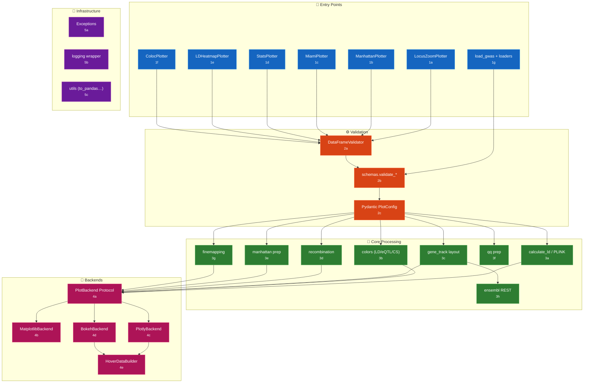
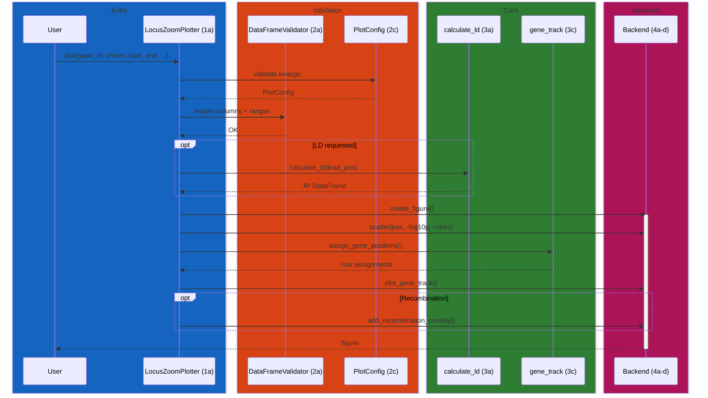
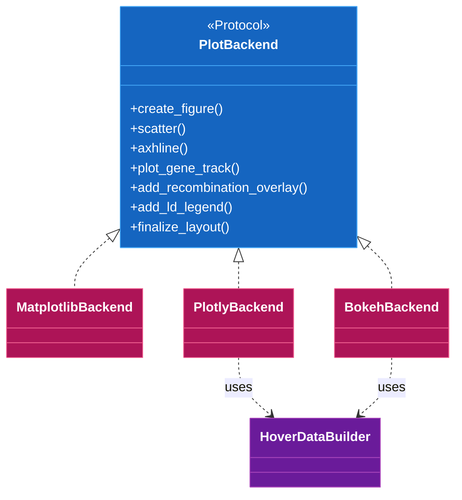

# pyLocusZoom Code Map

Bidirectional navigation between the architecture diagram and source code. Each component has a stable ID (`[1a]`, `[2b]`, …) that appears in the overview diagram, in a reference table below, and as a one-line comment at the referenced file:line.

## System Overview



---

## [1] Entry Points

User-facing plotter classes and data loaders. Each plotter owns a single plot family and delegates to the backend layer.

| ID | Component | Description | File:Line |
|----|-----------|-------------|-----------|
| 1a | LocusZoomPlotter | Regional association plots (single/stacked) | [plotter.py:58](../src/pylocuszoom/plotter.py#L58) |
| 1b | ManhattanPlotter | Genome-wide Manhattan / QQ plots | [manhattan_plotter.py:33](../src/pylocuszoom/manhattan_plotter.py#L33) |
| 1c | MiamiPlotter | Two-trait mirrored Manhattan plots | [miami_plotter.py:25](../src/pylocuszoom/miami_plotter.py#L25) |
| 1d | StatsPlotter | PheWAS and forest plots | [stats_plotter.py:20](../src/pylocuszoom/stats_plotter.py#L20) |
| 1e | LDHeatmapPlotter | Pairwise LD heatmaps | [ld_heatmap_plotter.py:20](../src/pylocuszoom/ld_heatmap_plotter.py#L20) |
| 1f | ColocPlotter | Colocalisation scatter (GWAS × eQTL) | [coloc_plotter.py:69](../src/pylocuszoom/coloc_plotter.py#L69) |
| 1g | load_gwas | Auto-detecting GWAS format loader | [loaders.py:849](../src/pylocuszoom/loaders.py#L849) |

### File Loaders [1g]

| Domain | Formats | Entry points |
|--------|---------|--------------|
| GWAS | PLINK, REGENIE, BOLT-LMM, GEMMA, SAIGE, GWAS Catalog | [loaders.py:67–296](../src/pylocuszoom/loaders.py#L67) |
| eQTL | GTEx, eQTL Catalogue, MatrixEQTL | [loaders.py:333–438](../src/pylocuszoom/loaders.py#L333) |
| Fine-mapping | SuSiE, FINEMAP, CAVIAR, PolyFun | [loaders.py:480–625](../src/pylocuszoom/loaders.py#L480) |
| Genes | GTF, BED, Ensembl | [loaders.py:667–800](../src/pylocuszoom/loaders.py#L667) |

---

## [2] Validation

Two validation styles coexist: a fluent builder (`DataFrameValidator`) for ad-hoc checks, and per-DataFrame schema functions in `schemas.py`. Plot options validate via Pydantic.

| ID | Component | Description | File:Line |
|----|-----------|-------------|-----------|
| 2a | DataFrameValidator | Fluent DataFrame validator | [validation.py:15](../src/pylocuszoom/validation.py#L15) |
| 2b | validate_gwas_dataframe | GWAS column/type/range checks | [schemas.py:19](../src/pylocuszoom/schemas.py#L19) |
| 2b | validate_eqtl_dataframe | eQTL schema validation | [schemas.py:96](../src/pylocuszoom/schemas.py#L96) |
| 2b | validate_finemapping_dataframe | Fine-mapping schema validation | [schemas.py:149](../src/pylocuszoom/schemas.py#L149) |
| 2c | PlotConfig | Pydantic model for `plot()` kwargs | [config.py:132](../src/pylocuszoom/config.py#L132) |
| 2c | StackedPlotConfig | Pydantic model for `plot_stacked()` | [config.py:238](../src/pylocuszoom/config.py#L238) |

---

## [3] Core Processing

Data transformation between validated input and backend-ready primitives.

| ID | Component | Description | File:Line |
|----|-----------|-------------|-----------|
| 3a | calculate_ld | PLINK wrapper, lead-SNP R² | [ld.py:249](../src/pylocuszoom/ld.py#L249) |
| 3a | find_plink | Locate PLINK executable | [ld.py:100](../src/pylocuszoom/ld.py#L100) |
| 3b | get_ld_color | Map R² → hex colour | [colors.py:177](../src/pylocuszoom/colors.py#L177) |
| 3b | get_credible_set_color | CS index → colour | [colors.py:244](../src/pylocuszoom/colors.py#L244) |
| 3b | get_eqtl_color | eQTL effect size → colour | [colors.py:125](../src/pylocuszoom/colors.py#L125) |
| 3c | assign_gene_positions | Overlap-free gene row layout | [gene_track.py:37](../src/pylocuszoom/gene_track.py#L37) |
| 3c | plot_gene_track_generic | Backend-agnostic gene rendering | [gene_track.py:414](../src/pylocuszoom/gene_track.py#L414) |
| 3d | get_recombination_rate_for_region | Region-filtered recomb rate | [recombination.py:387](../src/pylocuszoom/recombination.py#L387) |
| 3d | download_canine_recombination_maps | Lazy-download bundled maps | [recombination.py:225](../src/pylocuszoom/recombination.py#L225) |
| 3e | prepare_manhattan_data | Cumulative-position Manhattan prep | [manhattan.py:129](../src/pylocuszoom/manhattan.py#L129) |
| 3f | prepare_qq_data | Observed vs expected QQ data | [qq.py:68](../src/pylocuszoom/qq.py#L68) |
| 3g | prepare_finemapping_for_plotting | PIP/credible-set prep | [finemapping.py:127](../src/pylocuszoom/finemapping.py#L127) |
| 3h | get_genes_for_region | Ensembl REST with disk cache | [ensembl.py:412](../src/pylocuszoom/ensembl.py#L412) |

### LD Colour Bins [3b]

```python
# from src/pylocuszoom/colors.py
LD_BINS = [
    (0.8, "0.8 - 1.0", "#FF0000"),
    (0.6, "0.6 - 0.8", "#FFA500"),
    (0.4, "0.4 - 0.6", "#00CD00"),
    (0.2, "0.2 - 0.4", "#00EEEE"),
    (0.0, "0.0 - 0.2", "#4169E1"),
]
LEAD_SNP_COLOR = "#7D26CD"
```

---

## [4] Backends

Rendering protocol plus three concrete implementations. Backends are discovered via a registry (`backends/__init__.py`); the protocol defines the method surface every implementation must satisfy.

| ID | Component | Description | File:Line |
|----|-----------|-------------|-----------|
| 4a | PlotBackend | Protocol defining required methods | [backends/base.py:14](../src/pylocuszoom/backends/base.py#L14) |
| 4b | MatplotlibBackend | Static publication plots | [backends/matplotlib_backend.py:19](../src/pylocuszoom/backends/matplotlib_backend.py#L19) |
| 4c | PlotlyBackend | Interactive HTML with hover | [backends/plotly_backend.py:31](../src/pylocuszoom/backends/plotly_backend.py#L31) |
| 4d | BokehBackend | Dashboard-friendly interactive | [backends/bokeh_backend.py:33](../src/pylocuszoom/backends/bokeh_backend.py#L33) |
| 4e | HoverDataBuilder | Uniform hover tooltip construction | [backends/hover.py:33](../src/pylocuszoom/backends/hover.py#L33) |

### Backend Capabilities

| Backend | Static Export | Hover | Recomb Overlay | SNP Labels |
|---------|---------------|-------|----------------|------------|
| matplotlib | PNG/PDF/SVG | ❌ | ✅ | ✅ (adjustText) |
| plotly | HTML | ✅ | ✅ | ❌ |
| bokeh | HTML | ✅ | ✅ | ❌ |

---

## [5] Infrastructure

| ID | Component | Description | File:Line |
|----|-----------|-------------|-----------|
| 5a | PyLocusZoomError | Exception hierarchy root | [exceptions.py:8](../src/pylocuszoom/exceptions.py#L8) |
| 5b | enable_logging | Loguru/stdlib logging facade | [logging.py:173](../src/pylocuszoom/logging.py#L173) |
| 5c | to_pandas | PySpark → pandas bridge | [utils.py:35](../src/pylocuszoom/utils.py#L35) |
| 5c | normalize_chrom | Chromosome string normaliser | [utils.py:87](../src/pylocuszoom/utils.py#L87) |

### Exception Hierarchy [5a]

```text
PyLocusZoomError
├── ValidationError (also ValueError)
│   ├── EQTLValidationError
│   ├── FinemappingValidationError
│   ├── LoaderValidationError
│   ├── PheWASValidationError
│   └── ForestValidationError
├── BackendError
├── PlinkError (also RuntimeError)
└── DataDownloadError (also RuntimeError)
```

---

## Data Flow: Regional Plot



---

## Backend Registry [4a]



---

## Quick Navigation

| Area | Entry Point |
|------|-------------|
| Regional plots | [plotter.py](../src/pylocuszoom/plotter.py) |
| Manhattan / QQ | [manhattan_plotter.py](../src/pylocuszoom/manhattan_plotter.py) |
| Miami (two-trait) | [miami_plotter.py](../src/pylocuszoom/miami_plotter.py) |
| PheWAS / forest | [stats_plotter.py](../src/pylocuszoom/stats_plotter.py) |
| LD heatmap | [ld_heatmap_plotter.py](../src/pylocuszoom/ld_heatmap_plotter.py) |
| Colocalisation | [coloc_plotter.py](../src/pylocuszoom/coloc_plotter.py) |
| Data loaders | [loaders.py](../src/pylocuszoom/loaders.py) |
| DataFrame validator | [validation.py](../src/pylocuszoom/validation.py) |
| Pydantic config | [config.py](../src/pylocuszoom/config.py) |
| Backend protocol | [backends/base.py](../src/pylocuszoom/backends/base.py) |
| Colour scheme | [colors.py](../src/pylocuszoom/colors.py) |
| LD / PLINK | [ld.py](../src/pylocuszoom/ld.py) |
| Gene track layout | [gene_track.py](../src/pylocuszoom/gene_track.py) |
| Recombination maps | [recombination.py](../src/pylocuszoom/recombination.py) |
| Ensembl REST client | [ensembl.py](../src/pylocuszoom/ensembl.py) |
| Exceptions | [exceptions.py](../src/pylocuszoom/exceptions.py) |
