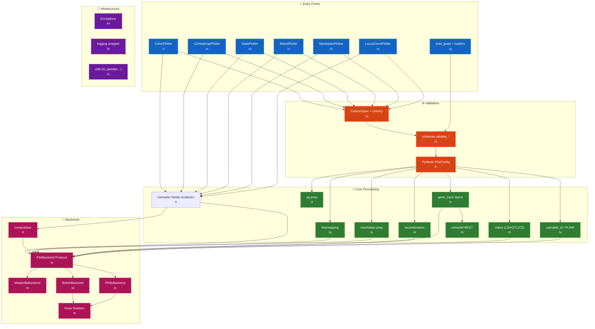
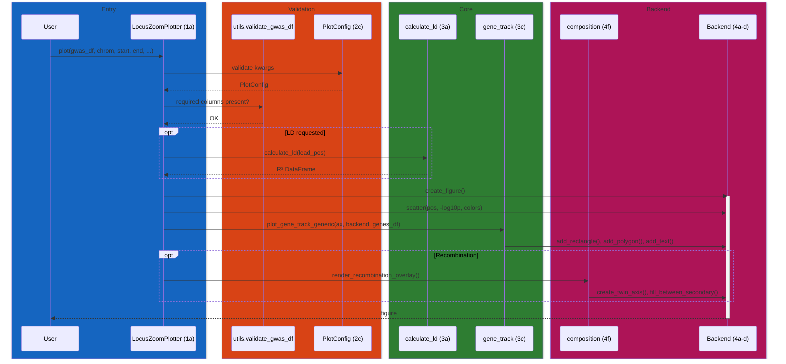
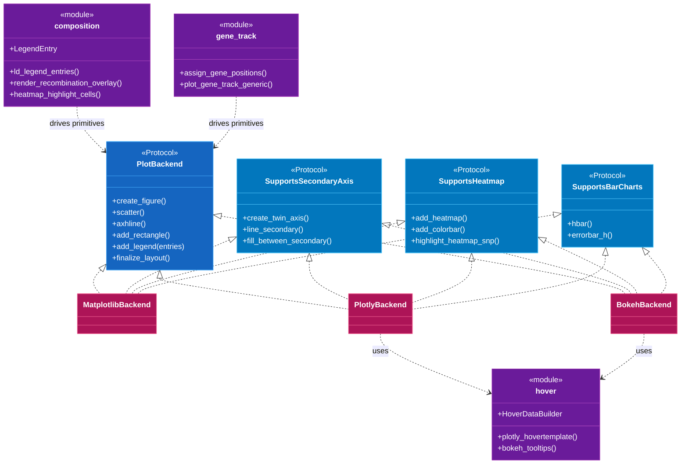

# pyLocusZoom Code Map

Navigation between the architecture diagram and source code. Each component has a stable ID (`[1a]`, `[2b]`, …) that appears in the overview diagram and the reference tables below. Source references link to files instead of volatile line numbers.

## System Overview



---

## [1] Entry Points

User-facing plotter classes and data loaders. Each plotter owns a single plot family and delegates to the backend layer.

| ID | Component | Description | File |
|----|-----------|-------------|-----------|
| 1a | LocusZoomPlotter | Regional association plots (single/stacked) | [plotter.py](../src/pylocuszoom/plotter.py) |
| 1b | ManhattanPlotter | Genome-wide Manhattan / QQ plots | [manhattan_plotter.py](../src/pylocuszoom/manhattan_plotter.py) |
| 1c | MiamiPlotter | Two-trait mirrored Manhattan plots | [miami_plotter.py](../src/pylocuszoom/miami_plotter.py) |
| 1d | StatsPlotter | PheWAS and forest plots | [stats_plotter.py](../src/pylocuszoom/stats_plotter.py) |
| 1e | LDHeatmapPlotter | Pairwise LD heatmaps | [ld_heatmap_plotter.py](../src/pylocuszoom/ld_heatmap_plotter.py) |
| 1f | ColocPlotter | Colocalisation scatter (GWAS × eQTL) | [coloc_plotter.py](../src/pylocuszoom/coloc_plotter.py) |
| 1g | load_gwas | Auto-detecting GWAS format loader | [loaders.py](../src/pylocuszoom/loaders.py) |
| 1g | LoaderSpec | Frozen per-format loader contract (separator, renames, p-value and first-present candidates, transform) driven by one `_load_tabular` engine | [loaders.py](../src/pylocuszoom/loaders.py) |

### File Loaders [1g]

Each static format is a `LoaderSpec` constant plus a thin public wrapper. `load_gtf`, `load_bed`, and `load_caviar` stay bespoke where the table did not fit.

| Domain | Formats | Entry points |
|--------|---------|--------------|
| GWAS | PLINK, REGENIE, BOLT-LMM, GEMMA, SAIGE, GWAS Catalog | [loaders.py](../src/pylocuszoom/loaders.py) |
| eQTL | GTEx, eQTL Catalogue, MatrixEQTL | [loaders.py](../src/pylocuszoom/loaders.py) |
| Fine-mapping | SuSiE, FINEMAP, CAVIAR, PolyFun | [loaders.py](../src/pylocuszoom/loaders.py) |
| Genes | GTF, BED, Ensembl | [loaders.py](../src/pylocuszoom/loaders.py) |

---

## [2] Validation

One validation engine, driven declaratively. Each family states its rules as a frozen `ColumnSpec` and runs it through the `check(df, spec)` function; `DataFrameValidator` is the rule runner `check` drives internally, and no production module builds one directly. The strict load-time schemas live in `schemas.py`; plot-time validation in `utils` is deliberately more permissive. Plot options validate via Pydantic.

| ID | Component | Description | File |
|----|-----------|-------------|-----------|
| 2a | ColumnSpec | Frozen per-family validation contract (required, numeric, not-null, ranges, p-value, ordering) | [validation.py](../src/pylocuszoom/validation.py) |
| 2a | RangeRule | One numeric-range constraint inside a `ColumnSpec` | [validation.py](../src/pylocuszoom/validation.py) |
| 2a | check | Runs a `ColumnSpec` against a DataFrame in fixed rule order | [validation.py](../src/pylocuszoom/validation.py) |
| 2a | DataFrameValidator | Fluent rule runner behind `check` | [validation.py](../src/pylocuszoom/validation.py) |
| 2b | validate_gwas_dataframe | GWAS column/type/range checks | [schemas.py](../src/pylocuszoom/schemas.py) |
| 2b | validate_eqtl_dataframe | eQTL schema validation | [schemas.py](../src/pylocuszoom/schemas.py) |
| 2b | validate_finemapping_dataframe | Fine-mapping schema validation | [schemas.py](../src/pylocuszoom/schemas.py) |
| 2c | PlotConfig | Pydantic model for `plot()` kwargs | [config.py](../src/pylocuszoom/config.py) |
| 2c | StackedPlotConfig | Pydantic model for `plot_stacked()` | [config.py](../src/pylocuszoom/config.py) |

---

## [3] Core Processing

Data transformation between validated input and backend-ready primitives.

| ID | Component | Description | File |
|----|-----------|-------------|-----------|
| 3a | calculate_ld | PLINK wrapper, lead-SNP R² | [ld.py](../src/pylocuszoom/ld.py) |
| 3a | find_plink | Locate PLINK executable | [ld.py](../src/pylocuszoom/ld.py) |
| 3b | get_ld_color | Map R² → hex colour | [colors.py](../src/pylocuszoom/colors.py) |
| 3b | get_credible_set_color | CS index → colour | [colors.py](../src/pylocuszoom/colors.py) |
| 3b | get_eqtl_color | eQTL effect size → colour | [colors.py](../src/pylocuszoom/colors.py) |
| 3c | assign_gene_positions | Overlap-free gene row layout | [gene_track.py](../src/pylocuszoom/gene_track.py) |
| 3c | plot_gene_track_generic | Backend-agnostic gene rendering | [gene_track.py](../src/pylocuszoom/gene_track.py) |
| 3d | get_recombination_rate_for_region | Region-filtered recomb rate | [recombination.py](../src/pylocuszoom/recombination.py) |
| 3d | download_canine_recombination_maps | Lazy-download bundled maps | [recombination.py](../src/pylocuszoom/recombination.py) |
| 3e | prepare_manhattan_data | Cumulative-position Manhattan prep | [manhattan.py](../src/pylocuszoom/manhattan.py) |
| 3f | prepare_qq_data | Observed vs expected QQ data | [qq.py](../src/pylocuszoom/qq.py) |
| 3g | prepare_finemapping_for_plotting | PIP/credible-set prep | [finemapping.py](../src/pylocuszoom/finemapping.py) |
| 3h | get_genes_for_region | Ensembl REST with disk cache | [ensembl.py](../src/pylocuszoom/ensembl.py) |
| 3i | Semantic family renderers | Panel composition and backend-neutral figure intent | [_rendering.py](../src/pylocuszoom/_rendering.py), [_regional.py](../src/pylocuszoom/_regional.py), [_miami_renderer.py](../src/pylocuszoom/_miami_renderer.py), [_stats_renderer.py](../src/pylocuszoom/_stats_renderer.py), [_coloc_renderer.py](../src/pylocuszoom/_coloc_renderer.py), [_ld_heatmap_renderer.py](../src/pylocuszoom/_ld_heatmap_renderer.py) |
| 3i | render_manhattan_points, shared_manhattan_limits | Per-chromosome scatter loop and axis padding shared by the Manhattan and Miami renderers, since a Miami plot is a mirrored Manhattan | [_manhattan_panel.py](../src/pylocuszoom/_manhattan_panel.py) |

### LD Colour Bins [3b]

```python
# from src/pylocuszoom/colors.py
LD_BINS = [
    (0.8, "0.8 - 1.0", "#FF0000"),
    (0.6, "0.6 - 0.8", "#FFA500"),
    (0.4, "0.4 - 0.6", "#00CD00"),
    (0.2, "0.2 - 0.4", "#00EEEE"),
    (0.0, "0.0 - 0.2", "#4169E1"),
]
LEAD_SNP_COLOR = "#7D26CD"
```

---

## [4] Backends

Rendering protocol plus three concrete implementations. Backends are discovered via a registry (`backends/__init__.py`). As of 2.0 the protocol carries drawing primitives only; legend and recombination-overlay composition sits above it in `composition.py`, and optional capabilities are negotiated with `@runtime_checkable` protocols.

| ID | Component | Description | File |
|----|-----------|-------------|-----------|
| 4a | PlotBackend | Protocol defining required methods | [base.py](../src/pylocuszoom/backends/base.py) |
| 4a | SupportsRegionHighlight, SupportsSNPLabels, SupportsSecondaryAxis, SupportsHeatmap, SupportsBarCharts | Optional `@runtime_checkable` capabilities, detected with `isinstance` | [base.py](../src/pylocuszoom/backends/base.py) |
| 4b | MatplotlibBackend | Static publication plots | [matplotlib_backend.py](../src/pylocuszoom/backends/matplotlib_backend.py) |
| 4c | PlotlyBackend | Interactive HTML with hover | [plotly_backend.py](../src/pylocuszoom/backends/plotly_backend.py) |
| 4d | BokehBackend | Dashboard-friendly interactive | [bokeh_backend.py](../src/pylocuszoom/backends/bokeh_backend.py) |
| 4e | hover | `HoverDataBuilder` plus the shared `plotly_hovertemplate` / `bokeh_tooltips` builders | [hover.py](../src/pylocuszoom/backends/hover.py) |
| 4f | composition | Legend, recombination-overlay, and heatmap-highlight composition above the primitive seam | [composition.py](../src/pylocuszoom/backends/composition.py) |

### Backend Capabilities

| Backend | Static Export | Hover | Recomb Overlay | Region Highlight | SNP Labels | Heatmap | Bar Charts |
|---------|---------------|-------|----------------|------------------|------------|---------|------------|
| matplotlib | PNG/PDF/SVG | ❌ | ✅ | ✅ | ✅ (adjustText) | ✅ | ✅ |
| plotly | HTML | ✅ | ✅ | ✅ | ❌ | ✅ | ✅ |
| bokeh | HTML | ✅ | ✅ | ✅ | ❌ | ✅ | ✅ |

Every column except Static Export and Hover is an optional `@runtime_checkable`
capability. A custom backend opts in by implementing the methods and out by
omitting them; see [ARCHITECTURE.md](ARCHITECTURE.md#optional-capabilities-in-21).

---

## [5] Infrastructure

| ID | Component | Description | File |
|----|-----------|-------------|-----------|
| 5a | PyLocusZoomError | Exception hierarchy root | [exceptions.py](../src/pylocuszoom/exceptions.py) |
| 5b | enable_logging | Loguru/stdlib logging facade | [logging.py](../src/pylocuszoom/logging.py) |
| 5c | to_pandas | PySpark → pandas bridge | [utils.py](../src/pylocuszoom/utils.py) |
| 5c | normalize_chrom | Chromosome string normaliser | [utils.py](../src/pylocuszoom/utils.py) |

### Exception Hierarchy [5a]

```text
PyLocusZoomError
├── ValidationError (also ValueError)
│   ├── EQTLValidationError
│   ├── FinemappingValidationError
│   ├── LoaderValidationError
│   ├── PheWASValidationError
│   └── ForestValidationError
├── PlinkError (also RuntimeError)
│   └── EmptyLDOutputError
└── DataDownloadError (also RuntimeError)
    └── ReferenceAPIError
        ├── EnsemblAPIError
        └── UCSCAPIError
```

---

## Data Flow: Regional Plot



---

## Backend Registry [4a]



---

## Quick Navigation

| Area | Entry Point |
|------|-------------|
| Regional plots | [plotter.py](../src/pylocuszoom/plotter.py) |
| Manhattan / QQ | [manhattan_plotter.py](../src/pylocuszoom/manhattan_plotter.py) |
| Miami (two-trait) | [miami_plotter.py](../src/pylocuszoom/miami_plotter.py) |
| PheWAS / forest | [stats_plotter.py](../src/pylocuszoom/stats_plotter.py) |
| LD heatmap | [ld_heatmap_plotter.py](../src/pylocuszoom/ld_heatmap_plotter.py) |
| Colocalisation | [coloc_plotter.py](../src/pylocuszoom/coloc_plotter.py) |
| Data loaders | [loaders.py](../src/pylocuszoom/loaders.py) |
| DataFrame validator | [validation.py](../src/pylocuszoom/validation.py) |
| Pydantic config | [config.py](../src/pylocuszoom/config.py) |
| Backend protocol | [backends/base.py](../src/pylocuszoom/backends/base.py) |
| Colour scheme | [colors.py](../src/pylocuszoom/colors.py) |
| LD / PLINK | [ld.py](../src/pylocuszoom/ld.py) |
| Gene track layout | [gene_track.py](../src/pylocuszoom/gene_track.py) |
| Recombination maps | [recombination.py](../src/pylocuszoom/recombination.py) |
| Ensembl REST client | [ensembl.py](../src/pylocuszoom/ensembl.py) |
| Exceptions | [exceptions.py](../src/pylocuszoom/exceptions.py) |
