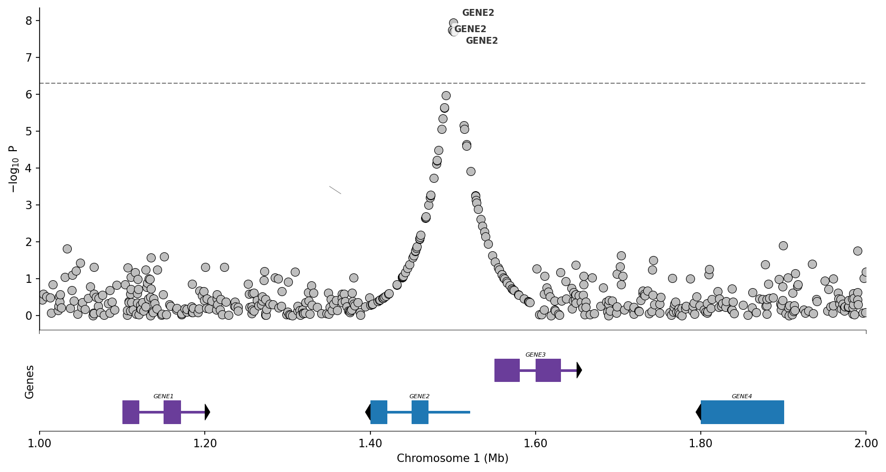
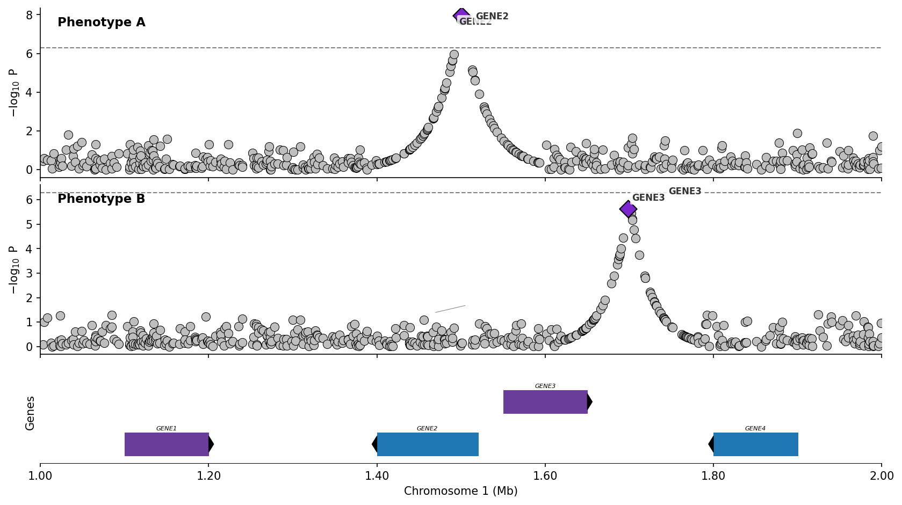
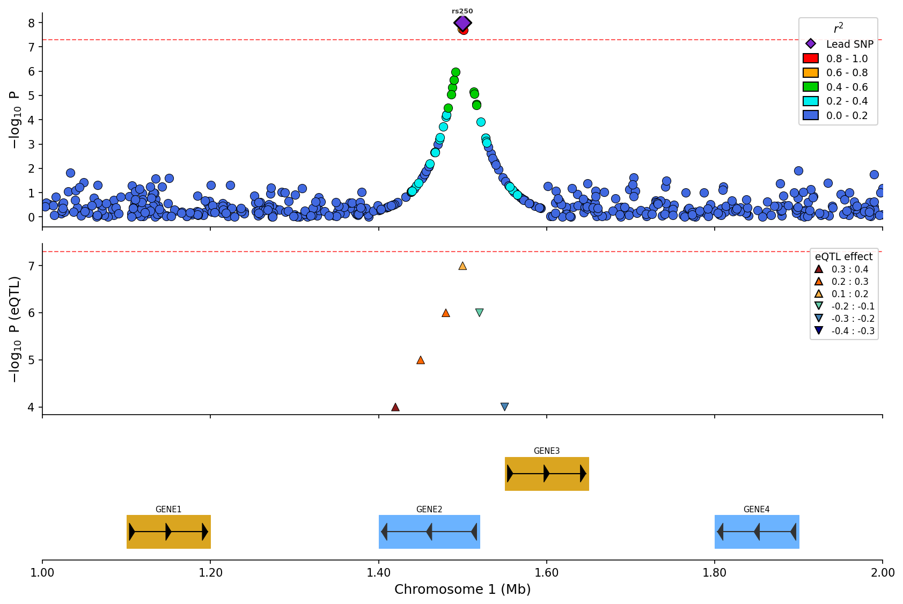
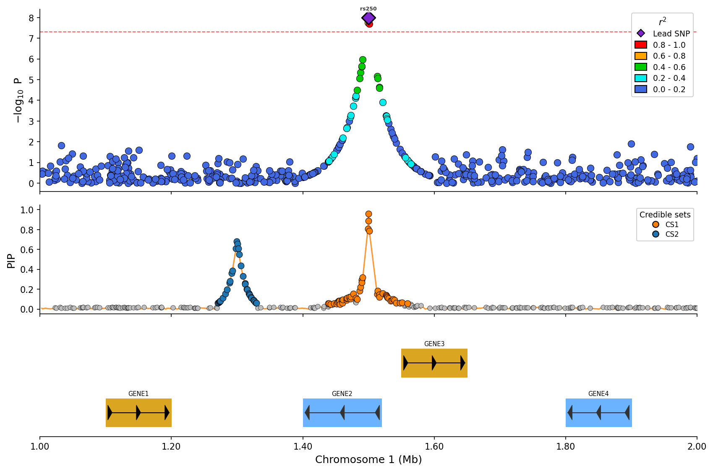

# pyLocusZoom User Guide

Comprehensive documentation for pyLocusZoom - regional association plots for GWAS results with LD coloring, gene tracks, and recombination rate overlays.

## Table of Contents

- [Installation](#installation)
- [Quick Start](#quick-start)
- [Plot Types](#plot-types)
  - [Regional Association Plot](#regional-association-plot)
  - [Stacked Plots](#stacked-plots)
  - [eQTL Overlay](#eqtl-overlay)
  - [Fine-mapping Visualization](#fine-mapping-visualization)
- [Backends](#backends)
  - [Matplotlib (Static)](#matplotlib-static)
  - [Plotly (Interactive)](#plotly-interactive)
  - [Bokeh (Dashboard)](#bokeh-dashboard)
- [API Reference](#api-reference)
  - [LocusZoomPlotter](#locuszoomplotter)
  - [plot() Method](#plot-method)
  - [plot_stacked() Method](#plot_stacked-method)
- [File Loaders](#file-loaders)
  - [GWAS Loaders](#gwas-loaders)
  - [eQTL Loaders](#eqtl-loaders)
  - [Fine-mapping Loaders](#fine-mapping-loaders)
  - [Gene Annotation Loaders](#gene-annotation-loaders)
- [Data Formats](#data-formats)
- [Species Support](#species-support)
- [Recipes & Examples](#recipes--examples)

---

## Installation

### pip (PyPI)

```bash
pip install pylocuszoom
```

### uv

```bash
uv add pylocuszoom
```

### conda (Bioconda)

```bash
conda install -c bioconda pylocuszoom
```

### Optional Dependencies

```bash
# For PySpark DataFrame support
pip install pylocuszoom[spark]
```

### External Requirements

**PLINK 1.9** is required for LD calculations. Install from [cog-genomics.org/plink](https://www.cog-genomics.org/plink/) and ensure it's on your PATH, or specify the path via `plink_path` parameter.

---

## Quick Start

```python
import pandas as pd
from pylocuszoom import LocusZoomPlotter

# Sample GWAS data
gwas_df = pd.DataFrame({
    "ps": [1000000, 1000500, 1001000, 1001500, 1002000],
    "p_wald": [0.05, 1e-4, 1e-8, 1e-6, 0.01],
    "rs": ["rs1", "rs2", "rs3", "rs4", "rs5"],
})

# Create plotter
plotter = LocusZoomPlotter(species="canine")

# Generate plot
fig = plotter.plot(
    gwas_df,
    chrom=1,
    start=999000,
    end=1003000,
    lead_pos=1001000,  # Highlight the most significant SNP
)

# Save
fig.savefig("my_plot.png", dpi=150, bbox_inches="tight")
```

---

## Plot Types

### Regional Association Plot

The basic single-panel plot showing association signals with LD coloring.



```python
fig = plotter.plot(
    gwas_df,
    chrom=1,
    start=1000000,
    end=2000000,
    lead_pos=1500000,           # Lead SNP position
    ld_reference_file="geno",   # PLINK fileset for LD calculation
    genes_df=genes_df,          # Gene annotations
    exons_df=exons_df,          # Exon structure (optional)
    show_recombination=True,    # Recombination rate overlay
    snp_labels=True,            # Label top SNPs (matplotlib only)
    label_top_n=5,              # How many to label
)
```

**Features:**
- SNPs colored by R² with lead variant (purple → red gradient)
- Lead SNP shown as purple diamond
- Gene track with intron/exon structure
- Recombination rate overlay (blue line, right y-axis)
- Genome-wide significance line (red dashed, default 5e-8)
- SNP labels with RS IDs or nearest gene names (matplotlib only)

### Stacked Plots

Compare multiple GWAS results vertically with a shared x-axis.



```python
fig = plotter.plot_stacked(
    [gwas_height, gwas_bmi, gwas_whr],
    chrom=1,
    start=1000000,
    end=2000000,
    lead_positions=[1500000, 1480000, 1520000],  # Per-panel leads
    panel_labels=["Height", "BMI", "WHR"],
    genes_df=genes_df,
)
```

**Features:**
- Vertical stacking with aligned x-axes
- Independent LD coloring per panel
- Shared gene track at bottom
- Optional recombination overlay (top panel only)

### eQTL Overlay

Add expression QTL data as a separate panel below GWAS results.



```python
eqtl_df = pd.DataFrame({
    "pos": [1000500, 1001200, 1002000],
    "p_value": [1e-6, 1e-4, 0.01],
    "gene": ["BRCA1", "BRCA1", "BRCA1"],
    "effect": [0.5, -0.3, 0.1],  # Optional: colors by effect direction
})

fig = plotter.plot_stacked(
    [gwas_df],
    chrom=1,
    start=1000000,
    end=2000000,
    eqtl_df=eqtl_df,
    eqtl_gene="BRCA1",  # Filter to specific gene
    genes_df=genes_df,
)
```

**Features:**
- Separate panel for eQTL associations
- Color by effect direction (red = positive, blue = negative)
- Filter to specific target gene

### Fine-mapping Visualization

Visualize SuSiE or other fine-mapping results with credible set coloring.



```python
finemapping_df = pd.DataFrame({
    "pos": [1000500, 1001200, 1002000, 1003500],
    "pip": [0.85, 0.12, 0.02, 0.45],  # Posterior inclusion probability
    "cs": [1, 1, 0, 2],               # Credible set (0 = not in CS)
})

fig = plotter.plot_stacked(
    [gwas_df],
    chrom=1,
    start=1000000,
    end=2000000,
    finemapping_df=finemapping_df,
    finemapping_cs_col="cs",
    genes_df=genes_df,
)
```

**Features:**
- PIP values shown as line plot
- Credible sets colored distinctly (CS1 = red, CS2 = blue, etc.)
- Variants not in credible sets shown in gray

---

## Backends

pyLocusZoom supports three rendering backends for different use cases.

| Backend | Output | Best For | SNP Labels |
|---------|--------|----------|------------|
| `matplotlib` | PNG, PDF, SVG | Publications, presentations | Yes (adjustText) |
| `plotly` | Interactive HTML | Web reports, exploration | No (hover instead) |
| `bokeh` | Interactive HTML | Dashboards, web apps | No (hover instead) |

### Matplotlib (Static)

Default backend for publication-quality static plots.

```python
plotter = LocusZoomPlotter(species="canine", backend="matplotlib")
fig = plotter.plot(gwas_df, chrom=1, start=1e6, end=2e6)
fig.savefig("plot.png", dpi=300, bbox_inches="tight")
fig.savefig("plot.pdf")  # Vector format for publications
```

**Unique features:**
- SNP labels with automatic positioning (adjustText library)
- High DPI for print quality
- Vector formats (PDF, SVG) supported

### Plotly (Interactive)

Interactive plots for web reports and data exploration.

```python
plotter = LocusZoomPlotter(species="canine", backend="plotly")
fig = plotter.plot(gwas_df, chrom=1, start=1e6, end=2e6)
fig.write_html("plot.html")
fig.show()  # Opens in browser
```

**Unique features:**
- Hover tooltips showing SNP ID, position, p-value, LD
- Pan and zoom
- Export to PNG/SVG from browser

### Bokeh (Dashboard)

Interactive plots optimized for dashboard integration.

```python
from bokeh.io import output_file, save

plotter = LocusZoomPlotter(species="canine", backend="bokeh")
fig = plotter.plot(gwas_df, chrom=1, start=1e6, end=2e6)
output_file("plot.html")
save(fig)
```

**Unique features:**
- Hover tooltips
- Pan and zoom
- Easy integration with Bokeh server applications

---

## API Reference

### LocusZoomPlotter

The main class for creating regional association plots.

```python
plotter = LocusZoomPlotter(
    species="canine",           # "canine", "feline", or None
    genome_build="canfam3.1",   # Build for coordinate system
    backend="matplotlib",       # "matplotlib", "plotly", "bokeh"
    plink_path=None,            # Path to PLINK (auto-detects)
    recomb_data_dir=None,       # Custom recombination maps
    genomewide_threshold=5e-8,  # Significance line threshold
    log_level="INFO",           # "DEBUG", "INFO", "WARNING", None
)
```

| Parameter | Type | Default | Description |
|-----------|------|---------|-------------|
| `species` | str | `"canine"` | Species name. `"canine"` has built-in recombination maps. |
| `genome_build` | str | Auto | Genome build (`"canfam3.1"`, `"canfam4"`, `"felCat9"`). |
| `backend` | str | `"matplotlib"` | Rendering backend. |
| `plink_path` | str | Auto | Path to PLINK executable. |
| `recomb_data_dir` | str | Auto | Directory with recombination maps. |
| `genomewide_threshold` | float | `5e-8` | P-value for significance line. |
| `log_level` | str | `"INFO"` | Logging verbosity or `None` to disable. |

### plot() Method

Create a single regional association plot.

```python
fig = plotter.plot(
    gwas_df,                    # Required: GWAS results
    chrom=1,                    # Required: chromosome
    start=1000000,              # Required: start position
    end=2000000,                # Required: end position
    lead_pos=1500000,           # Lead SNP to highlight
    ld_reference_file=None,     # PLINK fileset for LD
    ld_col=None,                # Column with pre-computed LD
    genes_df=None,              # Gene annotations
    exons_df=None,              # Exon annotations
    recomb_df=None,             # Custom recombination data
    show_recombination=True,    # Show recomb overlay
    snp_labels=True,            # Label top SNPs
    label_top_n=5,              # Number to label
    pos_col="ps",               # Position column name
    p_col="p_wald",             # P-value column name
    rs_col="rs",                # SNP ID column name
    figsize=(12, 8),            # Figure dimensions
)
```

| Parameter | Type | Default | Description |
|-----------|------|---------|-------------|
| `gwas_df` | DataFrame | Required | GWAS results with position and p-value columns. |
| `chrom` | int | Required | Chromosome number. |
| `start` | int | Required | Region start position (bp). |
| `end` | int | Required | Region end position (bp). |
| `lead_pos` | int | None | Lead SNP position to highlight. |
| `ld_reference_file` | str | None | PLINK fileset (without extension) for LD calculation. |
| `ld_col` | str | None | Column name if LD is pre-computed in gwas_df. |
| `genes_df` | DataFrame | None | Gene annotations for track. |
| `exons_df` | DataFrame | None | Exon annotations for gene structure. |
| `recomb_df` | DataFrame | None | Custom recombination rate data. |
| `show_recombination` | bool | True | Whether to show recombination overlay. |
| `snp_labels` | bool | True | Whether to label top SNPs (matplotlib only). |
| `label_top_n` | int | 5 | Number of top SNPs to label. |
| `pos_col` | str | `"ps"` | Position column name in gwas_df. |
| `p_col` | str | `"p_wald"` | P-value column name in gwas_df. |
| `rs_col` | str | `"rs"` | SNP ID column name in gwas_df. |
| `figsize` | tuple | `(12, 8)` | Figure size (width, height) in inches. |

### plot_stacked() Method

Create stacked plots for comparing multiple GWAS or adding eQTL/fine-mapping panels.

```python
fig = plotter.plot_stacked(
    gwas_dfs,                   # Required: list of GWAS DataFrames
    chrom=1,                    # Required: chromosome
    start=1000000,              # Required: start position
    end=2000000,                # Required: end position
    lead_positions=None,        # Per-panel lead SNP positions
    panel_labels=None,          # Labels for each panel
    ld_reference_file=None,     # Single PLINK fileset for all
    ld_reference_files=None,    # Per-panel PLINK filesets
    ld_col=None,                # Pre-computed LD column
    genes_df=None,              # Gene annotations
    exons_df=None,              # Exon annotations
    eqtl_df=None,               # eQTL data
    eqtl_gene=None,             # Filter eQTL to gene
    finemapping_df=None,        # Fine-mapping results
    finemapping_cs_col="cs",    # Credible set column
    recomb_df=None,             # Recombination data
    show_recombination=True,    # Show recomb overlay
    snp_labels=True,            # Label top SNPs
    label_top_n=3,              # SNPs to label per panel
    pos_col="ps",               # Position column
    p_col="p_wald",             # P-value column
    rs_col="rs",                # SNP ID column
    figsize=(12, None),         # Width, auto-height
)
```

| Parameter | Type | Default | Description |
|-----------|------|---------|-------------|
| `gwas_dfs` | list | Required | List of GWAS DataFrames. |
| `lead_positions` | list | None | Lead SNP positions per panel. |
| `panel_labels` | list | None | Labels for each panel. |
| `ld_reference_file` | str | None | Single PLINK fileset for all panels. |
| `ld_reference_files` | list | None | Per-panel PLINK filesets. |
| `eqtl_df` | DataFrame | None | eQTL data for additional panel. |
| `eqtl_gene` | str | None | Filter eQTL to specific gene. |
| `finemapping_df` | DataFrame | None | Fine-mapping results with `pos` and `pip`. |
| `finemapping_cs_col` | str | `"cs"` | Column for credible set assignment. |

---

## File Loaders

pyLocusZoom includes convenience functions for loading common file formats directly into DataFrames ready for plotting.

### GWAS Loaders

| Function | Format | Description |
|----------|--------|-------------|
| `load_gwas()` | Auto | Auto-detects format from filename |
| `load_plink_assoc()` | PLINK | `.assoc`, `.assoc.linear`, `.assoc.logistic`, `.qassoc` |
| `load_regenie()` | REGENIE | `.regenie` files |
| `load_bolt_lmm()` | BOLT-LMM | `.stats` files |
| `load_gemma()` | GEMMA | `.assoc.txt` files |
| `load_saige()` | SAIGE | SAIGE output files |
| `load_gwas_catalog()` | GWAS Catalog | Summary statistics format |

```python
from pylocuszoom import load_gwas, load_plink_assoc, load_regenie

# Auto-detect format from filename extension
gwas_df = load_gwas("results.assoc.linear")

# Or use specific loader with custom column names
gwas_df = load_plink_assoc(
    "results.assoc",
    pos_col="position",  # Rename output column
    p_col="pvalue",
    rs_col="snp_id",
)

# REGENIE (handles LOG10P conversion automatically)
gwas_df = load_regenie("ukb_chr1.regenie")
```

### eQTL Loaders

| Function | Format | Description |
|----------|--------|-------------|
| `load_gtex_eqtl()` | GTEx | Significant variant-gene pairs |
| `load_eqtl_catalogue()` | eQTL Catalogue | Standardized eQTL format |
| `load_matrixeqtl()` | MatrixEQTL | R MatrixEQTL output |

```python
from pylocuszoom import load_gtex_eqtl, load_eqtl_catalogue

# Load GTEx data, optionally filter to specific gene
eqtl_df = load_gtex_eqtl(
    "GTEx_Analysis_v8.signif_variant_gene_pairs.txt.gz",
    gene="BRCA1",  # Filter to BRCA1 associations
)

# eQTL Catalogue format
eqtl_df = load_eqtl_catalogue("eqtl_results.tsv", gene="TP53")
```

**Output columns:** `pos`, `p_value`, `gene`, `effect`

### Fine-mapping Loaders

| Function | Format | Description |
|----------|--------|-------------|
| `load_susie()` | SuSiE | susieR output (TSV) |
| `load_finemap()` | FINEMAP | `.snp` output file |
| `load_caviar()` | CAVIAR | `.set` output file |
| `load_polyfun()` | PolyFun | PolyFun+SuSiE output |

```python
from pylocuszoom import load_susie, load_finemap

# SuSiE results (handles credible set standardization)
fm_df = load_susie("susie_results.tsv")
# Output: pos, pip, cs (credible set, 0 = not in CS)

# FINEMAP results (assigns CS based on 95% PIP threshold)
fm_df = load_finemap("finemap_output.snp")

# Use in plot
fig = plotter.plot_stacked(
    [gwas_df],
    chrom=1, start=1e6, end=2e6,
    finemapping_df=fm_df,
)
```

**Output columns:** `pos`, `pip`, `cs` (credible set assignment)

### Gene Annotation Loaders

| Function | Format | Description |
|----------|--------|-------------|
| `load_gtf()` | GTF/GFF3 | Standard gene annotation format |
| `load_bed()` | BED | BED4+ format |
| `load_ensembl_genes()` | Ensembl | BioMart gene export |

```python
from pylocuszoom import load_gtf, load_bed

# Load genes and exons from GTF
genes_df = load_gtf("gencode.v40.annotation.gtf.gz", feature_type="gene")
exons_df = load_gtf("gencode.v40.annotation.gtf.gz", feature_type="exon")

# Load from BED file
genes_df = load_bed("genes.bed")

# Use in plot
fig = plotter.plot(
    gwas_df, chrom=1, start=1e6, end=2e6,
    genes_df=genes_df,
    exons_df=exons_df,
)
```

**Output columns:** `chr`, `start`, `end`, `gene_name`, `strand` (optional)

---

## Data Formats

### GWAS Results DataFrame

| Column | Type | Required | Description |
|--------|------|----------|-------------|
| `ps` | int | Yes | Genomic position (bp, 1-based). |
| `p_wald` | float | Yes | P-value (0 < p ≤ 1). |
| `rs` | str | For LD/labels | SNP identifier. |

```python
gwas_df = pd.DataFrame({
    "ps": [1000000, 1000500, 1001000],
    "p_wald": [1e-8, 1e-6, 0.05],
    "rs": ["rs123", "rs456", "rs789"],
})
```

### Genes DataFrame

| Column | Type | Required | Description |
|--------|------|----------|-------------|
| `chr` | str/int | Yes | Chromosome (accepts "1", "chr1", or 1). |
| `start` | int | Yes | Gene start position (bp). |
| `end` | int | Yes | Gene end position (bp). |
| `gene_name` | str | Yes | Gene symbol for display. |
| `strand` | str | No | "+" or "-" for directional arrows. |

### Exons DataFrame

| Column | Type | Required | Description |
|--------|------|----------|-------------|
| `chr` | str/int | Yes | Chromosome. |
| `start` | int | Yes | Exon start position. |
| `end` | int | Yes | Exon end position. |
| `gene_name` | str | Yes | Parent gene (must match genes_df). |

### Recombination DataFrame

| Column | Type | Required | Description |
|--------|------|----------|-------------|
| `pos` | int | Yes | Position (bp). |
| `rate` | float | Yes | Recombination rate (cM/Mb). |

### Fine-mapping DataFrame

| Column | Type | Required | Description |
|--------|------|----------|-------------|
| `pos` | int | Yes | Variant position. |
| `pip` | float | Yes | Posterior inclusion probability (0-1). |
| `cs` | int | No | Credible set assignment (0 = not in CS). |

### eQTL DataFrame

| Column | Type | Required | Description |
|--------|------|----------|-------------|
| `pos` | int | Yes | Variant position. |
| `p_value` | float | Yes | Association p-value. |
| `gene` | str | Yes | Target gene symbol. |
| `effect` | float | No | Effect size for color coding. |

---

## Species Support

| Species | Recombination | LD Flag | Builds |
|---------|--------------|---------|--------|
| Canine | Built-in (auto-download) | `--dog` | CanFam3.1, CanFam4 |
| Feline | User-provided | `--chr-set 18` | FelCat9 |
| Custom | User-provided | User config | Any |

### Canine

```python
# CanFam3.1 (default)
plotter = LocusZoomPlotter(species="canine")

# CanFam4 with automatic liftover
plotter = LocusZoomPlotter(species="canine", genome_build="canfam4")
```

Recombination maps are automatically downloaded on first use (~50MB).

### Feline

```python
plotter = LocusZoomPlotter(species="feline")

# Provide recombination data per-plot
fig = plotter.plot(
    gwas_df, chrom=1, start=1e6, end=2e6,
    recomb_df=my_feline_recomb_df,
)
```

### Custom Species

```python
plotter = LocusZoomPlotter(
    species=None,
    recomb_data_dir="/path/to/recomb_maps/",
)
```

Recombination maps must be named `chr{N}_recomb.tsv`.

---

## Recipes & Examples

### Plot Without LD (No PLINK)

```python
fig = plotter.plot(
    gwas_df,
    chrom=1, start=1e6, end=2e6,
    lead_pos=None,  # No lead SNP
    # No ld_reference_file
)
```

All SNPs will be gray.

### Pre-computed LD

```python
# LD already in DataFrame
gwas_df["r2"] = [1.0, 0.8, 0.5, 0.2, 0.0]

fig = plotter.plot(
    gwas_df,
    chrom=1, start=1e6, end=2e6,
    lead_pos=1500000,
    ld_col="r2",  # Use pre-computed LD
)
```

### Save in Multiple Formats

```python
# High-resolution PNG
fig.savefig("plot.png", dpi=300, bbox_inches="tight")

# Vector PDF for publication
fig.savefig("plot.pdf", bbox_inches="tight")

# SVG for web
fig.savefig("plot.svg", bbox_inches="tight")
```

### Suppress Logging

```python
plotter = LocusZoomPlotter(species="canine", log_level=None)
```

### Custom Significance Threshold

```python
# Suggestive threshold
plotter = LocusZoomPlotter(
    species="canine",
    genomewide_threshold=1e-5,
)
```

### Large Datasets with PySpark

```python
from pylocuszoom import LocusZoomPlotter, to_pandas

# Automatic conversion
fig = plotter.plot(spark_df, chrom=1, start=1e6, end=2e6)

# Manual conversion with sampling
pandas_df = to_pandas(spark_df, sample_size=100000)
fig = plotter.plot(pandas_df, ...)
```

---

## Troubleshooting

### PLINK Not Found

```
ValidationError: Could not find PLINK executable
```

Install PLINK 1.9 and add to PATH, or specify:

```python
plotter = LocusZoomPlotter(plink_path="/path/to/plink")
```

### Missing Recombination Maps

The first canine plot triggers an automatic download. If it fails:

```python
from pylocuszoom import download_canine_recombination_maps
download_canine_recombination_maps()
```

### Plot Not Displaying in Jupyter

pyLocusZoom disables interactive display for cleaner notebook output. Save or display explicitly:

```python
fig.savefig("plot.png")
# or
from IPython.display import Image
Image("plot.png")
```

### LD Calculation Fails

Ensure:
1. GWAS DataFrame has `rs` column (or specify `rs_col`)
2. SNP IDs match those in PLINK fileset
3. Lead SNP exists in both datasets

---

## See Also

- [Example Notebook](../examples/getting_started.ipynb) - Interactive tutorial
- [GitHub Issues](https://github.com/michael-denyer/pylocuszoom/issues) - Bug reports
- [CHANGELOG](../CHANGELOG.md) - Version history
