# pyLocusZoom User Guide

[](https://pypi.org/project/pylocuszoom/)

Comprehensive documentation for pyLocusZoom - regional association plots for GWAS results with LD coloring, gene tracks, and recombination rate overlays.

## Table of Contents

- [Installation](#installation)
- [Quick Start](#quick-start)
- [Plot Types](#plot-types)
  - [Regional Association Plot](#regional-association-plot)
  - [Stacked Plots](#stacked-plots)
  - [eQTL Overlay](#eqtl-overlay)
  - [Fine-mapping Visualization](#fine-mapping-visualization)
  - [LD Heatmaps](#ld-heatmaps)
  - [Colocalization Plots](#colocalization-plots)
  - [PheWAS Plots](#phewas-plots)
  - [Forest Plots](#forest-plots)
  - [Miami Plots](#miami-plots)
  - [Manhattan Plots](#manhattan-plots)
  - [QQ Plots](#qq-plots)
  - [Stacked Manhattan Plots](#stacked-manhattan-plots)
  - [Manhattan and QQ Side-by-Side](#manhattan-and-qq-side-by-side)
- [Backends](#backends)
  - [Matplotlib (Static)](#matplotlib-static)
  - [Plotly (Interactive)](#plotly-interactive)
  - [Bokeh (Dashboard)](#bokeh-dashboard)
- [API Reference](#api-reference)
  - [LocusZoomPlotter](#locuszoomplotter)
  - [plot() Method](#plot-method)
  - [plot_stacked() Method](#plot_stacked-method)
- [File Loaders](#file-loaders)
  - [GWAS Loaders](#gwas-loaders)
  - [eQTL Loaders](#eqtl-loaders)
  - [Fine-mapping Loaders](#fine-mapping-loaders)
  - [Gene Annotation Loaders](#gene-annotation-loaders)
- [Data Formats](#data-formats)
- [Species Support](#species-support)
- [Recipes & Examples](#recipes--examples)

---

## Installation

### pip (PyPI)

```bash
pip install pylocuszoom
```

### uv

```bash
uv add pylocuszoom
```

### conda (Bioconda)

```bash
conda install -c bioconda pylocuszoom
```

### Optional Dependencies

```bash
# For PySpark DataFrame support
pip install pylocuszoom[spark]
```

### External Requirements

**PLINK 1.9** is required for LD calculations. Install from [cog-genomics.org/plink](https://www.cog-genomics.org/plink/) and ensure it's on your PATH, or specify the path via `plink_path` parameter.

---

## Quick Start

```python
import pandas as pd
from pylocuszoom import LocusZoomPlotter

# Sample GWAS data
gwas_df = pd.DataFrame({
    "ps": [1000000, 1000500, 1001000, 1001500, 1002000],
    "p_wald": [0.05, 1e-4, 1e-8, 1e-6, 0.01],
    "rs": ["rs1", "rs2", "rs3", "rs4", "rs5"],
})

# Create plotter
plotter = LocusZoomPlotter(species="canine")

# Create plot with kwargs
fig = plotter.plot(
    gwas_df,
    chrom=1,
    start=999000,
    end=1003000,
    lead_pos=1001000,  # Highlight the most significant SNP
)

# Save
fig.savefig("my_plot.png", dpi=150, bbox_inches="tight")
```

---

## Plot Types

### Regional Association Plot

The basic single-panel plot showing association signals with LD coloring.

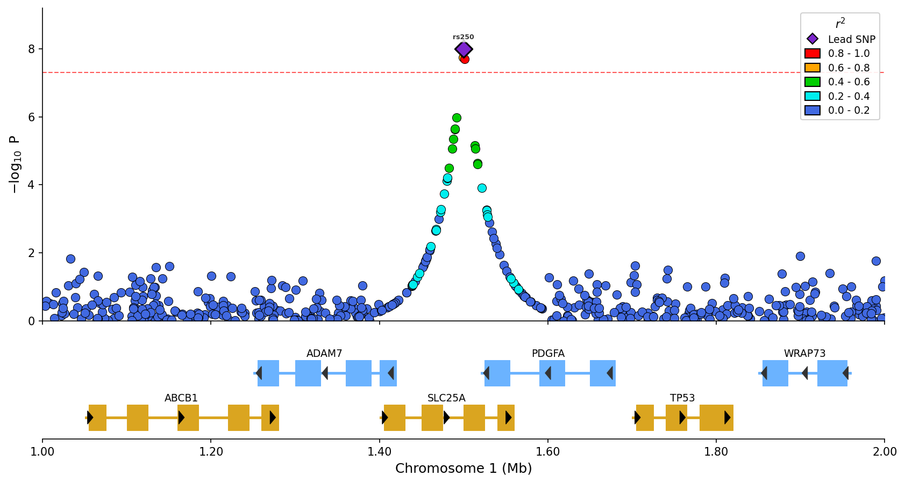

```python
fig = plotter.plot(
    gwas_df,
    chrom=1,
    start=1000000,
    end=2000000,
    lead_pos=1500000,           # Lead SNP position
    ld_reference_file="geno",   # PLINK fileset for LD calculation
    show_recombination=True,    # Recombination rate overlay
    snp_labels=True,            # Label top SNPs (matplotlib only)
    label_top_n=5,              # How many to label
    genes_df=genes_df,          # Gene annotations
    exons_df=exons_df,          # Exon structure (optional)
)
```

**Features:**

- SNPs colored by R² with lead variant (purple → red gradient)
- Lead SNP shown as purple diamond
- Gene track with intron/exon structure
- Recombination rate overlay (blue line, right y-axis)
- Genome-wide significance line (red dashed, default 5e-8)
- SNP labels with RS IDs or nearest gene names (matplotlib only)

### Stacked Plots

Compare multiple GWAS results vertically with a shared x-axis.

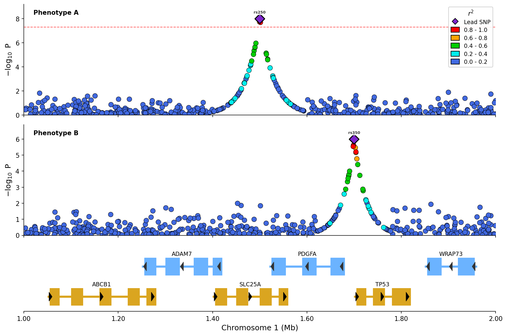

```python
fig = plotter.plot_stacked(
    [gwas_height, gwas_bmi, gwas_whr],
    chrom=1,
    start=1000000,
    end=2000000,
    lead_positions=[1500000, 1480000, 1520000],  # Per-panel leads
    panel_labels=["Height", "BMI", "WHR"],
    genes_df=genes_df,
)
```

**Features:**

- Vertical stacking with aligned x-axes
- Independent LD coloring per panel
- Shared gene track at bottom
- Optional recombination overlay (top panel only)

### eQTL Overlay

Add expression QTL data as a separate panel below GWAS results.

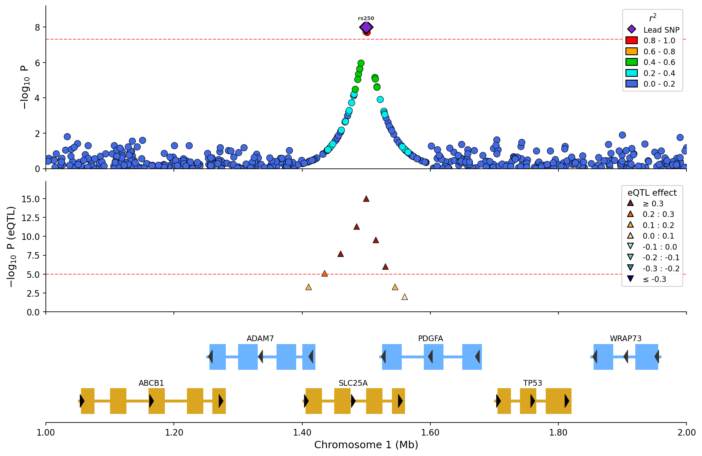

```python
eqtl_df = pd.DataFrame({
    "pos": [1000500, 1001200, 1002000],
    "p_value": [1e-6, 1e-4, 0.01],
    "gene": ["BRCA1", "BRCA1", "BRCA1"],
    "effect_size": [0.5, -0.3, 0.1],  # Optional: colors by effect direction
})

fig = plotter.plot_stacked(
    [gwas_df],
    chrom=1,
    start=1000000,
    end=2000000,
    eqtl_df=eqtl_df,
    eqtl_gene="BRCA1",  # Filter to specific gene
    genes_df=genes_df,
)
```

**Features:**

- Separate panel for eQTL associations
- Color by effect direction (red = positive, blue = negative)
- Filter to specific target gene

### Fine-mapping Visualization

Visualize SuSiE or other fine-mapping results with credible set coloring.

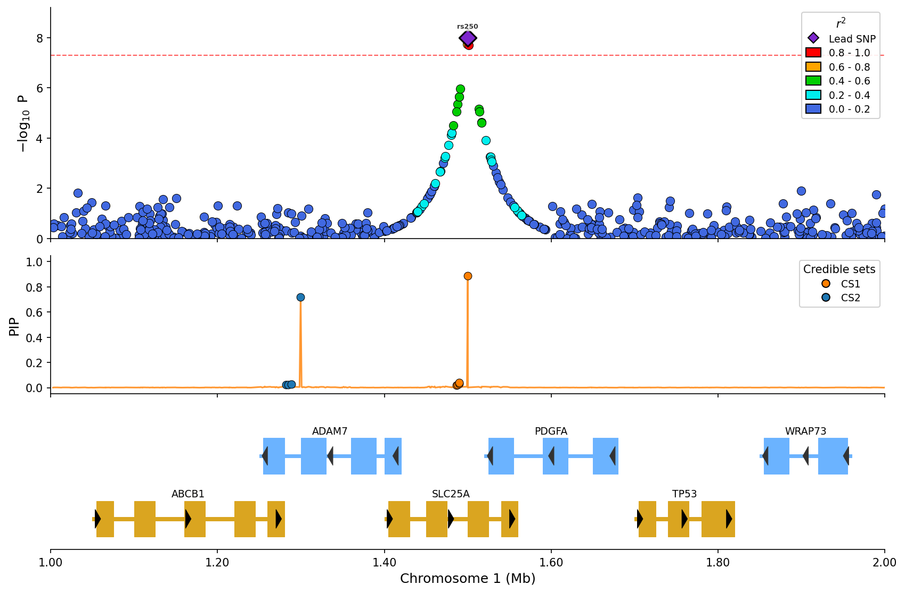

```python
finemapping_df = pd.DataFrame({
    "pos": [1000500, 1001200, 1002000, 1003500],
    "pip": [0.85, 0.12, 0.02, 0.45],  # Posterior inclusion probability
    "cs": [1, 1, 0, 2],               # Credible set (0 = not in CS)
})

fig = plotter.plot_stacked(
    [gwas_df],
    chrom=1,
    start=1000000,
    end=2000000,
    finemapping_df=finemapping_df,
    finemapping_cs_col="cs",
    genes_df=genes_df,
)
```

**Features:**

- PIP values shown as line plot
- Credible sets colored distinctly (CS1 = red, CS2 = blue, etc.)
- Variants not in credible sets shown in gray

### LD Heatmaps

Create triangular LD heatmaps showing pairwise linkage disequilibrium patterns.

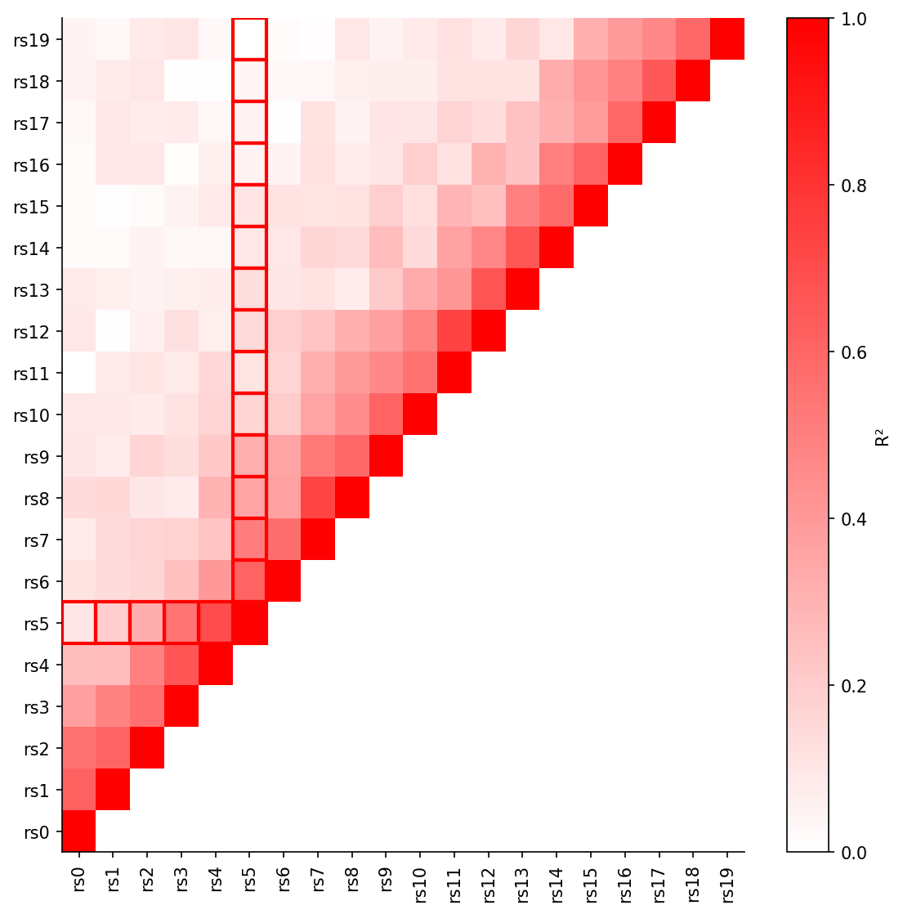

```python
from pylocuszoom import LDHeatmapPlotter

# ld_matrix is a square DataFrame with SNP IDs as index/columns
# snp_ids is a list of SNP IDs in matrix order

ld_plotter = LDHeatmapPlotter()
fig = ld_plotter.plot_ld_heatmap(
    ld_matrix,
    snp_ids=snp_ids,
    lead_snp="rs12345",    # Highlight lead SNP (red)
    highlight_snps=None,   # Optional extra SNPs to mark (blue)
    metric="r2",           # or "dprime"
)
fig.savefig("ld_heatmap.png", dpi=150)
```

**Features:**

- Triangular heatmap showing pairwise LD (R² or D')
- White-to-red color gradient
- Optional lead SNP highlighting
- Colorbar legend with metric label

#### Integrated LD Heatmap with Regional Plot

Add an LD heatmap panel below a regional association plot:

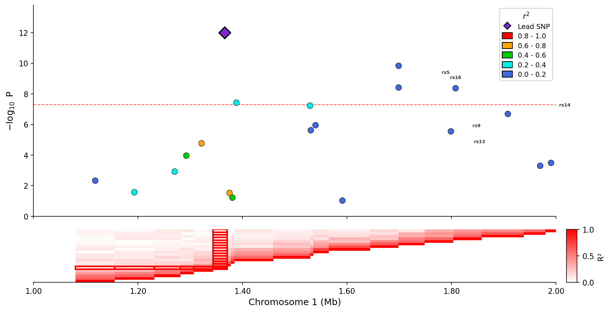

```python
plotter = LocusZoomPlotter(species="canine")

fig = plotter.plot(
    gwas_df,
    chrom=1,
    start=1000000,
    end=2000000,
    lead_pos=1500000,
    ld_heatmap_df=ld_matrix,         # Pairwise LD matrix
    ld_heatmap_snp_ids=snp_ids,      # SNP IDs in matrix
    ld_heatmap_height=0.25,          # Panel height ratio
)
```

**Features:**

- Heatmap panel automatically added below association plot
- SNPs aligned with x-axis coordinates from GWAS data
- Works with both `plot()` and `plot_stacked()`
- Heatmap at very bottom in stacked plots

### Colocalization Plots

Visualize GWAS-eQTL colocalization by comparing association signals in a scatter plot with LD coloring.

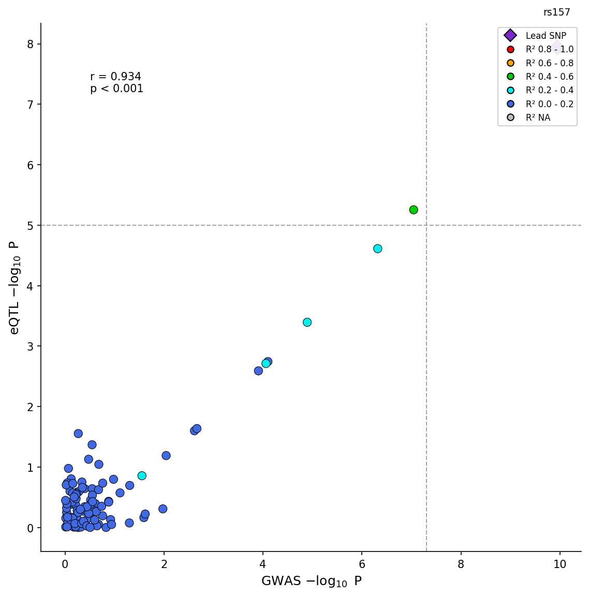

```python
from pylocuszoom import ColocPlotter
import pandas as pd

# GWAS data with position and p-value
gwas_df = pd.DataFrame({
    "pos": [1000000, 1000500, 1001000, 1001500, 1002000],
    "p": [1e-8, 1e-6, 1e-4, 0.01, 0.05],
    "ld_r2": [1.0, 0.8, 0.5, 0.2, 0.1],  # Optional: LD with lead SNP
})

# eQTL data with position and p-value
eqtl_df = pd.DataFrame({
    "pos": [1000000, 1000500, 1001000, 1001500, 1002000],
    "p": [1e-6, 1e-8, 1e-5, 0.02, 0.1],
})

plotter = ColocPlotter()
fig = plotter.plot_coloc(
    gwas_df=gwas_df,
    eqtl_df=eqtl_df,
    pos_col="pos",
    gwas_p_col="p",
    eqtl_p_col="p",
    ld_col="ld_r2",  # Optional: color by LD
)
fig.savefig("colocalization.png", dpi=150)
```

**Features:**

- Scatter plot comparing GWAS -log10(p) vs eQTL -log10(p)
- Points colored by LD (R²) with lead SNP (purple → red gradient)
- Lead SNP labeled on plot
- Pearson correlation coefficient and p-value displayed
- Significance threshold reference lines

**Effect Direction Coloring:**

Color points by whether GWAS and eQTL effects are in the same direction (congruent) or opposite (incongruent). This helps identify whether increased gene expression is associated with increased or decreased disease risk.

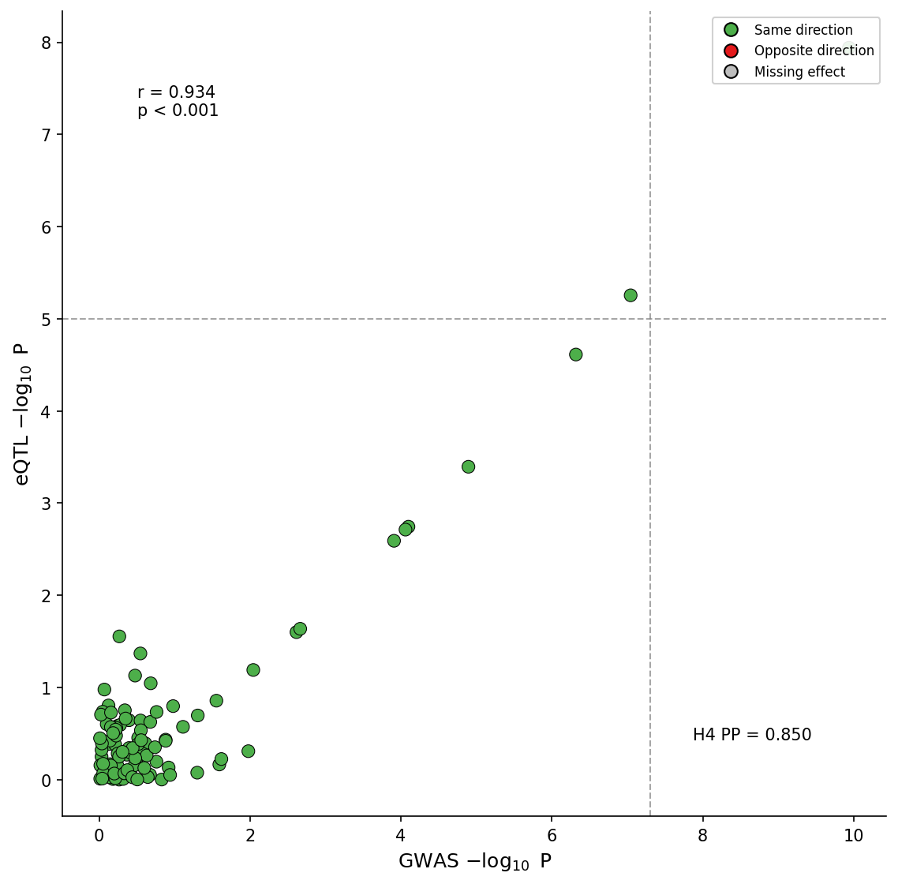

```python
# Effect direction coloring requires effect size columns in both datasets
gwas_df = pd.DataFrame({
    "pos": [1000000, 1000500, 1001000],
    "p": [1e-8, 1e-6, 1e-4],
    "beta": [0.5, 0.3, -0.2],  # GWAS effect sizes
})

eqtl_df = pd.DataFrame({
    "pos": [1000000, 1000500, 1001000],
    "p": [1e-6, 1e-8, 1e-5],
    "slope": [0.8, 0.5, -0.4],  # eQTL effect sizes
})

fig = plotter.plot_coloc(
    gwas_df=gwas_df,
    eqtl_df=eqtl_df,
    pos_col="pos",
    gwas_p_col="p",
    eqtl_p_col="p",
    gwas_effect_col="beta",
    eqtl_effect_col="slope",
    color_by_effect=True,  # Green=same direction, Red=opposite
    h4_posterior=0.85,  # Display coloc H4 posterior probability
)
```

**Additional options:**

```python
fig = plotter.plot_coloc(
    gwas_df=gwas_df,
    eqtl_df=eqtl_df,
    pos_col="pos",
    gwas_p_col="p",
    eqtl_p_col="p",
    ld_col="ld_r2",
    # Significance thresholds
    gwas_threshold=5e-8,
    eqtl_threshold=1e-5,
)
```

**Interactive Plotly backend:**

```python
from pylocuszoom import ColocPlotter

plotter = ColocPlotter(backend="plotly")
fig = plotter.plot_coloc(
    gwas_df=gwas_df,
    eqtl_df=eqtl_df,
    pos_col="pos",
    gwas_p_col="p",
    eqtl_p_col="p",
    ld_col="ld_r2",
)

# Save as interactive HTML
fig.write_html("colocalization_interactive.html")

# Display in Jupyter notebook
from IPython.display import display, HTML
display(HTML(fig.to_html(include_plotlyjs='cdn')))
```

### PheWAS Plots

Visualize associations of a single variant across multiple phenotypes in a phenome-wide association study.

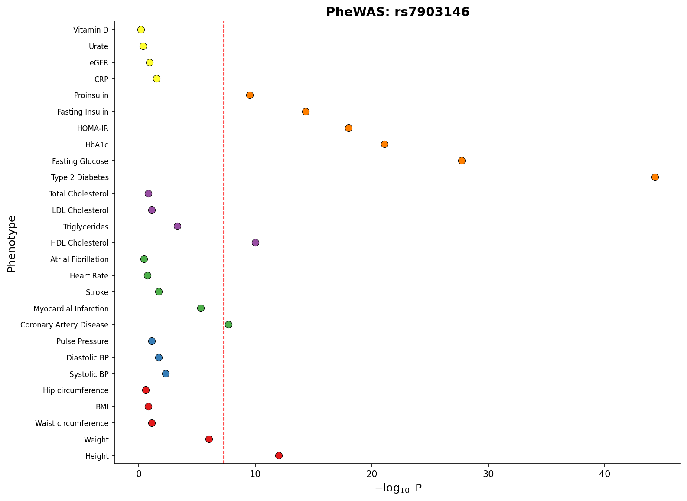

```python
from pylocuszoom import StatsPlotter

phewas_df = pd.DataFrame({
    "phenotype": ["Height", "BMI", "T2D", "CAD", "HDL"],
    "p_value": [1e-15, 0.05, 1e-8, 1e-3, 1e-10],
    "category": ["Anthropometric", "Anthropometric", "Metabolic", "Cardiovascular", "Lipids"],
})

plotter = StatsPlotter()
fig = plotter.plot_phewas(
    phewas_df,
    variant_id="rs12345",
    category_col="category",
    significance_threshold=5e-8,
)
```

**Features:**

- Phenotypes grouped and colored by category
- Genome-wide significance line (red dashed)
- Optional effect direction markers (triangles for +/-)
- 12-color palette for distinct categories

### Forest Plots

Create forest plots for meta-analysis visualization showing effect sizes with confidence intervals.

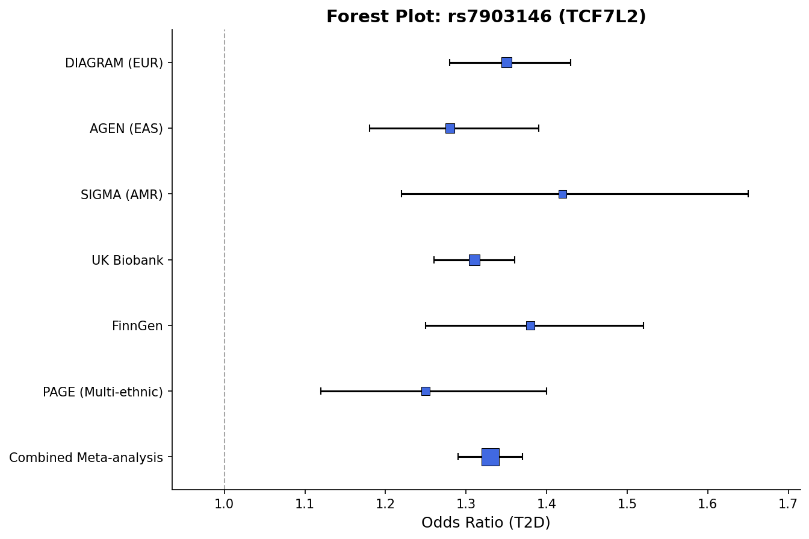

```python
from pylocuszoom import StatsPlotter

forest_df = pd.DataFrame({
    "study": ["Study A", "Study B", "Study C", "Meta-analysis"],
    "effect": [0.45, 0.52, 0.38, 0.46],
    "ci_lower": [0.30, 0.35, 0.20, 0.40],
    "ci_upper": [0.60, 0.69, 0.56, 0.52],
    "weight": [25, 35, 20, 100],  # Optional: affects marker size
})

plotter = StatsPlotter()
fig = plotter.plot_forest(
    forest_df,
    variant_id="rs12345",
    weight_col="weight",
    null_value=0.0,  # Reference line (0 for beta, 1 for OR)
    effect_label="Effect Size",
)
```

**Features:**

- Effect sizes as squares with confidence interval whiskers
- Marker size scaled by study weight (optional)
- Null effect reference line
- Study names as y-axis labels

### Miami Plots

Miami plots (mirrored Manhattan plots) compare two GWAS datasets side-by-side with a shared x-axis. The top panel shows -log10(p) ascending, while the bottom panel is inverted.

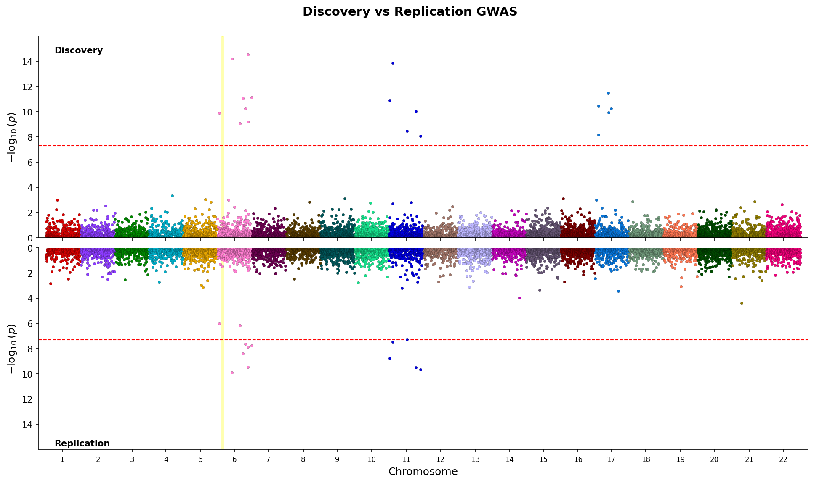

```python
from pylocuszoom import MiamiPlotter
import pandas as pd

# Two GWAS datasets to compare
gwas1 = pd.read_csv("gwas_study1.csv")
gwas2 = pd.read_csv("gwas_study2.csv")

plotter = MiamiPlotter()
fig = plotter.plot_miami(
    top_df=gwas1,
    bottom_df=gwas2,
    chrom_col="chrom",
    pos_col="pos",
    p_col="p",
    top_label="Study 1",
    bottom_label="Study 2",
    figsize=(14, 8),
)
fig.savefig("miami.png", dpi=150)
```

**Features:**

- Mirrored panels with shared x-axis and consistent chromosome colors
- Per-panel significance thresholds (`top_threshold`, `bottom_threshold`)
- Panel labels to identify datasets
- SNP annotations independent per panel (`top_snp_annotations`, `bottom_snp_annotations`)
- Region highlighting across both panels (`highlight_regions`)
- Interactive hover tooltips in plotly/bokeh backends
- Full support for all three backends (matplotlib, plotly, bokeh)

**Customization options:**

```python
fig = plotter.plot_miami(
    top_df=gwas1,
    bottom_df=gwas2,
    chrom_col="chrom",
    pos_col="pos",
    p_col="p",
    # Per-panel thresholds
    top_threshold=5e-8,
    bottom_threshold=1e-5,
    # Panel labels
    top_label="Discovery Cohort",
    bottom_label="Replication Cohort",
    # SNP annotations (list of SNP IDs — requires rs_col to be set)
    rs_col="rs",
    top_snp_annotations=["rs123"],
    bottom_snp_annotations=["rs456"],
    # Highlight regions (list of (chrom, start, end) tuples)
    highlight_regions=[(1, 1000000, 2000000), (5, 50000000, 51000000)],
)
```

**Interactive Plotly backend:**

```python
from pylocuszoom import MiamiPlotter

# Create plotter with Plotly backend
plotter = MiamiPlotter(species="human", backend="plotly")

fig = plotter.plot_miami(
    top_df=discovery_df,
    bottom_df=replication_df,
    top_label="Discovery",
    bottom_label="Replication",
    top_threshold=5e-8,
    bottom_threshold=5e-8,
    highlight_regions=[("6", 25_000_000, 35_000_000)],  # MHC region
    title="Discovery vs Replication GWAS",
)

# Save as interactive HTML
fig.write_html("miami_interactive.html")

# Display in Jupyter notebook
from IPython.display import display, HTML
display(HTML(fig.to_html(include_plotlyjs='cdn')))
```

**Interactive Bokeh backend:**

```python
from pylocuszoom import MiamiPlotter
from bokeh.io import output_file, save
from bokeh.resources import CDN
from bokeh.embed import file_html

# Create plotter with Bokeh backend
plotter = MiamiPlotter(species="human", backend="bokeh")

fig = plotter.plot_miami(
    top_df=discovery_df,
    bottom_df=replication_df,
    top_label="Discovery",
    bottom_label="Replication",
    top_threshold=5e-8,
    bottom_threshold=5e-8,
    highlight_regions=[("6", 25_000_000, 35_000_000)],
    title="Discovery vs Replication GWAS",
)

# Save as interactive HTML
output_file("miami_bokeh.html")
save(fig)

# Display in Jupyter notebook
from IPython.display import display, HTML
display(HTML(file_html(fig, CDN, "Miami Plot")))
```

### Manhattan Plots

Genome-wide Manhattan plots showing associations across all chromosomes.

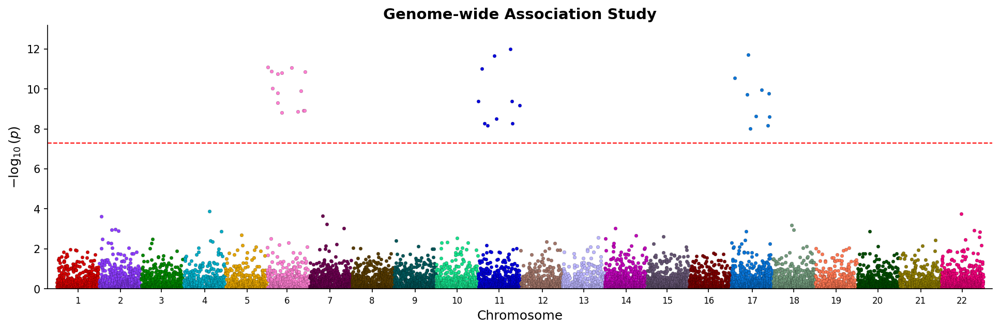

```python
from pylocuszoom import ManhattanPlotter

plotter = ManhattanPlotter()
fig = plotter.plot_manhattan(
    gwas_df,
    chrom_col="chrom",
    pos_col="pos",
    p_col="p",
    significance_threshold=5e-8,
    figsize=(12, 5),
)
fig.savefig("manhattan.png", dpi=150)
```

**Features:**

- Chromosomes colored alternately for distinction
- Genome-wide significance threshold line (red dashed)
- Automatic cumulative position calculation
- Chromosome labels on x-axis

### QQ Plots

Quantile-quantile plots for assessing p-value distribution and detecting systematic bias.

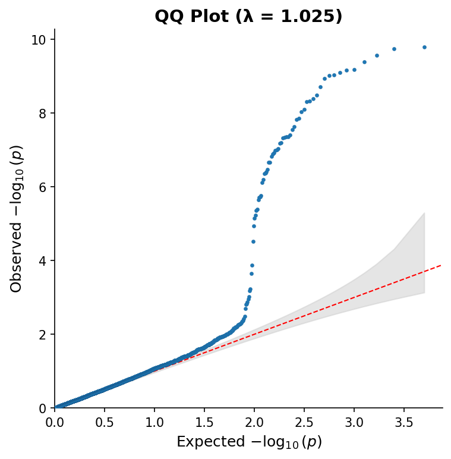

```python
from pylocuszoom import ManhattanPlotter

plotter = ManhattanPlotter()
fig = plotter.plot_qq(
    gwas_df,
    p_col="p",
    show_confidence_band=True,
    show_lambda=True,
    figsize=(6, 6),
)
fig.savefig("qq_plot.png", dpi=150)
```

**Features:**

- Expected vs observed -log10(p) values
- 95% confidence band (beta distribution)
- Genomic inflation factor (λ) in title
- Identity line for reference

### Stacked Manhattan Plots

Compare multiple GWAS studies in vertically stacked Manhattan plots with shared chromosome axis.

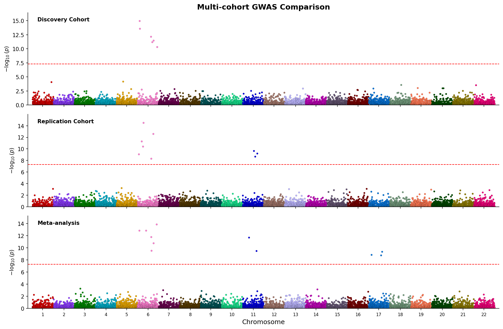

```python
from pylocuszoom import ManhattanPlotter

plotter = ManhattanPlotter()
fig = plotter.plot_manhattan_stacked(
    [gwas_study1, gwas_study2, gwas_study3],
    chrom_col="chrom",
    pos_col="pos",
    p_col="p",
    panel_labels=["Study 1", "Study 2", "Study 3"],
    significance_threshold=5e-8,
    figsize=(12, 8),
    title="Multi-study GWAS Comparison",
)
fig.savefig("manhattan_stacked.png", dpi=150)
```

**Features:**

- Vertically stacked panels with aligned x-axes
- Shared chromosome coloring across panels
- Independent y-axes per panel
- Panel labels for study identification
- Optional overall figure title

### Manhattan and QQ Side-by-Side

Combined Manhattan and QQ plots in a single figure for comprehensive GWAS summary.

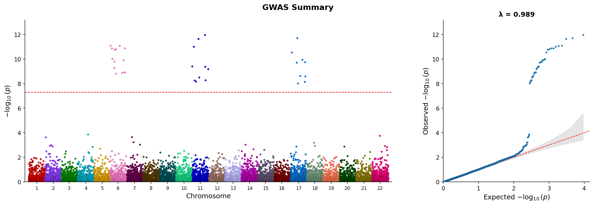

```python
from pylocuszoom import ManhattanPlotter

plotter = ManhattanPlotter()
fig = plotter.plot_manhattan_qq(
    gwas_df,
    chrom_col="chrom",
    pos_col="pos",
    p_col="p",
    significance_threshold=5e-8,
    show_confidence_band=True,
    show_lambda=True,
    figsize=(14, 5),
    title="GWAS Results",
)
fig.savefig("manhattan_qq.png", dpi=150)
```

**Features:**

- Manhattan plot on left (wider), QQ plot on right
- Shared significance threshold line on Manhattan
- Confidence band and λ on QQ plot
- Optional overall figure title

---

## Backends

pyLocusZoom supports three rendering backends for different use cases.

| Backend | Output | Best For | SNP Labels |
|---------|--------|----------|------------|
| `matplotlib` | PNG, PDF, SVG | Publications, presentations | Yes (adjustText) |
| `plotly` | Interactive HTML | Web reports, exploration | No (hover instead) |
| `bokeh` | Interactive HTML | Dashboards, web apps | No (hover instead) |

### Matplotlib (Static)

Default backend for publication-quality static plots.

```python
plotter = LocusZoomPlotter(species="canine", backend="matplotlib")
fig = plotter.plot(gwas_df, chrom=1, start=1e6, end=2e6)
fig.savefig("plot.png", dpi=300, bbox_inches="tight")
fig.savefig("plot.pdf")  # Vector format for publications
```

**Unique features:**

- SNP labels with automatic positioning (adjustText library)
- High DPI for print quality
- Vector formats (PDF, SVG) supported

### Plotly (Interactive)

Interactive plots for web reports and data exploration.

```python
plotter = LocusZoomPlotter(species="canine", backend="plotly")
fig = plotter.plot(gwas_df, chrom=1, start=1e6, end=2e6)
fig.write_html("plot.html")
fig.show()  # Opens in browser
```

**Unique features:**

- Hover tooltips showing SNP ID, position, p-value, LD
- Pan and zoom
- Export to PNG/SVG from browser

### Bokeh (Dashboard)

Interactive plots optimized for dashboard integration.

```python
from bokeh.io import output_file, save

plotter = LocusZoomPlotter(species="canine", backend="bokeh")
fig = plotter.plot(gwas_df, chrom=1, start=1e6, end=2e6)
output_file("plot.html")
save(fig)
```

**Unique features:**

- Hover tooltips
- Pan and zoom
- Easy integration with Bokeh server applications

---

## API Reference

### Specialized Plotter Classes

pyLocusZoom provides specialized plotter classes for different plot types:

| Class | Purpose |
|-------|---------|
| `LocusZoomPlotter` | Regional association plots with LD coloring |
| `ManhattanPlotter` | Genome-wide Manhattan and QQ plots |
| `MiamiPlotter` | Two-trait mirrored Manhattan plots |
| `StatsPlotter` | PheWAS and forest plots |
| `LDHeatmapPlotter` | Pairwise LD heatmaps |
| `ColocPlotter` | GWAS × eQTL colocalisation scatter |

```python
from pylocuszoom import LocusZoomPlotter, ManhattanPlotter, StatsPlotter

# Regional plots
regional = LocusZoomPlotter(species="canine")
fig = regional.plot(gwas_df, chrom=1, start=1e6, end=2e6)

# Manhattan/QQ plots
manhattan = ManhattanPlotter()
fig = manhattan.plot_manhattan(gwas_df)

# PheWAS/forest plots
stats = StatsPlotter()
fig = stats.plot_phewas(phewas_df, variant_id="rs12345")
```

### LocusZoomPlotter

The main class for creating regional association plots.

```python
plotter = LocusZoomPlotter(
    species="canine",           # "canine", "feline", "human", etc.
    genome_build="canfam3.1",   # Build for coordinate system (auto-selected)
    backend="matplotlib",       # "matplotlib", "plotly", "bokeh"
    plink_path=None,            # Path to PLINK (auto-detects)
    recomb_data_dir=None,       # Custom recombination maps
    genomewide_threshold=5e-8,  # Significance line threshold
    log_level="INFO",           # "DEBUG", "INFO", "WARNING", None
    auto_genes=False,           # Auto-fetch gene track from Ensembl
)
```

| Parameter | Type | Default | Description |
|-----------|------|---------|-------------|
| `species` | str | `"canine"` | Species name. `"canine"` has built-in recombination maps. |
| `genome_build` | str | Auto | Genome build (`"canfam3.1"`, `"canfam4"`, `"felCat9"`). |
| `backend` | str | `"matplotlib"` | Rendering backend. |
| `plink_path` | str | Auto | Path to PLINK executable. |
| `recomb_data_dir` | str | Auto | Directory with recombination maps. |
| `genomewide_threshold` | float | `5e-8` | P-value for significance line. |
| `log_level` | str | `"INFO"` | Logging verbosity or `None` to disable. |
| `auto_genes` | bool | `False` | If `True`, fetch the gene track with exon structure when `genes_df` is not supplied. |

### plot() Method

Create a single regional association plot.

```python
fig = plotter.plot(
    gwas_df,                    # Required: GWAS results
    chrom=1,                    # Required: chromosome
    start=1000000,              # Required: start position
    end=2000000,                # Required: end position
    lead_pos=1500000,           # Lead SNP to highlight
    ld_reference_file=None,     # PLINK fileset for LD
    ld_col=None,                # Column with pre-computed LD
    show_recombination=True,    # Show recomb overlay
    snp_labels=True,            # Label top SNPs
    label_top_n=5,              # Number to label
    pos_col="ps",               # Position column name
    p_col="p_wald",             # P-value column name
    rs_col="rs",                # SNP ID column name
    figsize=(12, 8),            # Figure dimensions
    genes_df=None,              # Gene annotations
    exons_df=None,              # Exon annotations
    recomb_df=None,             # Custom recombination data
    eqtl_df=None,               # eQTL data
    eqtl_gene=None,             # Filter eQTL to gene
    finemapping_df=None,        # Fine-mapping results
    finemapping_cs_col="cs",    # Credible set column
)
```

#### Parameters

| Parameter | Type | Default | Description |
|-----------|------|---------|-------------|
| `gwas_df` | DataFrame | Required | GWAS results with position and p-value columns. |
| `chrom` | int | Required | Chromosome number. |
| `start` | int | Required | Region start position (bp). |
| `end` | int | Required | Region end position (bp). |
| `lead_pos` | int | None | Lead SNP position to highlight. |
| `ld_reference_file` | str | None | PLINK fileset (without extension) for LD calculation. |
| `ld_col` | str | None | Column name if LD is pre-computed in gwas_df. |
| `show_recombination` | bool | True | Whether to show recombination overlay. |
| `snp_labels` | bool | True | Whether to label top SNPs (matplotlib only). |
| `label_top_n` | int | 5 | Number of top SNPs to label. |
| `pos_col` | str | `"ps"` | Position column name in gwas_df. |
| `p_col` | str | `"p_wald"` | P-value column name in gwas_df. |
| `rs_col` | str | `"rs"` | SNP ID column name in gwas_df. |
| `figsize` | tuple | `(12, 8)` | Figure size (width, height) in inches. |
| `genes_df` | DataFrame | None | Gene annotations for track. |
| `exons_df` | DataFrame | None | Exon annotations for gene structure. |
| `recomb_df` | DataFrame | None | Custom recombination rate data. |
| `eqtl_df` | DataFrame | None | eQTL data for additional panel. |
| `eqtl_gene` | str | None | Filter eQTL to specific gene; requires a `gene` column. |
| `eqtl_threshold` | float | `1e-5` | eQTL significance line. |
| `finemapping_df` | DataFrame | None | Fine-mapping results with `pos` and `pip`. |
| `finemapping_cs_col` | str | `"cs"` | Column for credible set assignment. |
| `ld_heatmap_df` | DataFrame | None | Pairwise LD matrix; adds heatmap panel when supplied. |
| `ld_heatmap_snp_ids` | list | None | Required when `ld_heatmap_df` is set. |
| `ld_heatmap_height` | float | `0.25` | Heatmap panel height ratio. |
| `ld_heatmap_metric` | str | `"r2"` | `"r2"` or `"dprime"`. |

> **Note:** all arguments after `gwas_df` are keyword-only.

### plot_stacked() Method

Create stacked plots comparing multiple GWAS. The optional eQTL, fine-mapping, gene-track and LD-heatmap panels are the same ones `plot()` accepts.

```python
fig = plotter.plot_stacked(
    gwas_dfs,                   # Required: list of GWAS DataFrames
    chrom=1,                    # Required: chromosome
    start=1000000,              # Required: start position
    end=2000000,                # Required: end position
    lead_positions=None,        # Per-panel lead SNP positions
    panel_labels=None,          # Labels for each panel
    ld_reference_file=None,     # Single PLINK fileset (broadcast to all panels)
    ld_reference_files=None,    # Per-panel PLINK filesets
    ld_col=None,                # Pre-computed LD column
    auto_genes=None,            # Override the constructor's auto_genes
    show_recombination=True,    # Show recomb overlay
    snp_labels=True,            # Label top SNPs
    label_top_n=3,              # SNPs to label per panel
    pos_col="ps",               # Position column
    p_col="p_wald",             # P-value column
    rs_col="rs",                # SNP ID column
    figsize=(12, None),         # Width, auto-height
    genes_df=None,              # Gene annotations
    exons_df=None,              # Exon annotations
    eqtl_df=None,               # eQTL data
    eqtl_gene=None,             # Filter eQTL to gene
    finemapping_df=None,        # Fine-mapping results
    finemapping_cs_col="cs",    # Credible set column
    recomb_df=None,             # Recombination data
)
```

#### Parameters

| Parameter | Type | Default | Description |
|-----------|------|---------|-------------|
| `gwas_dfs` | list | Required | List of GWAS DataFrames. |
| `chrom` | int | Required | Chromosome number. |
| `start` | int | Required | Region start position (bp). |
| `end` | int | Required | Region end position (bp). |
| `lead_positions` | list | None | Lead SNP positions per panel. |
| `panel_labels` | list | None | Labels for each panel. |
| `ld_reference_file` | str | None | Single PLINK fileset (broadcast to all panels with lead_positions). |
| `ld_reference_files` | list | None | Per-panel PLINK filesets. |
| `ld_col` | str | None | Pre-computed LD column name. |
| `auto_genes` | bool | None | Fetch the gene track with exon structure when `genes_df` is not supplied; `None` inherits the constructor setting. |
| `show_recombination` | bool | True | Whether to show recombination overlay. |
| `snp_labels` | bool | True | Whether to label top SNPs (matplotlib only). |
| `label_top_n` | int | 3 | Number of top SNPs to label per panel. |
| `pos_col` | str | `"ps"` | Position column name. |
| `p_col` | str | `"p_wald"` | P-value column name. |
| `rs_col` | str | `"rs"` | SNP ID column name. |
| `figsize` | tuple | `(12, None)` | Figure size (width, auto-height). |
| `genes_df` | DataFrame | None | Gene annotations for track. |
| `exons_df` | DataFrame | None | Exon annotations. |
| `eqtl_df` | DataFrame | None | eQTL data for additional panel. |
| `eqtl_gene` | str | None | Filter eQTL to specific gene; requires a `gene` column. |
| `eqtl_threshold` | float | `1e-5` | eQTL significance line. |
| `finemapping_df` | DataFrame | None | Fine-mapping results with `pos` and `pip`. |
| `finemapping_cs_col` | str | `"cs"` | Column for credible set assignment. |
| `recomb_df` | DataFrame | None | Custom recombination data. |
| `ld_heatmap_df` | DataFrame | None | Pairwise LD matrix; adds heatmap panel at bottom. |
| `ld_heatmap_snp_ids` | list | None | Required when `ld_heatmap_df` is set. |
| `ld_heatmap_height` | float | `0.25` | Heatmap panel height ratio. |
| `ld_heatmap_metric` | str | `"r2"` | `"r2"` or `"dprime"`. |

### Parameter Naming Conventions

Note the difference in parameter naming between single-region and multi-region methods:

- `plot()` uses `lead_pos` (singular) - for single region plots
- `plot_stacked()` uses `lead_positions` (plural list) - one per region

This naming convention distinguishes between methods that take a single value
versus those that take a list matching the number of regions/panels.

---

## File Loaders

pyLocusZoom includes convenience functions for loading common file formats directly into DataFrames ready for plotting.

### GWAS Loaders

| Function | Format | Description |
|----------|--------|-------------|
| `load_gwas()` | Auto | Auto-detects format from filename |
| `load_plink_assoc()` | PLINK 1.x and 2 | `.assoc`, `.assoc.linear`, `.assoc.logistic`, `.qassoc`, and PLINK 2 `--glm` output (`.glm.linear`, `.glm.logistic`), whose header line starts with `#CHROM` |
| `load_regenie()` | REGENIE | `.regenie` files |
| `load_bolt_lmm()` | BOLT-LMM | `.stats` files |
| `load_gemma()` | GEMMA | `.assoc.txt` files |
| `load_saige()` | SAIGE | SAIGE output files |
| `load_gwas_catalog()` | GWAS Catalog | Summary statistics format |

```python
from pylocuszoom import load_gwas, load_plink_assoc, load_regenie

# Auto-detect format from filename extension
gwas_df = load_gwas("results.assoc.linear")

# Or use specific loader with custom column names
gwas_df = load_plink_assoc(
    "results.assoc",
    pos_col="position",  # Rename output column
    p_col="pvalue",
    rs_col="snp_id",
)

# REGENIE (handles LOG10P conversion automatically)
gwas_df = load_regenie("ukb_chr1.regenie")
```

### eQTL Loaders

| Function | Format | Description |
|----------|--------|-------------|
| `load_gtex_eqtl()` | GTEx | Significant variant-gene pairs |
| `load_eqtl_catalogue()` | eQTL Catalogue | Standardized eQTL format |
| `load_matrixeqtl()` | MatrixEQTL | R MatrixEQTL output |

```python
from pylocuszoom import load_gtex_eqtl, load_eqtl_catalogue

# Load GTEx data, optionally filter to specific gene
eqtl_df = load_gtex_eqtl(
    "GTEx_Analysis_v8.signif_variant_gene_pairs.txt.gz",
    gene="BRCA1",  # Filter to BRCA1 associations
)

# eQTL Catalogue format
eqtl_df = load_eqtl_catalogue("eqtl_results.tsv", gene="TP53")
```

**Output columns:** `pos`, `p_value`, `gene`, `effect`

### Fine-mapping Loaders

| Function | Format | Description |
|----------|--------|-------------|
| `load_susie()` | SuSiE | susieR output (TSV) |
| `load_finemap()` | FINEMAP | `.snp` output file |
| `load_caviar()` | CAVIAR | `.set` output file |
| `load_polyfun()` | PolyFun | PolyFun+SuSiE output |

```python
from pylocuszoom import load_susie, load_finemap

# SuSiE results (handles credible set standardization)
fm_df = load_susie("susie_results.tsv")
# Output: pos, pip, cs (credible set, 0 = not in CS)

# FINEMAP results (assigns CS based on 95% PIP threshold)
fm_df = load_finemap("finemap_output.snp")

# Use in plot
fig = plotter.plot_stacked(
    [gwas_df],
    chrom=1, start=1e6, end=2e6,
    finemapping_df=fm_df,
)
```

**Output columns:** `pos`, `pip`, `cs` (credible set assignment)

### Gene Annotation Loaders

| Function | Format | Description |
|----------|--------|-------------|
| `load_gtf()` | GTF/GFF3 | Standard gene annotation format |
| `load_bed()` | BED | BED4+ format |
| `load_ensembl_genes()` | Ensembl | BioMart gene export |

```python
from pylocuszoom import load_gtf, load_bed

# Load genes and exons from GTF
genes_df = load_gtf("gencode.v40.annotation.gtf.gz", feature_type="gene")
exons_df = load_gtf("gencode.v40.annotation.gtf.gz", feature_type="exon")

# Load from BED file
genes_df = load_bed("genes.bed")

# Use in plot
fig = plotter.plot(
    gwas_df, chrom=1, start=1e6, end=2e6,
    genes_df=genes_df,
    exons_df=exons_df,
)
```

**Output columns:** `chr`, `start`, `end`, `gene_name`, `strand` (optional)

---

## Data Formats

### GWAS Results DataFrame

| Column | Type | Required | Description |
|--------|------|----------|-------------|
| `ps` | int | Yes | Genomic position (bp, 1-based). |
| `p_wald` | float | Yes | P-value (0 < p ≤ 1). |
| `rs` | str | For LD/labels | SNP identifier. |

```python
gwas_df = pd.DataFrame({
    "ps": [1000000, 1000500, 1001000],
    "p_wald": [1e-8, 1e-6, 0.05],
    "rs": ["rs123", "rs456", "rs789"],
})
```

### Genes DataFrame

| Column | Type | Required | Description |
|--------|------|----------|-------------|
| `chr` | str/int | Yes | Chromosome (accepts "1", "chr1", or 1). |
| `start` | int | Yes | Gene start position (bp). |
| `end` | int | Yes | Gene end position (bp). |
| `gene_name` | str | Yes | Gene symbol for display. |
| `strand` | str | No | "+" or "-" for directional arrows. |
| `assembly` | str | No | Assembly the coordinates are in. Set on frames fetched from Ensembl; ignored when plotting. |

### Exons DataFrame

| Column | Type | Required | Description |
|--------|------|----------|-------------|
| `chr` | str/int | Yes | Chromosome. |
| `start` | int | Yes | Exon start position. |
| `end` | int | Yes | Exon end position. |
| `gene_name` | str | Yes | Parent gene (must match genes_df). |
| `assembly` | str | No | Assembly the coordinates are in. Set on frames fetched from Ensembl; ignored when plotting. |

### Recombination DataFrame

| Column | Type | Required | Description |
|--------|------|----------|-------------|
| `pos` | int | Yes | Position (bp). |
| `rate` | float | Yes | Recombination rate (cM/Mb). |

### Fine-mapping DataFrame

| Column | Type | Required | Description |
|--------|------|----------|-------------|
| `pos` | int | Yes | Variant position. |
| `pip` | float | Yes | Posterior inclusion probability (0-1). |
| `cs` | int | No | Credible set assignment (0 = not in CS). |

### eQTL DataFrame

| Column | Type | Required | Description |
|--------|------|----------|-------------|
| `pos` | int | Yes | Variant position. |
| `p_value` | float | Yes | Association p-value. |
| `gene` | str | Yes | Target gene symbol. |
| `effect_size` | float | No | Effect size for color coding. |

### PheWAS DataFrame

| Column | Type | Required | Description |
|--------|------|----------|-------------|
| `phenotype` | str | Yes | Phenotype name. |
| `p_value` | float | Yes | Association p-value. |
| `category` | str | No | Phenotype category for grouping/coloring. |
| `effect_size` | float | No | Effect size for direction markers. |

```python
phewas_df = pd.DataFrame({
    "phenotype": ["Height", "BMI", "T2D"],
    "p_value": [1e-15, 0.05, 1e-8],
    "category": ["Anthropometric", "Anthropometric", "Metabolic"],
})
```

### Forest Plot DataFrame

| Column | Type | Required | Description |
|--------|------|----------|-------------|
| `study` | str | Yes | Study or phenotype name. |
| `effect` | float | Yes | Effect size (beta, OR, HR). |
| `ci_lower` | float | Yes | Lower confidence interval bound. |
| `ci_upper` | float | Yes | Upper confidence interval bound. |
| `weight` | float | No | Study weight (affects marker size). |

```python
forest_df = pd.DataFrame({
    "study": ["Study A", "Study B", "Meta-analysis"],
    "effect": [0.45, 0.52, 0.46],
    "ci_lower": [0.30, 0.35, 0.40],
    "ci_upper": [0.60, 0.69, 0.52],
    "weight": [25, 35, 100],
})
```

---

## Species Support

| Species | Recombination | LD Flag | Builds |
|---------|--------------|---------|--------|
| Canine | Built-in (auto-download) | `--dog` | CanFam3.1, CanFam4 |
| Feline | User-provided | `--chr-set 18` | FelCat9 |
| Custom | User-provided | User config | Any |

### Canine

```python
# CanFam3.1 (default)
plotter = LocusZoomPlotter(species="canine")

# CanFam4 with automatic liftover
plotter = LocusZoomPlotter(species="canine", genome_build="canfam4")
```

Recombination maps are automatically downloaded on first use (~50MB).

### Feline

```python
plotter = LocusZoomPlotter(species="feline")

# Provide recombination data per-plot
fig = plotter.plot(
    gwas_df, chrom=1, start=1e6, end=2e6,
    recomb_df=my_feline_recomb_df,
)
```

### Custom Species

```python
plotter = LocusZoomPlotter(
    species=None,
    recomb_data_dir="/path/to/recomb_maps/",
)
```

Recombination maps must be named `chr{N}_recomb.tsv`.

### Automatic Gene Annotations from Ensembl

Instead of providing your own `genes_df`, enable automatic fetching from Ensembl:

```python
plotter = LocusZoomPlotter(species="human", auto_genes=True)
fig = plotter.plot(gwas_df, chrom=1, start=1000000, end=2000000)
# Gene track populated automatically from Ensembl
```

Genes come back with their exons, so the automatic track draws intron and exon
structure rather than a plain rectangle per gene. Passing your own `exons_df`
overrides the fetched one.

**Supported Species:**

| Alias | Ensembl Name |
|-------|--------------|
| human | homo_sapiens |
| mouse | mus_musculus |
| rat | rattus_norvegicus |
| canine, dog | canis_lupus_familiaris |
| feline, cat | felis_catus |

Any valid Ensembl species name also works (e.g., `sus_scrofa` for pig).

**Region Limit:** Maximum 5Mb per request (Ensembl API limitation). For larger regions, provide `genes_df` directly.

**Genome Build:** Genes are fetched in the build you set, from whichever source can serve it. CanFam3.1, CanFam4 and FelCat9 come from UCSC's `ncbiRefSeq` track; every other build comes from Ensembl.

| `genome_build` | Source | Assembly returned |
|----------------|--------|-------------------|
| `canfam3.1` (canine default) | UCSC `ncbiRefSeq` | CanFam3.1 |
| `canfam4`, `UU_Cfam_GSD_1.0` | UCSC `ncbiRefSeq` | UU_Cfam_GSD_1.0 |
| `felCat9` (feline default) | UCSC `ncbiRefSeq` | Felis_catus_9.0 |
| anything else | Ensembl REST | Ensembl's current assembly for the species |

Ensembl serves exactly one reference assembly per species and answers a request naming any other with that same assembly and an HTTP 200, so it cannot supply the three retired builds and will not say so. Its dog is `ROS_Cfam_1.0` and its cat is `F.catus_Fca126_mat1.0`. Release 116 was the last on the legacy REST platform and the archive REST hosts redirect to a help page, so those builds have no Ensembl source at any URL.

Both sources return the same columns, including an `assembly` column naming the assembly each row is in. On the Ensembl path, a `genome_build` that disagrees with what Ensembl served warns with a `UserWarning` naming both assemblies, since the coordinates will be off by hundreds of kilobases with nothing in the figure to show it.

UCSC's `ncbiRefSeq` is a transcript-level track, so transcripts sharing a symbol are collapsed into one gene row spanning the widest of them, and the default `biotype="protein_coding"` filter keeps genes with at least one `NM_`/`XM_` transcript. UCSC imposes no 5Mb region limit, so that cap applies only to the Ensembl path.

`genome_build` also selects the recombination map, where CanFam3.1 and CanFam4 are both supported.

**Error Handling:** A source failure raises `EnsemblAPIError` or `UCSCAPIError`, both catchable as `ReferenceAPIError`. Under `auto_genes=True` the plotter catches it, warns, and draws the plot without the gene track.

**Cache Location:** each source caches under its own leaf, so a region fetched from Ensembl and the same region fetched from UCSC never collide.

- Linux/macOS: `~/.cache/pylocuszoom/ensembl/{ensembl_species}/` and `~/.cache/pylocuszoom/ucsc/{ucsc_genome}/`
- Windows: `%LOCALAPPDATA%/pylocuszoom/ensembl/{ensembl_species}/` and `%LOCALAPPDATA%/pylocuszoom/ucsc/{ucsc_genome}/`

A CanFam3.1 or FelCat9 plot caches under `ucsc/canFam3/` or `ucsc/felCat9/`, not under `ensembl/`.

```python
# Clear cache when needed
from pylocuszoom import clear_gene_cache, get_ensembl_species_name

clear_gene_cache("ensembl")  # Every species cached from Ensembl
clear_gene_cache("ensembl", cache_species=get_ensembl_species_name("human"))
clear_gene_cache("ucsc", cache_species="canFam3")
```

The species subdirectory is named the way the source names it, so an Ensembl
one is `homo_sapiens` rather than `human`; `get_ensembl_species_name` resolves
an alias to it.

**Fetching genes without plotting:** `get_genes_for_build` returns the genes
and exons for a region, going through the same cache the plotter uses.

```python
from pylocuszoom import get_genes_for_build

genes_df, exons_df = get_genes_for_build(
    species="canine", chrom=1, start=1_000_000, end=2_000_000,
    genome_build="canfam3.1", include_exons=True,
)
```

`source_for(species, genome_build)` returns the `GeneSource` that routing would
pick, which is the way to ask one source directly for a build the other would
otherwise serve.

**Note:** Recombination rates are NOT available from Ensembl for most species. Continue to provide recombination maps separately.

---

## Recipes & Examples

### Plot Without LD (No PLINK)

```python
fig = plotter.plot(
    gwas_df,
    chrom=1, start=1e6, end=2e6,
    # No lead_pos or ld_reference_file
)
```

All SNPs will be gray.

### Pre-computed LD

```python
# LD already in DataFrame
gwas_df["r2"] = [1.0, 0.8, 0.5, 0.2, 0.0]

fig = plotter.plot(
    gwas_df,
    chrom=1, start=1e6, end=2e6,
    lead_pos=1500000,
    ld_col="r2",  # Use pre-computed LD
)
```

### Save in Multiple Formats

```python
# High-resolution PNG
fig.savefig("plot.png", dpi=300, bbox_inches="tight")

# Vector PDF for publication
fig.savefig("plot.pdf", bbox_inches="tight")

# SVG for web
fig.savefig("plot.svg", bbox_inches="tight")
```

### Suppress Logging

```python
plotter = LocusZoomPlotter(species="canine", log_level=None)
```

### Custom Significance Threshold

`genomewide_threshold` sets where that plotter draws its significance line.
`LocusZoomPlotter`, `ManhattanPlotter`, `MiamiPlotter`, and `StatsPlotter` all
take it. It applies to the plot families that have a significance line; QQ plots
(`plot_qq`) and forest plots (`plot_forest`) do not draw one and ignore it.

```python
# Suggestive threshold
plotter = LocusZoomPlotter(
    species="canine",
    genomewide_threshold=1e-5,
)
```

Some plot methods also take a per-call threshold argument. Omit it to inherit
the plotter's `genomewide_threshold`, pass a p-value to override it for one
call, or pass `None` to draw no line. The argument is not spelled the same way
everywhere, and two methods do not take one at all:

| Method | Per-call argument |
|--------|-------------------|
| `ManhattanPlotter.plot_manhattan` | `significance_threshold` |
| `ManhattanPlotter.plot_manhattan_stacked` | `significance_threshold` |
| `ManhattanPlotter.plot_manhattan_qq` | `significance_threshold` |
| `ManhattanPlotter.plot_manhattan_qq_stacked` | `significance_threshold` |
| `StatsPlotter.plot_phewas` | `significance_threshold` |
| `MiamiPlotter.plot_miami` | `top_threshold` and `bottom_threshold` |
| `ManhattanPlotter.plot_qq` | none |
| `StatsPlotter.plot_forest` | none |

`LocusZoomPlotter.plot` and `plot_stacked` have no per-call significance
threshold either; the constructor value is the only control.

```python
plotter = ManhattanPlotter(genomewide_threshold=1e-5)

plotter.plot_manhattan(df)                                # line at 1e-5
plotter.plot_manhattan(df, significance_threshold=5e-8)   # line at 5e-8
plotter.plot_manhattan(df, significance_threshold=None)   # no line

# Miami names one threshold per panel, not significance_threshold
miami = MiamiPlotter(genomewide_threshold=1e-5)
miami.plot_miami(top_df, bottom_df, top_threshold=5e-8, bottom_threshold=None)
```

> **Changed:** before this release, `ManhattanPlotter`, `MiamiPlotter`, and
> `StatsPlotter` accepted `genomewide_threshold` and then ignored it, always
> drawing at 5e-8. If you passed it and worked around the old behaviour by also
> passing the per-call argument, that still works and still wins.

### Large Datasets with PySpark

```python
from pylocuszoom import LocusZoomPlotter, to_pandas

# Automatic conversion
fig = plotter.plot(spark_df, chrom=1, start=1e6, end=2e6)

# Manual conversion with sampling
pandas_df = to_pandas(spark_df, sample_size=100000)
fig = plotter.plot(pandas_df, chrom=1, start=1e6, end=2e6)
```

---

## Troubleshooting

### PLINK Not Found

```text
ValidationError: Could not find PLINK executable
```

Install PLINK 1.9 and add to PATH, or specify:

```python
plotter = LocusZoomPlotter(plink_path="/path/to/plink")
```

### Missing Recombination Maps

The first canine plot triggers an automatic download. If it fails:

```python
from pylocuszoom import download_canine_recombination_maps
download_canine_recombination_maps()
```

### Plot Not Displaying in Jupyter

pyLocusZoom disables interactive display for cleaner notebook output. Save or display explicitly:

```python
fig.savefig("plot.png")
# or
from IPython.display import Image
Image("plot.png")
```

### LD Calculation Fails

Ensure:

1. GWAS DataFrame has `rs` column (or specify `rs_col`)
2. SNP IDs match those in PLINK fileset
3. Lead SNP exists in both datasets

---

## See Also

- [Code Map](CODEMAP.md) - Architecture and source code navigation
- [Example Notebook](../examples/getting_started.ipynb) - Interactive tutorial
- [GitHub Issues](https://github.com/michael-denyer/pylocuszoom/issues) - Bug reports
- [CHANGELOG](../CHANGELOG.md) - Version history
